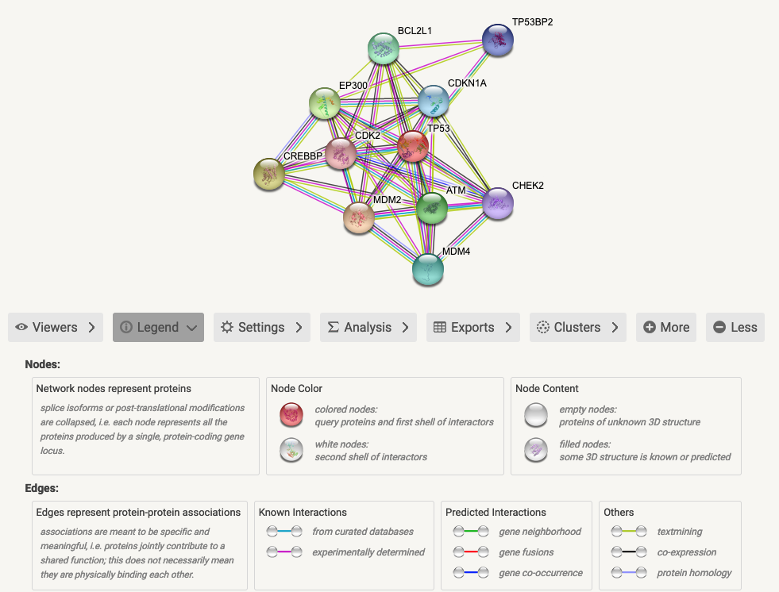

# Grafi v molekularni biologiji

Najbolj splošna definicija grafa (s področja diskretne matematike) je *množica točk in povezav med njimi* ([Wikipedia](https://en.wikipedia.org/wiki/Graph_(discrete_mathematics))), podrobno ga pa obravnava *teorija grafov* ([Wikipedia](https://en.wikipedia.org/wiki/Graph_theory)). Grafi so zelo uporaben način predstavitve in povezave nekih objektov ter povezav med njimi. V biologiji, biokemiji, molekularni biologiji ... jih pogosto uporabljamo za predstavitev odnosov ved organizmi, prikaz medproteinskih ali drugih medmolekulskih interakcij, regulatornih povezav ipd.

Medproteinske interakcije so, na primer, zbrane v zbirki [STRING](https://string-db.org/), kjer si jih lahko ogledamo na grafičen način – kot grafe. Primer medproteinskih interakcij človeškega proteina p53 je prikazan spodaj (različne barve povezav med proteini ponazarjajo status interakcije – eksperimentalno potrjene ali napovedane interakcije).

Že v samem pregledovalniku na omenjeni spletni strani lahko izvajamo določene analize, a za obsežnejše analize obsežnejših grafov, tudi celotnega interaktoma nekega organizma, potrebujemo specializirane programe. Eden izmed takih je Cytoscape, ki ga bomo spoznali v okviru vaj.