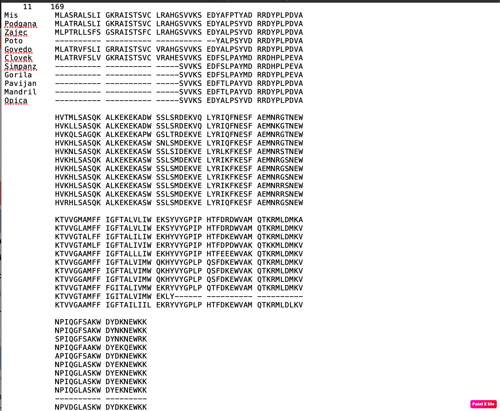
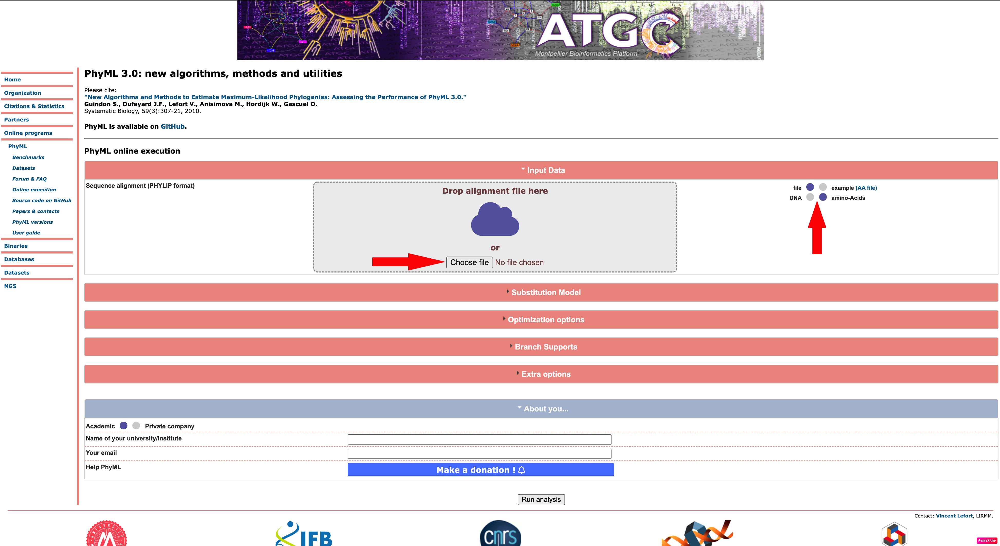
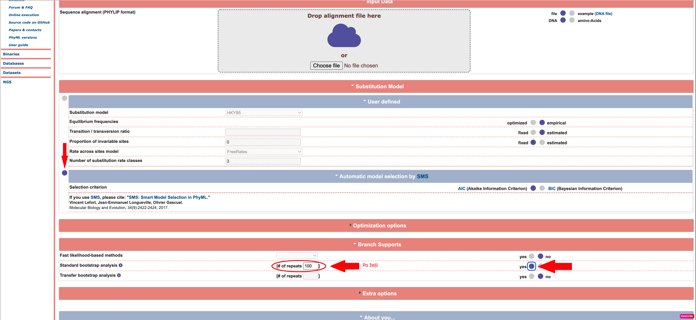
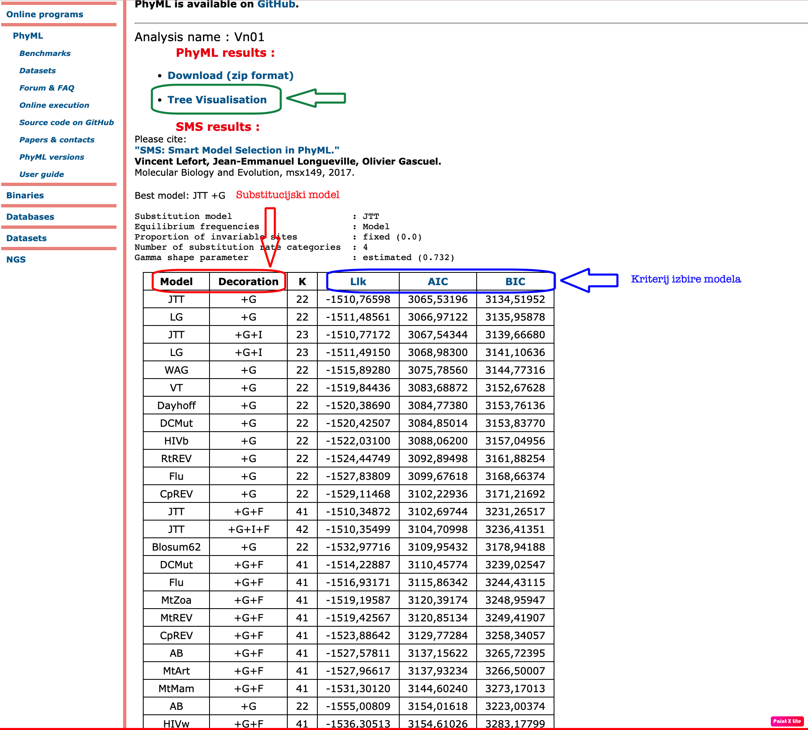
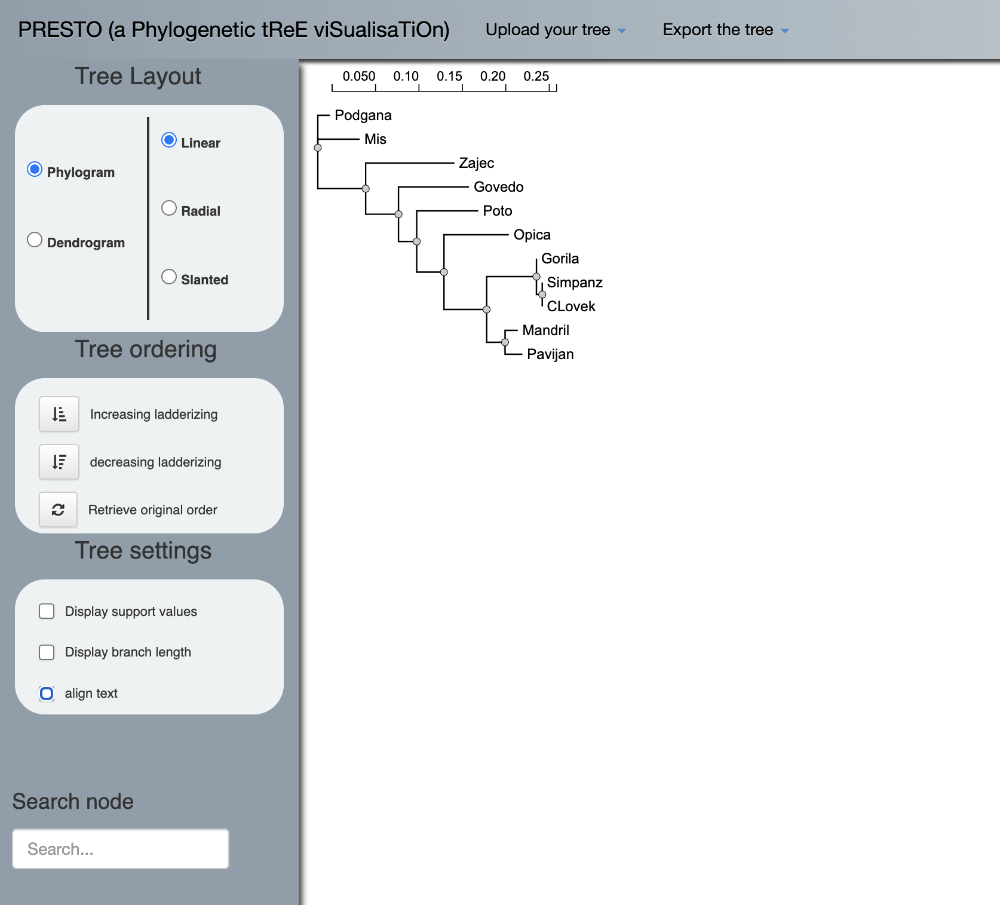
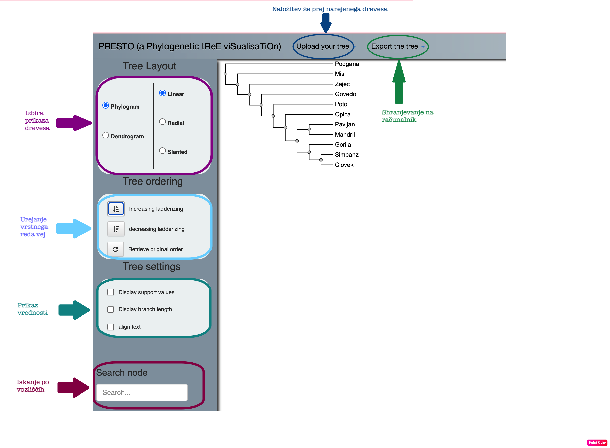
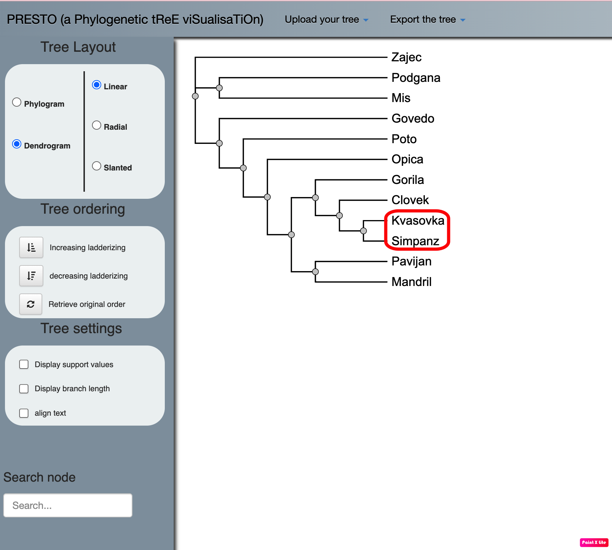

# PhyML-filogenetska drevesa

**Avtorja**: Maja Deutsch, Sara Jerič

**Datum predstavitve**: 2022-05-13

---
## Namen vaje

Na tej vaji bomo narisali filogenetsko drevo, ki bo temeljilo na principu največje verjetnosti. 

---
## Program

Program: **[PhyML 3.0](http://www.atgc-montpellier.fr/phyml/)**

Avtorji programa: Guindon S., Dufayard J.F., Lefort V., Anisimova M., Hordijk W., Gascuel O., **[Institut Français de Bioinformatique](https://www.france-bioinformatique.fr/en/home/)** in **[France Génomique](https://www.france-genomique.org/)**


Reference:
- Guindon, S.; Dufayard, J.; et al. (2010) **New Algorithms and Methods to Estimate Maximum-Likelihood Phylogenies: Assessing the Performance of PhyML 3.0** *Systematic Biology.* 52(5),696-704. [10.1093/sysbio/syq010] 
(https://doi.org/10.1093/sysbio/syq010)
- Manalastas-Cantos, K.; Konarev, P.V.; Hajizadeh, N.R.; Kikhney, A.G.; Petoukhov, M.V.; Molodenskiy, D.S.; Panjkovich, A.; Mertens, H.D.T.; Gruzinov, A.; Borges, C.; et al. (2021) **ATSAS 3.0: Expanded Functionality and New Tools for Small-Angle Scattering Data Analysis.** *Journal of Applied Crystallograpy* 54, 343–355. [10.1107/S1600576720013412](https://doi.org/10.1107/S1600576720013412)


### Opis programa
PhyML je program (software package), ki je primarno namenjen za oceno največje verjetnosti filogenije iz poravnav zaporedij. Ta zaporedja so lahko aminokislinska ali nukleotidna. Največja prednost PhyML je veliko število nadomestnih modelov, ki so povezani z različnimi možnostmi za iskanje topologij filogenetskega drevesa. PhyML deluje hitro do počasi, vendar je zelo natančen. PhyML s pomočjo testa razmerij na osnovi največje verjetnosti poišče najbolj podobne organizme in na podlagi tega izriše filogenetsko drevo.

PhyML 3.0 (najnovejša verzija) izvrši nov iskalni algoritem SPR (Subtree-Pruning-Regrafting), ki se zanaša na filter, kateri temelji na varčnosti namesto na razdalji. Ločimo dva algoritma: Multiple_Spr_Cycles in One_Spr_Cycle. Slednji obravnava vsako poddrevo v trenutni filogeniji. Vrednost varčevanja je ocenjena za vsako poddrevo pri vsakem razcepu. Ko dobi vse vrednosti varčevanja, jih razvrsti. Verjetnost za najbolj varčne rešitve so ocenjene s pomočjo uporabe dvostopenjskega pristopa. Na prvi stopnji se oceni verjetnost drevesa po dodatku varčnega SPR koraka brez prilagajanja dolžine vej. Če je dobljena verjetnost večja od do sedaj največje pridobljene verjetnosti, postane novo dobljena verjetnost najboljša. Če dobljena verjetnost ne postane najboljša, pa se ob razcepu tri dolžine vej optimizirajo tako, da povečajo verjetnost. Tukaj je potrebno upoštevati, da so to približne ocene, ki temeljijo na posodobitvi verjetnosti omejenega števila poddreves in ne celotne podatkovne strukture. Ko so vsi SPR koraki ocenjeni, se uporabi največja pridobljena ocenjena verjetnost in celotna podatkovna struktura se popolnoma posodobi. Multiple_Spr_Cycles v prvem koraku obravnava poddrevesa skozi One_Spr_Cycle, nato pa prilagodi parametre nadomestnega modela. Sledi prilagoditev vseh dolžin vej z uporabo metode optimizacije. Zadnji korak je posodobitev celotne podatkovne zbirke. Ti koraki se ponavljajo, dokler se verjetnost ne izboljša.

### Vhodni podatki

Vhodni podatki so aminokislinska oz. nukleotidna zaporedja v formatu Phylip.


---
## Navodila

### Vhodni podatki
Ker je pretvorba podatkov iz fasta v Phylip format časovno preobsežna za današnjo vajo, so potrebni preoblikovani podatki že podani:

#### Citokrom_c

[Citokrom_c (phy format)](https://github.com/mpavsic/biokeminfo/blob/main/biokeminfo/seminar/s19-phyml-vhod1.phy)

```
    11    169
Mis        MLASRALSLI GKRAISTSVC LRAHGSVVKS EDYAFPTYAD RRDYPLPDVA 
Podgana    MLATRALSLI GKRAISTSVC LRAHGSVVKS EDYALPSYVD RRDYPLPDVA 
Zajec      MLPTRLLSFS GSRAISTSFC LRAHGSVVKS EDYALPSYVD RRDYPLPDVA 
Poto       ---------- ---------- ---------- --YALPSYVD RRDYPLPDVA 
Govedo     MLATRVFSLI GRRAISTSVC VRAHGSVVKS EDYALPSYVD RRDYPLPDVA 
Clovek     MLATRVFSLV GKRAISTSVC VRAHESVVKS EDFSLPAYMD RRDHPLPEVA 
Simpanz    ---------- ---------- -----SVVKS EDFSLPAYMD RRDHPLPEVA 
Gorila     ---------- ---------- -----SVVKS EDFSLPAYMD RRDYPLPEVA 
Pavijan    ---------- ---------- -----SVVKS EDFTLPAYVD RRDYPLPDVA 
Mandril    ---------- ---------- -----SVVKS EDFTLPAYVD RRDYPLPDVA 
Opica      ---------- ---------- -----SVVKS EDYALPSYVD RRDYPLPDVA 

           HVTMLSASQK ALKEKEKADW SSLSRDEKVQ LYRIQFNESF AEMNRGTNEW 
           HVKLLSASQK ALKEKEKADW SSLSRDEKVQ LYRIQFNESF AEMNKGTNEW 
           HVKQLSAGQK ALKEKEKAPW GSLTRDEKVE LYRIQFNESF AEMNRGTNEW 
           HVKHLSASQK ALKEKEKASW SNLSMDEKVE LYRIQFKESF AEMNRGTNEW 
           HVKNLSASQK ALKEKEKASW SSLSIDEKVE LYRLKFKESF AEMNRSTNEW 
           HVKHLSASQK ALKEKEKASW SSLSMDEKVE LYRIKFKESF AEMNRGSNEW 
           HVKHLSASQK ALKEKEKASW SSLSMDEKVE LYRIKFKESF AEMNRGSNEW 
           HVKHLSASQK ALKEKEKASW SSLSMDEKVE LYRIKFKESF AEMNRGSNEW 
           HVKHLSASQK ALKEKEKASW SSLSMDEKVE LYRIKFKESF AEMNRRSNEW 
           HVKHLSASQK ALKEKEKASW SSLSMDEKVE LYRIKFKESF AEMNRRSNEW 
           HVRHLSASQK ALKEKEKASW SSLSMDEKVE LYRIQFKESF AEMNRGSNEW 

           KTVVGMAMFF IGFTALVLIW EKSYVYGPIP HTFDRDWVAM QTKRMLDMKA 
           KTVVGLAMFF IGFTALVLIW EKSYVYGPIP HTFDRDWVAM QTKRMLDMKV 
           KTVVGTALFF IGFTALILIW EKHYVYGPIP HTFDKEWVAM QTKRMLDMKV 
           KTVVGTAMLF IGFTALIVIW EKRYVYGPIP HTFDPDWVAK QTKKMLDMKV 
           KTVVGAAMFF IGFTALLLIW EKHYVYGPIP HTFEEEWVAK QTKRMLDMKV 
           KTVVGGAMFF IGFTALVIMW QKHYVYGPLP QSFDKEWVAK QTKRMLDMKV 
           KTVVGGAMFF IGFTALVIMW QKHYVYGPLP QSFDKEWVAK QTKRMLDMKV 
           KTVVGGAMFF IGFTALVIMW QKHYVYGPLP QSFDKEWVAK QTKRMLDMKV 
           KTVVGTAMFF FGITALIVMW EKRYVYGPLP QTFDKEWVAM QTKRMLDMKV 
           KTVVGTAMFF IGITALVIMW EKLY------ ---------- ---------- 
           KTVVGAAMFF IGFTAILIIL EKRYVYGPLP HTFDKEWVAM QTKRMLDLKV 

           NPIQGFSAKW DYDKNEWKK
           NPIQGFSAKW DYNKNEWKK
           SPIQGFSAKW DYNKNEWRK
           NPIQGFAAKW DYEKQEWKK
           APIQGFSAKW DYDKNEWKK
           NPIQGLASKW DYEKNEWKK
           NPIQGLASKW DYEKNEWKK
           NPIQGLASKW DYEKNEWKK
           NPIQGLASKW DYEKNEWKK
           ---------- ---------
           NPVDGLASKW DYDKKEWKK
```

#### Outgroup

[Outgroup (phy format)](https://github.com/mpavsic/biokeminfo/blob/main/biokeminfo/seminar/s19-phyml-vhod2.phy)

```
    12    170
Clovek     MLATRVFSLV GKRAISTSVC VRAHESVVKS EDFSLPAYMD RRDHPLPEVA 
Simpanz    ---------- ---------- -----SVVKS EDFSLPAYMD RRDHPLPEVA 
Gorila     ---------- ---------- -----SVVKS EDFSLPAYMD RRDYPLPEVA 
Pavijan    ---------- ---------- -----SVVKS EDFTLPAYVD RRDYPLPDVA 
Mandril    ---------- ---------- -----SVVKS EDFTLPAYVD RRDYPLPDVA 
Opica      ---------- ---------- -----SVVKS EDYALPSYVD RRDYPLPDVA 
Mis        MLASRALSLI GKRAISTSVC LRAHGSVVKS EDYAFPTYAD RRDYPLPDVA 
Podgana    MLATRALSLI GKRAISTSVC LRAHGSVVKS EDYALPSYVD RRDYPLPDVA 
Zajec      MLPTRLLSFS GSRAISTSFC LRAHGSVVKS EDYALPSYVD RRDYPLPDVA 
Govedo     MLATRVFSLI GRRAISTSVC VRAHGSVVKS EDYALPSYVD RRDYPLPDVA 
Poto       ---------- ---------- ---------- --YALPSYVD RRDYPLPDVA 
Kvasovka   ---------- -----MLSLR QSIRFFKPAT RTLCSSRYLL QQKPVVKTAQ 

           HVKHLSASQK ALKEKEKASW SSLSMDEKVE LYRIKFKESF AEMNRGSNE- 
           HVKHLSASQK ALKEKEKASW SSLSMDEKVE LYRIKFKESF AEMNRGSNE- 
           HVKHLSASQK ALKEKEKASW SSLSMDEKVE LYRIKFKESF AEMNRGSNE- 
           HVKHLSASQK ALKEKEKASW SSLSMDEKVE LYRIKFKESF AEMNRRSNE- 
           HVKHLSASQK ALKEKEKASW SSLSMDEKVE LYRIKFKESF AEMNRRSNE- 
           HVRHLSASQK ALKEKEKASW SSLSMDEKVE LYRIQFKESF AEMNRGSNE- 
           HVTMLSASQK ALKEKEKADW SSLSRDEKVQ LYRIQFNESF AEMNRGTNE- 
           HVKLLSASQK ALKEKEKADW SSLSRDEKVQ LYRIQFNESF AEMNKGTNE- 
           HVKQLSAGQK ALKEKEKAPW GSLTRDEKVE LYRIQFNESF AEMNRGTNE- 
           HVKNLSASQK ALKEKEKASW SSLSIDEKVE LYRLKFKESF AEMNRSTNE- 
           HVKHLSASQK ALKEKEKASW SNLSMDEKVE LYRIQFKESF AEMNRGTNE- 
           NLAEVNGPET LIGPGAKEGT VPTDLDQETG LARLELLGKL EGIDVFDTKP 

           WKTVVGGAMF FIGFTALVIM WQKHYVYGPL PQSFDKEWVA KQTKRMLDMK 
           WKTVVGGAMF FIGFTALVIM WQKHYVYGPL PQSFDKEWVA KQTKRMLDMK 
           WKTVVGGAMF FIGFTALVIM WQKHYVYGPL PQSFDKEWVA KQTKRMLDMK 
           WKTVVGTAMF FFGITALIVM WEKRYVYGPL PQTFDKEWVA MQTKRMLDMK 
           WKTVVGTAMF FIGITALVIM WEKLY----- ---------- ---------- 
           WKTVVGAAMF FIGFTAILII LEKRYVYGPL PHTFDKEWVA MQTKRMLDLK 
           WKTVVGMAMF FIGFTALVLI WEKSYVYGPI PHTFDRDWVA MQTKRMLDMK 
           WKTVVGLAMF FIGFTALVLI WEKSYVYGPI PHTFDRDWVA MQTKRMLDMK 
           WKTVVGTALF FIGFTALILI WEKHYVYGPI PHTFDKEWVA MQTKRMLDMK 
           WKTVVGAAMF FIGFTALLLI WEKHYVYGPI PHTFEEEWVA KQTKRMLDMK 
           WKTVVGTAML FIGFTALIVI WEKRYVYGPI PHTFDPDWVA KQTKKMLDMK 
           LDSSRKGTMK DPIIIESYDD YRYVGCTGSP AGSHTIMWLK PTVNEVARCW 

           VNPIQGLASK WDYEKNEWKK 
           VNPIQGLASK WDYEKNEWKK 
           VNPIQGLASK WDYEKNEWKK 
           VNPIQGLASK WDYEKNEWKK 
           ---------- ---------- 
           VNPVDGLASK WDYDKKEWKK 
           ANPIQGFSAK WDYDKNEWKK 
           VNPIQGFSAK WDYNKNEWKK 
           VSPIQGFSAK WDYNKNEWRK 
           VAPIQGFSAK WDYDKNEWKK 
           VNPIQGFAAK WDYEKQEWKK 
           ECGSVYKLNP VGVPNDDHHH 

```

### Postopek dela
V okviru vaje bomo pregledali delovanje programa PhyML:
1. Našo datoteko v pravilnem formatu vstavimo v program in izberemo, kakšen tip zaporedja imamo v datoteki, za nas je to aminokislinsko zaporedje.

2. Kliknemo na substitution model in izberemo avtomatično izbiro modela (automatic model selection), ki s pomočjo AIC oz. BIC (kriterija za oceno optimalnosti modela) avtomatizira izbiro najbolj primernega modela za risanje izbranega filogenetskega drevesa.
3. Izbrati moramo tudi standard bootstrap analysis (tehnika za ocenjevanje točnosti), kar storimo v razdelku branch support in določimo, koliko ponovitev naj naredi.

4. Zaženemo program (Run analysis).
5. Na zaslonu se nam prikaže potrdilo o oddani datoteki, status njene obdelave pa si lahko ogledamo na linku.
6. Ko se rezultati naložijo, sprva vidimo, kateri model si je izbral program in njegove parametre, če pa želimo videti naše drevo, moramo izbrati Tree Visualisation (vidimo online). Vse parametre in način risanja drevesa si lahko ogledamo, če si naložimo zip datoteko (Download).


### Pričakovani rezultati in razlaga
Program deluje dobro, ko vsebuje zaporedja organizmov, ki so si dovolj sorodna - tako dobimo prikaz filogenetskega drevesa, ki deluje smiseln in na katerem so vidni dolžina posameznih vej, ki ponazarja genetsko spremembo kot tudi "support values", ki pove kolikokrat od 100ih primerov se ponovi ista veja drevesa, ko naredimo filogenetsko rekonstrukcijo (zato smo tudi predhodno opravili bootstrap analizo).


Ko se nam izriše filogenetsko drevo, ga lahko poljubno urejamo, da dobimo željen izgled. Spreminjamo lahko obliko drevesa, urejamo vrstni red vej, izbiramo katere vrednosti želimo imeti prikazane ter tudi iščemo podatke iz drevesa preko vozlišč. Ko dobimo željen prikaz drevesa, ga seveda lahko shranimo na računalnik. V primeru, da drevesa nočemo dobiti preko PhyML, ampak preko drugega programa, vseeno pa bi njegov prikaz urejali v PhyML, lahko svoje že narejeno drevo naložite in ga nato poljubno urejate.


Če imamo organizem, ki se evolucijsko bolj razlikuje od ostalih (t.i. outgroup organism/sequence) pa pride do napake, saj sam program ne zazna organizma kot oddaljenega. Z drugimi besedami PhyML prezre razliko med organizmi, ki so si evolucijsko bližje in tistimi, ki so bolj oddaljeni in sestavi drevo tako, da je le-to čim bolj monofiletično, pri čemer pride do velikih odstopanj.

