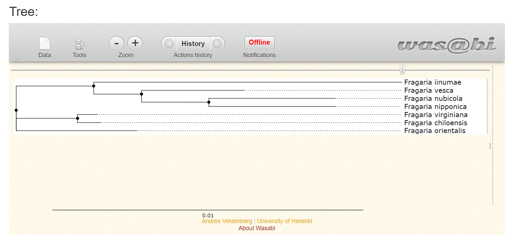
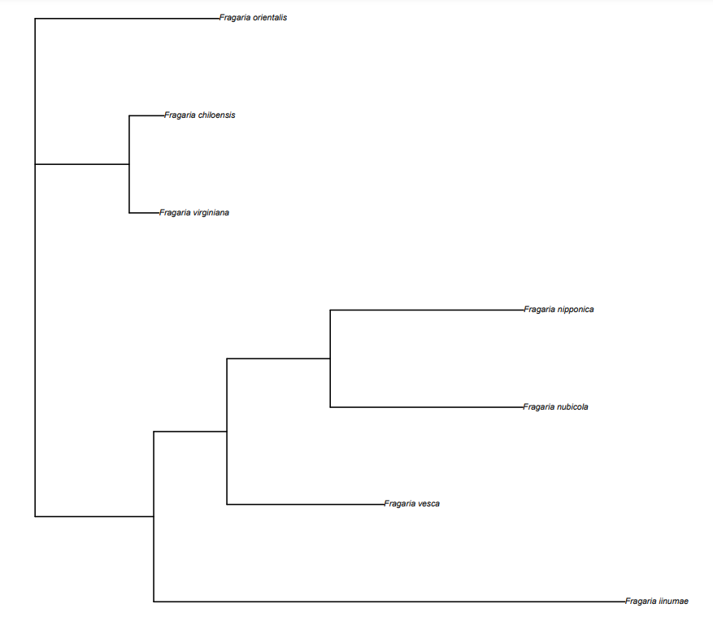

# OneTwoTree

**Avtorja**: Katja Resnik, Pia Špehar

**Datum predstavitve**: 2022-05-11

---
## Namen vaje
Uporabiti program za izris filogenetskega drevesa na podlagi taksonomskih imen oziroma identifikacijskih številk.

---
## Program

Program: **[OneTwoTree](http://onetwotree.tau.ac.il/index.htm)**

Avtorji programa: Michal Drori,Anna Rice,Moshe Einhorn,Ofer Chay,Lior Glick,Itay Mayrose; [Tel Aviv University](https://english.tau.ac.il/)

Reference:
- Drori M.; Rice A.; Einhorn M.; Chay O.; Glick L.; Mayrose I.(2018) **OneTwoTree: An online tool for phylogeny reconstruction.** *Molecular Ecology Resources* 1-8. [10.1111/1755-0998.12972](https://doi.org/10.1111/1755-0998.12927)

### Opis programa

OneTwoTree je spletno orodje, ki nam omogoča izris filogenetskega drevesa na podlagi vnesenih taksonomskih imen oz. taksonomskih identifikacijskih številk (TaxID). Na enkrat lahko vnesemo največ 10 000 takšnih podatkov, program pa nato sam poišče ustrezna DNA zaporedja, ki so objavljena v NCBI GenBank. Za čim hitrejše zbiranje potrebnih podatkov in njihovo obdelavo je program omejen in deluje le za taksonomska imena šestih skupin evkariontov, to so: sesalci, rastline, nevretenčarji, primati, glodavci in vretenčarji. Prav tako so zaporedja z enako TaxID, za katera velja več kot 98% identičnost, filtrirana, pri čemer program kot reprezentativno zaporedje izbere najdaljše med njimi.

Analiza DNA zaporedij privzeto poteka na nivoju vrste, kar lahko spremenimo na analizo glede na hibride, intraspecifične variance ali odprto nomenklaturo. Prav tako lahko specifično definiramo, glede na katero vrsto genoma želimo, da program zbere podatke o zaporedjih. Pri tem lahko izberemo med jedrnim, mitohondrijskim genomom ali genomom kloroplasta.

Poleg filogenetskega drevesa program izpiše tudi razvrstitev zaporedij v ortološke skupine – klastre. Razdelitev je narejena glede na poravnavo zaporedij, pri čemer morajo poravnane regije predstavljati vsaj 50 % vsakega zaporedja. Delež poravnanih regij glede na dolžino zaporedja lahko tudi poljubno ponastavimo. Prav tako lahko dodatno nastavimo željeno gostoto klastra s pomočjo inflacijskega parametra. Taksonomske identifikacijske številke z več kot 1000 zaporedij DNA so pri tem procesu izločene. Po končanem razvrščanju v klastre se le preveri kolikšna je podobnost takšnih zaporedij s tistim reprezentativnim iz klastra. Če je zadostna, program takšno zaporedje doda v klaster. Tako imenovane ITS  (Internal Transcribed Spacer) regije genoma se v klastre razvršča nekoliko drugače. Takšni sta zaporedji ITS1 in ITS2, ki imata precej podobno zaporedje, zato sta večkrat pomotoma razvrščena v isto skupino, kar lahko vodi do napačnih poravnav. Razvršča se jih posebej glede na prisotno eno, drugo ali pa obe obliki ITS.

Po končani analizi tako dobimo izrisano filogenetsko drevo in izpisano tabelo vseh najdenih klastrov, skupaj s podatki o tem, glede na kateri genom so bili oblikovani, kolikšna je povprečna dolžina vseh zaporedij, ki so del posameznega klastra in še mnoge druge dodatne informacije.

### Vhodni podatki

Taksonomska imena organizmov ali taksonomske identifikacijske številke (TaxID).

---
## Navodila

### Vhodni podatki

Kot vhodne podatke uporabite taksonomska imena in taksonomske identifikacijske številke za različne vrste jagod, ki so že pripravljena v priloženi datoteki - [podatki](https://github.com/mpavsic/biokeminfo/blob/main/biokeminfo/seminar/Vhodni_podatki.txt).

### Postopek dela

1.	Odpremo OneTwoTree.
2.	Izberemo možnost »filogenetska rekonstrukcija« (Phylogeny reconstruction).
3.	Vnesemo seznam izbranih taksonomskih imen oz. taksonomskih identifikacijskih številk v zato namenjeno okno.
4.	Ostale nastavitve pustimo privzete.
5.	V spodnja kvadratka vpišemo svoj elektronski naslov in, če želiš, ime svoje analize.
6.	Kliknemo »Submit« in počakamo na izpis podatkov ter izris filogenetskega drevesa.

### Pričakovani rezultati in razlaga

Pričakujemo, da nam bo program vrnil izrisano filogenetsko drevo. Pod filogenetskim drevesom se izpiše tudi tabela vseh najdenih klastrov.

Izris filogenetskega drevesa za naš primer:

Sliko drevesa lahko tudi naložimo v pdf obliki:

Drevo se ne izriše v primeru, ko kot vhodne podatke uporabimo taksonomska imena organizmov, ki ne spadajo v eno izmed šestih skupin evkariontov na katera je program OneTwoTree omejen.

