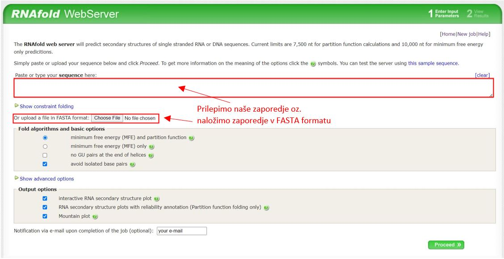
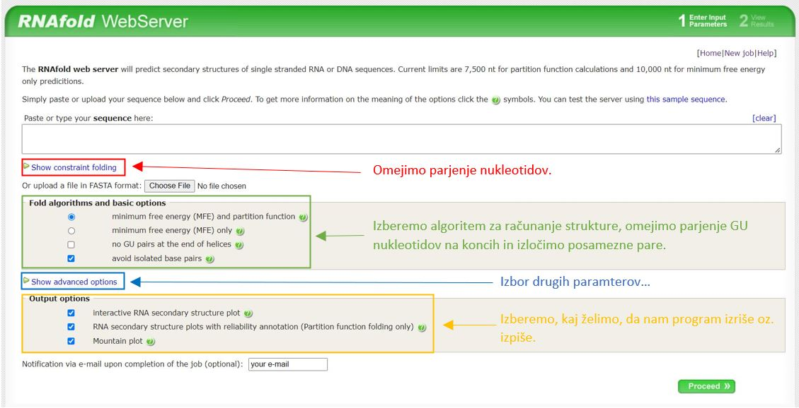
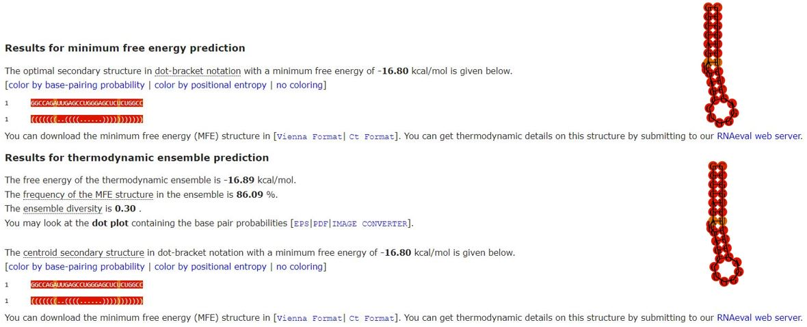
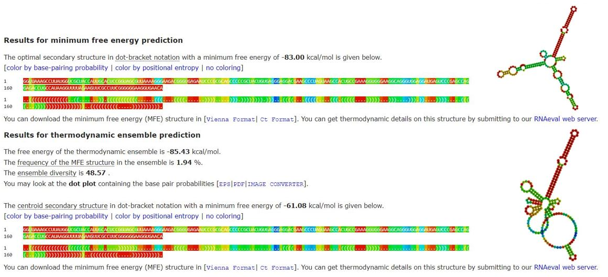

# RNAfold - napoved sekundarnih RNA struktur

**Avtorja**: Maj Priveršek, Metka Rus

**Datum predstavitve**: 2022-05-18

---
## Namen vaje
Ugotavljanje sekundarnih RNA struktur iz zaporedja nukleotidov s programom RNAfold

---
## Program
Program: **[RNAfold 2.5.0](http://rna.tbi.univie.ac.at/cgi-bin/RNAWebSuite/RNAfold.cgi)**

Avtorji programa: Gruber AR, Lorenz R, Bernhart SH, Neuböck R, Hofacker IL.; Institute of Theoretical Chemistry, University of Vienna (http://www.tbi.univie.ac.at/)

Reference:
- Lorenz, R. and Bernhart, S.H. and Höner zu Siederdissen, C. and Tafer, H. and Flamm, C. and Stadler, P.F. and Hofacker, I.L. \"ViennaRNA Package 2.0\", Algorithms for Molecular Biology, 6:1 page(s): 26, 2011 **The Vienna RNA Websuite.** *Nucleic Acids Research*, Volume 36, Issue suppl_2, 1 July 2008, Pages W70-W74, DOI: [10.1093/nar/gkn188](https://almob.biomedcentral.com/articles/10.1186/1748-7188-6-26)
- Mathews DH, Disney MD, Childs JL, Schroeder SJ, Zuker M, Turner DH. (2004) Incorporating chemical modification constraints into a dynamic programming algorithm for prediction of RNA secondary structure. Proc Natl Acad Sci U S A 101(19):7287-92, DOI: [101 (19) 7287-7292](ttps://doi.org/10.1073/pnas.0401799101)

### Opis programa

RNAfold je del obširnega serverja ViennaRNA Web Services, ki zajema mnoge različne načine za obdelavo in predvidevanje sekundarne strukture RNA in baze podatkov potrebne za njihovo delovanje.
RNAfold Server je sposoben oblikovati sekundarno strukturo RNA iz zaporednja RNA nukleotidov. Deluje na podlagi matematičnega algoritma za napovedovanje sekundarnih struktur RNA, ki so ga predstavili Zuker et al. Gre za model na podlagi energije različnih vrst zank, ki se pojavljajo v sekundarnih strukturah.

Algoritem za izračun oblike z najmanjšo energijo upošteva vse možne dovoljene oblike sekundarne strukture (vse oblike kjer je vsaka od baz vezana z maksimalno eno drugo bazo, vezi pa se med sabo ne križajo) in iz vseh teh izbere tisto z najmanjšo možno prosto energijo.
To naredi na podlagi različnih parametrov: topološka in termodinamska pravila (določena v prej objavljenih člankih), dostopni eksperimentalni podatki o termoninamiki različnih oblik in motivov, znani podatki o odzivnosti nukleotidnih parov na kemijske modifikacije, o tem katere fospodiesterske vezi so najprej na udaru pri hidrolizi, podatki o ohranjenih sekundarnih strukturah in specifičnih dovoljenih daljnosežnih interakcijah med nukleotidi.
Algoritem deluje na podlagi matematičnega modela, ki so ga predstavili že Nussinov et al., ki računa obliko z maksimalnim številom baznih parov. Algoritem je bil seveda prilagojen, da upošteva tudi vse prej naštete parametre.

Ker pa je RNA dinamična struktura, pa program podaja tudi energijo za ansamble vseh možnih dovoljenih struktur. Ansamble je set vseh sprejemljivih struktur RNA (pari se ne križajo in prekrivajo). Strukturni ansamble RNA ima Boltzmanovo porazdelitev, kjer je vrjetnost da se RNA nahaja v določeni obliki enaka enačbi  P=e^(-β*εp)/Z  . V zapisu Z predstavlja particijsko funkcijo  ali seštevek boltzmanovih funkcij za vse dovoljene oblike sekundarne strukture RNA. Cilj računanja je najti neko povprečno obliko v kateri se RNA nahaja, če vemo, da le-ta s časom spreminja svojo sekundarno obliko med vsemi možnimi dovoljenimi in je v določeni obliki delež časa proporcionalen s tem, kako energijsko ugodna je oblika.
Program poda tudi strukturo, ki predstavlja srednjo/povprečno strukturo vseh struktur termodinamskega ansambla izračunanih s particijsko funkcijo.

### Vhodni podatki

FASTA format RNA zaporedja ali samostojno RNA zaporedje

---
## Navodila

### Vhodni podatki

Vhodne podatke podamo v FASTA formatu, lahko pa tudi samo kot zaporedje nukelotidov.
•	nukleotidno zaporedje transaktivacijske domene virusa HIV
>1AKX_1|Chain A|TAR RNA|
GGCCAGAUUGAGCCUGGGAGCUCUCUGGCC

•	nukleotidno zaporedje fenilalanin t-RNA iz kvasovke
>1EHZ_1|Chain A|TRANSFER RNA (PHE)|Saccharomyces cerevisiae (4932)
GCGGAUUUAGCUCAGUUGGGAGAGCGCCAGACUGAAGAUCUGGAGGUCCUGUGUUCGAUCCACAGAAUUCGCACCA

•	nukleotidno zaporedje adenozilkobalamin RNA stikala
>4GMA_1|Chain A[auth Z]|Adenosylcobalamin riboswitch|Marine metagenome (408172)
GGUUAAAGCCUUAUGGUCGCUACCAUUGCACUCCGGUAGCGUUAAAAGGGAAGACGGGUGAGAAUCCCGCGCAGCCCCCGCUACUGUGAGGGAGGACGAAGCCCUAGUAAGCCACUGCCGAAAGGUGGGAAGGCAGGGUGGAGGAUGAGUCCCGAGCCAGGAGACCUGCCAUAAGGUUUUAGAAGUUCGCCUUCGGGGGGAAGGUGAACA

•	nukleotidno zaporedje iz 50S velike ribosomalne podenote iz Deinococcus radiodurans
>1P9X_1|Chain A[auth 0]|23S RIBOSOMAL RNA|Deinococcus radiodurans (1299)
GGUCAAGAUAGUAAGGGUCCACGGUGGAUGCCCUGGCGCUGGAGCCGAUGAAGGACGCGAUUACCUGCGAAAAGCCCCGACGAGCUGGAGAUACGCUUUGACUCGGGGAUGUCCGAAUGGGGAAACCCACCUCGUAAGAGGUAUCCGCAAGGAUGGGAACUCAGGGAACUGAAACAUCUCAGUACCUGAAGGAGAAGAAAGAGAAUUCGAUUCCGUUAGUAGCGGCGAGCGAACCCGGAUCAGCCCAAACCGAAACGCUUGCGUUUCGGGGUUGUAGGACCAGUUUUUAAGAUUCAACCCCUCAAGCCGAAGUGGCUGGAAAGCUACACCUCAGAAGGUGAGAGUCCUGUAGGCGAACGAGCGGUUGACUGUACUGGCACCUGAGUAGGUCGUUGUUCGUGAAACGAUGACUGAAUCCGCGCGGACCACCGCGCAAGGCUAAAUACUCCCAGUGACCGAUAGCGCAUAGUACCGUGAGGGAAAGGUGAAAAGAACCCCGGGAGGGGAGUGAAAGAGAACCUGAAACCGUGGACUUACAAGCAGUCAUGGCACCUUAUGCGUGUUAUGGCGUGCCUAUUGAAGCAUGAGCCGGCGACUUAGACCUGACGUGCGAGCUUAAGUUGAAAAACGGAGGCGGAGCGAAAGCGAGUCCGAAUAGGGCGGCAUUAGUACGUCGGGCUAGACUCGAAACCAGGUGAGCUAAGCAUGACCAGGUUGAAACCCCCGUGACAGGGGGCGGAGGACCGAACCGGUGCCUGCUGAAACAGUCUCGGAUGAGUUGUGUUUAGGAGUGAAAAGCUAACCGAACCUGGAGAUAGCUAGUUCUCCCCGAAAUGUAUUGAGGUACAGCCUCGGAUGUUGACCAUGUCCUGUAGAGCACUCACAAGGCUAGGGGGCCUACCAGCUUACCAAACCUUAUGAAACUCCGAAGGGGCACGCGUUUAGUCCGGGAGUGAGGCUGCGAGAGCUAACUUCCGUAGCCGAGAGGGAAACAACCCAGACCAUCAGCUAAGGUCCCUAAAUGAUCGCUCAGUGGUUAAGGAUGUGUCGUCGCAUAGACAGCCAGGAGGUUGGCUUAGAAGCAGCCACCCUUCAAAGAGUGCGUAAUAGCUCACUGGUCGAGUGACGAUGCGCCGAAAAUGAUCGGGGCUCAAGUGAUCUACCGAAGCUAUGGAUUCAACUCGCGAAGCGAGUUGUCUGGUAGGGGAGCGUUCAGUCCGCGGAGAAGCCAUACCGGAAGGAGUGGUGGAGCCGACUGAAGUGCGGAUGCCGGCAUGAGUAACGAUAAAAGAAGUGAGAAUCUUCUUCGCCGUAAGGACAAGGGUUCCUGGGGAAGGGUCGUCCGCCCAGGGAAAGUCGGGACCUAAGGUGAGGCCGAACGGCGCAGCCGAUGGACAGCAGGUCAAGAUUCCUGCACCGAUCAUGUGGAGUGAUGGAGGGACGCAUUACGCUAUCCAAUGCCAAGCUAUGGCUAUGCUGGUUGGUACGCUCAAGGGCGAUCGGGUCAGAAAAUCUACCGGUCACAUGCCUCAGACGUAUCGGGAGCUUCCUCGGAAGCGAAGUUGGAAACGCGACGGUGCCAAGAAAAGCUUCUAAACGUUGAAACAUGAUUGCCCGUACCGCAAACCGACACAGGUGUCCGAGUGUCAAUGCACUAAGGCGCGCGAGAGAACCCUCGUUAAGGAACUUUGCAAUCUCACCCCGUAACUUCGGAAGAAGGGGUCCCCACGCUUCGCGUGGGGCGCAGUGAAUAGGCCCAGGCGACUGUUUACCAAAAUCACAGCACUCUGCCAACACGAACAGUGGACGUAUAGGGUGUGACGCCUGCCCGGUGCCGGAAGGUCAAGUGGAGCGGUGCAAGCUGCGAAAUGAAGCCCCGGUGAACGGCGGCCGUAACUAUAACGGUCCUAAGGUAGCGAAAUUCCUUGUCGGGUAAGUUCCGACCUGCACGAAAGGCGUAACGAUCUGGGCGCUGUCUCAACGAGGGACUCGGUGAAAUUGAAUUGGCUGUAAAGAUGCGGCCUACCCGUAGCAGGACGAAAAGACCCCGUGGAGCUUUACUAUAGUCUGGCAUUGGGAUUCGGGUUUCUCUGCGUAGGAUAGGUGGGAGCCUGCGAAACUGGCCUUUUGGGGUCGGUGGAGGCAACGGUGAAAUACCACCCUGAGAAACUUGGAUUUCUAACCUGAAAAAUCACUUUCGGGGACCGUGCUUGGCGGGUAGUUUGACUGGGGCGGUCGCCUCCCAAAAUGUAACGGAGGCGCCCAAAGGUCACCUCAAGACGGUUGGAAAUCGUCUGUAGAGCGCAAAGGUAGAAGGUGGCUUGACUGCGAGACUGACACGUCGAGCAGGGAGGAAACUCGGGCUUAGUGAACCGGUGGUACCGUGUGGAAGGGCCAUCGAUCAACGGAUAAAAGUUACCCCGGGGAUAACAGGCUGAUCUCCCCCGAGAGUCCAUAUCGGCGGGGAGGUUUGGCACCUCGAUGUCGGCUCGUCGCAUCCUGGGGCUGAAGAAGGUCCCAAGGGUUGGGCUGUUCGCCCAUUAAAGCGGCACGCGAGCUGGGUUCAGAACGUCGUGAGACAGUUCGGUCUCUAUCCGCUACGGGCGCAGGAGAAUUGAGGGGAGUUGCUCCUAGUACGAGAGGACCGGAGUGAACGGACCGCUGGUCUCCCUGCUGUCGUACCAACGGCACAUGCAGGGUAGCUAUGUCCGGAACGGAUAACCGCUGAAAGCAUCUAAGCGGGAAGCCAGCCCCAAGAUGAGUUCUCCCACUGUUUAUCAGGUAAGACUCCCGGAAGACCACCGGGUUAAGAGGCCAGGCGUGCACGCAUAGCAAUGUGUUCAGCGGACUGGUGCUCAUCAGUCGAGGUCUUGACCACUC

### Postopek dela
•	v okence vpišemo vhodne podatke – RNA zaporedje, katerega sekundarna struktura nas zanima
•	po želji lahko nastavimo  različne parametre (npr. omejimo, kateri nukleotidi se parijo) – če ne vemo, kaj delamo, je najbolje parametre pustiti kot so
•	kliknemo "Proceed >>" in počakamo

•	program izpiše in izriše dve RNA strukturi – strukturo, ki jo je sestavil z računanjem najnižje proste energije in strukturo, ki predstavlja srednjo/povprečno strukturo vseh struktur termodinamskega ansambla izračunanih s particijsko funkcijo; če smo tako  izbrali, nam program poda še grafičen prikaz sekundarne strukture

### Pričakovani rezultati in razlaga
Za kratke odseke RNA lahko vidimo, da se strukturi ne razlikujeta bistveno (oz. se sploh ne razlikujeta), frekvenca strukture z najnižjo prosto energijo v termodinamskem ansamblu pa je relativno visoka. Posledično je majhna tudi pozicijska entropija.

Daljše kot je naše zaporedje, več različnih struktur lahko tvori. Strukturi se lahko precej razlikujeta, frekvenca strukture z najnižjo prosto energijo – in vseh drugih možnih struktur – pa limitira proti nič. Pozicijska entropija je visoka v delih, kjer je struktura najbolj fleksibilna.

