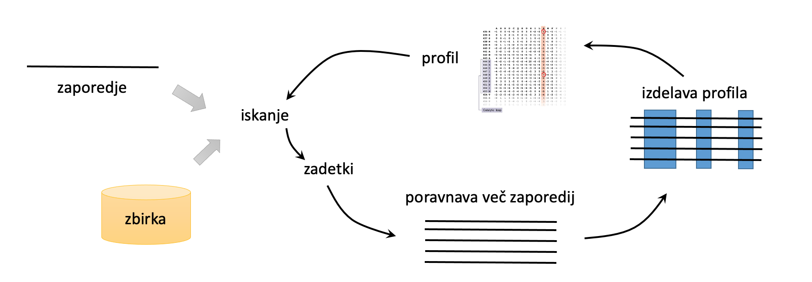

# Predloga

*V naslovu besedo "Predloga" zamenjajte s kratkim naslovom vašega seminarja – do 4 kratke besede, najbolje, da vsebuje kar naslov programa in eno ali dve ključni besedi. Tole besedilo seveda izbrišite.*

**Avtorja**: Ime in Priimek, Ime in Priimek

---
## Namen vaje
Tukaj v dveh do treh povedih navedite, kaj je bistvo vaje oz. kaj je tisto, kar se bodo vaši kolegi ob izvajanju naučili.

---
## Program

Program: **[ime in verzija programa, kot povezava](tukaj-navedete-povezavo)**

Avtorji programa: navedite avtorje programa ter institucijo, s katere prihajajo (pri insitutuciji navedite tudi spletno povezavo)

Reference:
- v obliki seznama navedite eno ali več referenc, povezanih s programom - gre za referenco/reference, običajno navedene na na spletni strani programa v kategoriji "Cite" ali kaj podobonega, torej gre za članke, ki opisujejo nastanek in delovanje programa ter bi se naj uporabljali pri citiranju v znanstveni literaturi, kjer se je ta program uporabljal
- reference oblikujte po zgledu spodaj
- Manalastas-Cantos, K.; Konarev, P.V.; Hajizadeh, N.R.; Kikhney, A.G.; Petoukhov, M.V.; Molodenskiy, D.S.; Panjkovich, A.; Mertens, H.D.T.; Gruzinov, A.; Borges, C.; et al. (2021) **ATSAS 3.0: Expanded Functionality and New Tools for Small-Angle Scattering Data Analysis.** *Journal of Applied Crystallograpy* 54, 343–355. [10.1107/S1600576720013412](https://doi.org/10.1107/S1600576720013412)

### Opis programa

Tukaj v enem ali več odstavkih opišite, kako program deluje, algoritem ipd. Te podatke najtede bodisi na spletni strani bodisi v članku, ki je naveden pri programu kot referenca.

Navedite tudi, za katere vhodne podatke je program primeren in za katere manj (npr. nekateri programi delujejo dobro na nukleotidnih zaporedjih vretenčarjev).

Uporabite lahko tudi kakšno sliko, npr. zaslonsko sliko, lahko tudi sami kaj narišete. Slika naj bo s formatu png ali jpg, pospremite pa jo z besedilom, po zgledu spodaj.

PSI-BLAST najprej poišče zaporedja iz izbrane zirke, ki so podobna iskalnemu zaporedju (*query sequence*), nato pa iz njih izračuna poravnavo več zaporedij oz. identificira, katera mesta v zaporedju so bolj ohranjena in katera manj. Na osnovi tega izdela pozicijsko uteženo matriko (profil), ki ga nato uporabi za izračun vrednosti poravnav pri ponovljenem iskanju po zbirki, kar je prikazano na spodnji shemi:

### Vhodni podatki

Navedite, kaj so vhodni podatki za program in v kakšni obliki morajo biti.

---
## Navodila

### Vhodni podatki

V obliki seznama navedite vhodne podatke, zgled je spodaj. Če gre za podatke iz drugih zbirk (npr. iz zbirke aminokislinskih zaporedij), jih navedite kot povezave na ustrezne zapise. Izogibajte se temu, da bodo morali kolegi podatke sami iskati po podatkovnih zbirkah, saj bo to bistveno zavleklo predstavitev.

Kot vhodne podatke uporabite (to je primer):
- aminokislinsko zaporedje človeškega grancima B (*granzyme B*, UniProt ID [P10144](https://www.uniprot.org/uniprot/P10144))
- nukleotidno zaporedje (mRNA) kodirajoče regije človeškega mucina 17 (GenBank ID [NM_001040105.2](https://www.ncbi.nlm.nih.gov/nuccore/NM_001040105.2)) – celotno zaporedje, ne zgolj CDS

*V skranjem primeru, če je potrebno vhodne podatke preoblikovati in bi to zahtevalo preveč časa, jih lahko navedete kar tukaj* (kot zaporedje, če gre za tak vhodni podatek, oz. kot povezavo do ustrezno poimenovane datoteke (glejte navodila za poimenovanje datotek)).

### Postopek dela

Tukaj opišite postopek dela, najbolje v obliki alinej ali oštevilčenih točk. Lahko vključite tudi kakšno zaslonsko sliko kjer dopišete oz. označite posamezna polja - podobno kot je to narejeno pri drugih vajah ([primer](../vaje/pubmed_web.md)).

Bodite pozorni, da v navodila vključite (vsaj najpomembnejše) nastavitve programa in jih ustrezno (kratko in jedrnato) razložite.

### Pričakovani rezultati in razlaga

Na kratko opišite pričakovane rezultate, lahko dodate tudi zaslonske slike. Podajte tudi razlago, kdaj program deluje dobro in kdaj rezultati niso realni.