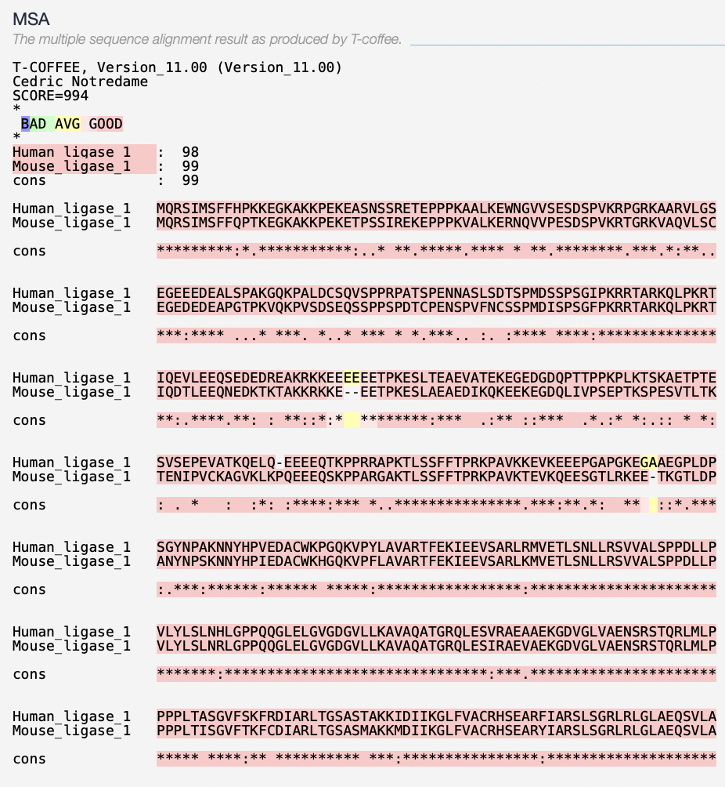
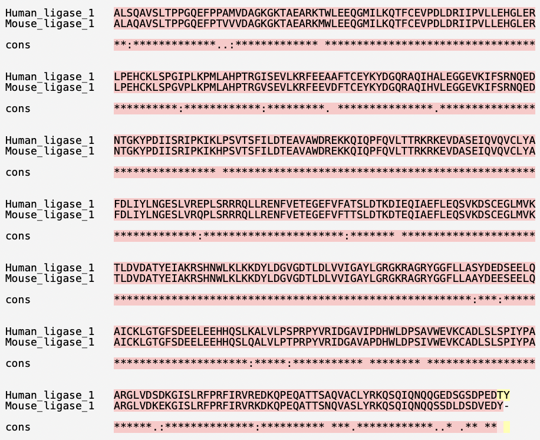
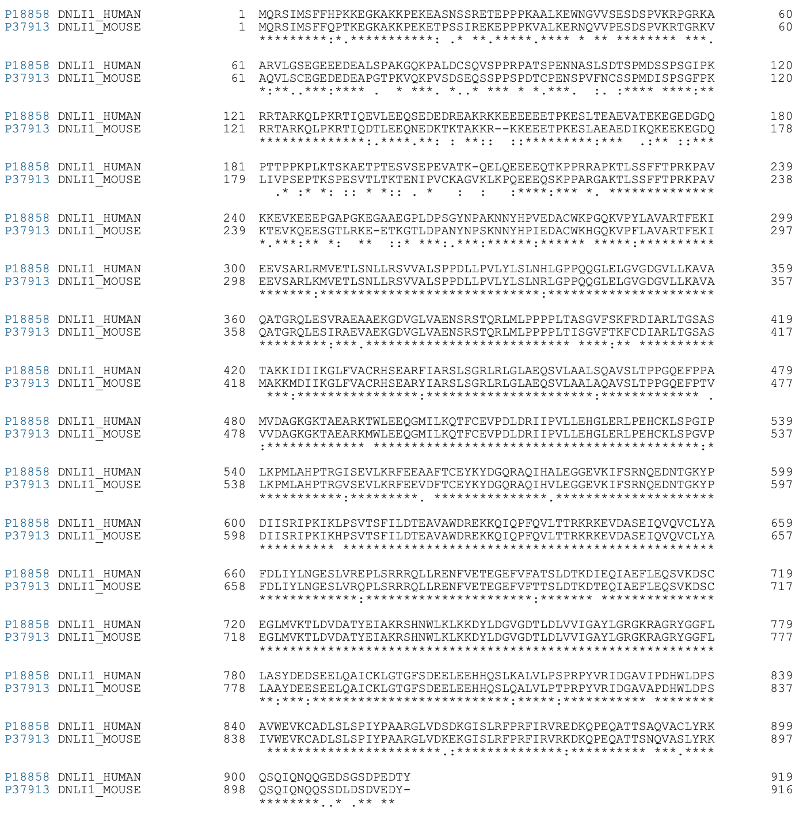
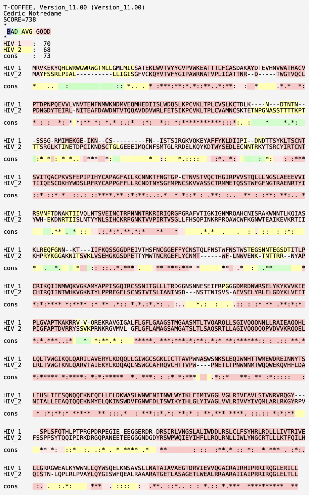
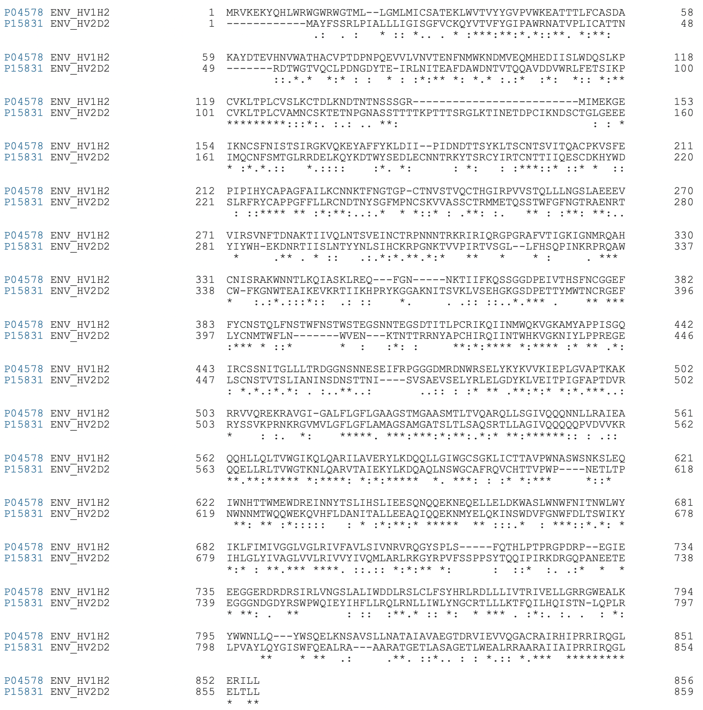

# M-coffee, poravnava zaporedij

**Avtorja**: Jan Kogovšek, Klara Razboršek

---
## Namen vaje
Spoznati se s spletnim orodjem M-Coffee. S pomočjo tega orodja poravnati različna zaporedja (aminokislinska in nukleotidna) in ugotoviti ustreznost poravnav.

---
## Program

Program: **[M-Coffee](https://tcoffee.crg.eu/apps/tcoffee/do:mcoffee)**

Avtorji programa: Dr. Cedric Notredame, [Center for Genomic Regulation (CRG)](https://www.crg.eu)

Reference:
- Notredame, C.; Higgins, D.; Heringa, J., **T-Coffee: A Novel Method for Fast and Accurate Multiple Sequence Alignment.** *Journal of Molecular Biology* 302, 205-217. [10.1006/jmbi.2000.4042](https://doi.org/10.1006/jmbi.2000.4042)

- **“Manual.”** https://petrov.stanford.edu/software/src/T-COFFEE_distribution_Version_5.65/doc/t_coffee_tutorial.htm#_Toc148261707 (pridobljeno dne Mar. 26, 2022).

### Opis programa

T-Coffee in njena pod-različica M-Coffee sta metodi za poravnavo več zaporedij. Algoritem temelji na ustvarjanju knjižnice poravnav, v kateri ima vsaka poravnava neko pripisano težo. Končna poravnava je sestavljena iz delčkov teh večih poravnav, ki daje največjo vsoto teže. 

Proces ustvarjanja poravnave s T-Coffee se začne z generiranjem dveh knjižnic: s pomočjo ClustalW se ustvari knjižnica vseh možnih globalnih poravnav, s pomočjo Lalign pa knjižnica vseh lokalnih poravnav. Vsaki izmed teh poravnav se pripiše njena teža. Nato se ustvari tako-imenovana razširjena knjižnica, v kateri poravnamo vse globalne poravnave z vsemi lokalnimi in obratno. Šele ko je program ustvaril to razširjeno knjižnico začne ustvarjati optimalno poravnavo našega zaporedja, ki bo imel, glede na vsoto posameznih delov, največjo težo.

M-Coffee združuje več metod, ki ustvarjajo skupno knjižnico in s tem ustvarijo boljše poravnave. Uporablja se tako za poravnave nukleotidnih, kot tudi aminokislinskih zaporedij.

### Vhodni podatki

Vhodni podatki so lahko aminokislinska ali nukleotidna zaporedja, pomembno je le, da so ta v FASTA formatu. Lahko jih vpišemo ločeno v program, lahko pa jih vpišemo v beležnico (windows) oz. texteditor (macOS) ter datoteko naložimo v program.

---
## Navodila

### Vhodni podatki

Kot vhodne podatke uporabite:
- aminokislinsko zaporedje človeške ligaze 1 (*human ligase 1*, UniProt ID [P18858](https://www.uniprot.org/uniprot/P18858))
- aminokislinsko zaporedje mišje ligaze 1 (*mouse ligase 1*, UniProt ID [P37913](https://www.uniprot.org/uniprot/P37913))

- aminokislinsko zaporedje glikoproteina gp160 virusa HIV 1 (*HIV 1*, UniProt ID [P04578](https://www.uniprot.org/uniprot/P04578))
- aminokislinsko zaporedje glikoproteina gp160 virusa HIV 2 (*HIV 2*, UniProt ID [P15831](https://www.uniprot.org/uniprot/P15831))

### Postopek dela

1. Odpremo [M-Coffee](https://tcoffee.crg.eu/apps/tcoffee/do:mcoffee)
2. Na [UniProt-u](https://www.uniprot.org) poiščemo aminokislinsko zaporedje proteinov podanih v vhodnih podatkih
3. Zaporedje parov lahko prekopiramo direktno v M-Coffee ali pa ga shranimo na računalnik v beležnico (windows) oz. texteditor (macOS) ter to datoteko naložimo v program.
4. Stisnemo submit in počakamo na reyultate.
5. Poženemo tudi poravnavo v Uniprotu-u, kjer poravnavo izvede Clustal Omega.
6. Enak postopek ponovimo tudi za naslednji par.

### Pričakovani rezultati in razlaga

- Zaslonski sliki prikazujeta rezultat poravnave v programu M-Coffee, kjer vidimo visoko ujemanje zaporedij, kar nakazuje na homolognost proteinov.

- Slika prikazuje poravnavo zaporedja s Clustal Omega, kjer opazimo, da se dobro ujema s poravnavo v M-Coffee, zato sklepamo, da je program natančno poravnal aminokislinsko zaporedje.

- Pri primerjavi glikoproteina gp160 virusne ovojnice virusa HIV 1 in 2 opazimo, da se ne ujemata v celoti, hkrati pa po primerjavi s Clustal Omega poravnavo opazimo, da je celotna poravnava drugačna, saj M-Coffee poravna na začetku brez vrzeli, medtem ko Clustal Omega na začetku pri HIV 2 vstavi vrzeli.

- Slika je poravnava v programu Clustal Omega

Iz rezultatov lahko sklepamo, da  M-Coffee bolje poravna homologna zaporedja, kot zaporedja, kjer so si vrste bolj oddaljene (primer HIV 1 in HIV 2). To se tudi sklada s komentarjem razvijalcev programa, ki so sami napovedali, da je orodje bolj primerno za primerjavo homolognih zaporedij.