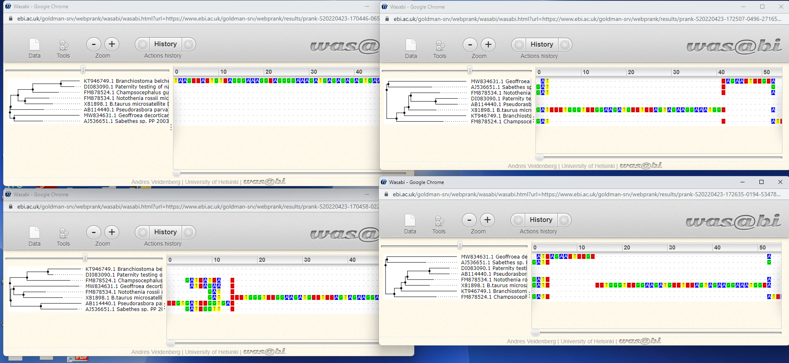

# webPRANK

**Avtorja**: Klara Ažbe, Ema Kavčič

**Datum predstavitve**: 2022-04-28

---
## Namen vaje
Pri poravnavi več zaporedij lahko razlikujemo med insercijami in delecijami. Programi, ki uporabljajo hevristične metode pri poravnavah, ne upoštevajo filogenetskega drevesa in velikokrat kopičijo vrzeli na enem mestu. webPRANK pri filogenetski poravnavi upošteva filogenetsko drevo in razlikuje med insercijami in delecijami. 

---
## Program

Program: **[webPRANK](https://www.ebi.ac.uk/goldman-srv/webprank/)**

Avtorji programa:Ari Löytynoja, [University of Helsinki](https://www.helsinki.fi/en), Nick Goldman [EMBL's European Bioinformatics Institute](https://www.ebi.ac.uk/)

Reference:
-Löytynoja, A.; Goldman, N. (2005) **An algorithm for progressive multiple alignment of sequences with insertions.** *Proceedings of the National Academy of Sciences of the United States of America* 102(30):10557-10562 [10.1073/pnas.0409137102](https://www.pnas.org/doi/full/10.1073/pnas.0409137102)
-Löytynoja, A.; Goldman, N. (2010) **webPRANK: a phylogeny-aware multiple sequence aligner with interactive alignment browser.** *BMC Bioinformatics* 11:579 [10.1186/1471-2105-11-579 ](https://bmcbioinformatics.biomedcentral.com/articles/10.1186/1471-2105-11-579)

### Opis programa

Program webPRANK je orodje za poravnavo več zaporedij, ki kot osnovo uporablja skriti model Markova. Za razliko od večine drugih programov ta program ne uporablja hevristične metode, vrzeli pa loči na insercije in delecije. Za poravnavo uporablja vodilno drevo (guide tree), ki ga lahko podamo, ali pa ga program izračuna sam s pomočjo metode NJ(združevanje sosedov). V primeru, da vodilno drevo podamo v naprej, se morajo imena v drevesu in imena sekvenc natančno ujemati. Program nato dolžine vej upošteva pri izračunu substitucijske matrike.
Poravnavo naredi petkrat, vsakič pa potem glede na poravnavo popravi vodilno drevo. Na koncu izpiše poravnavo z najvišjo vrednostjo. Rezultat lahko prenesemo v različnih formatih: XSAML (vsebuje vse podatke analize in omogoča kasnejšo analizno rezultatov), FASTA, PHYLIP, PAML, NEXUS. 

### Vhodni podatki

webPRANK kot vhodne podatke sprejme DNA, kodonska in aminokislinska zaporedija v formatu FASTA.

---
## Navodila

### Vhodni podatki
1. primer:
[Amilaza](https://github.com/mpavsic/biokeminfo/blob/main/biokeminfo/seminar/s10-webprank-vhod1.txt) aminokislinska zaporedja za protein amilazo različnih organizmov v FASTA formatu
2. primer:
[Mikrosatelitne DNA](https://github.com/mpavsic/biokeminfo/blob/main/biokeminfo/seminar/s10-webprank-vhod2.txt) zaporedja mikrosatelitne DNA

### Postopek dela

1. Odpremo [webPRANK](https://www.ebi.ac.uk/goldman-srv/webprank/) 
2. V okno prilepimo aminokislinska zaporedja v FASTA formatu ali naložimo datoteko z AK zaporedji v FASTA formatu. Paziti je potrebno, da se organizmi imenujejo različno oz. da za znakom »>« ne sledi vedno »sp«, kot to vedno sledi pri datotekah naloženih iz UniProt-a.
3. Nastavitev ni potrebno spreminjati, po želji pa lahko v zavihku »basic alignment options« dodamo vodilno drevo. 
4. Če želimo, da nam program izpiše tudi zaporedja prednikov, v zavihku »advanced alignment options« izberemo opcijo »output ancestral sequences«.
5. V posameznem zavihku lahko kliknemo na »More information«, da dobimo razlago parametrov, ki jih lahko spreminjamo.
6. Pritisnemo »start alignment« in počakamo nekaj minut na rezultate poravnave, saj program ni najhitrejši. Ko čakamo na končni rezultat, imamo pred sabo na ekranu izpisan ID našega dela, ki si ga lahko shranimo in kasneje spet uporabimo tako, da v okence »retrieve finished job« prilepimo shranjeni ID.
7. Ko se poravnava izvede do konca, pritisnemo »alignment« in odpre se nam nov zavihek s poravnavo in filogenetskim drevesom.
8. Poravnavo si lahko prenesemo kot datoteko v različnih formatih (PRANK HSAML, FASTA, Nexus …) 

### Pričakovani rezultati in razlaga

1. primer

Kot je razvidno iz zgornje slike, v tem primeru webPRANK deluje pravilno, saj je izrisano filogenetsko drevo smiselno. Daljša kot je črta, manj sta si organizma med sabo evolucijsko sorodna. Riž (oryza sativa) in gliva zraščenka (grifola frondosa) se nahajata vsak posebej na vrhu, mikroorganizem symbiodinium microadriaticum pa posebej na dnu filogenetskega drevesa. Vsi trije organizmi so od drugih ločeni z dolgimi črtami, ki izhajajo iz skupnega vozlišča, kar pomeni, da so evolucijsko precej različni med sabo in od ostalih organizmov, ki so bolj »na kupu« na sredini filogentskega drevesa. Organizmi na sredini filogenetskega drevesa so v tem primeru živali, ki so med sabo ločene s krajšimi črtami in so si evolucijsko bolj sorodne. Na primer miš in podgana se nahajata najbolj skupaj in sta ločeni z najkrajšimi črtami, kar še enkrat nakazuje na njuno bližnjo sorodnost in na pravilnost izvedbe poravnave.
(Do poravnave na sliki lahko dostopate preko povezave [Rezultat1](https://www.ebi.ac.uk/goldman-srv/webprank/results/prank-S20220423-160515-0729-65112038-p1m.html)

2. primer

Mikrosatelitna DNA je del DNA, kjer se kratek motiv (6 ali več baz) ponovi 5-50-krat. Ta del je podvržen mutacijam. Tako je možno, da se zgodi več neodvisnih delecij, ki pa jih algoritem poravna tako, da se prekrivajo. Obstaja več različnih možnosti, kako program zamakne zaporedja.
(Do poravnav na slikah lahko dostopate preko povezav: [levo zgoraj](https://www.ebi.ac.uk/goldman-srv/webprank/results/prank-S20220423-170446-0654-38827629-p2m.html), [levo spodaj](https://www.ebi.ac.uk/goldman-srv/webprank/results/prank-S20220423-170458-0226-25294347-p2m.html), [desno zgoraj](https://www.ebi.ac.uk/goldman-srv/webprank/results/prank-S20220423-172507-0496-27165156-p2m.html), [desno spodaj](https://www.ebi.ac.uk/goldman-srv/webprank/results/prank-S20220423-172635-0194-53478270-p1m.html))