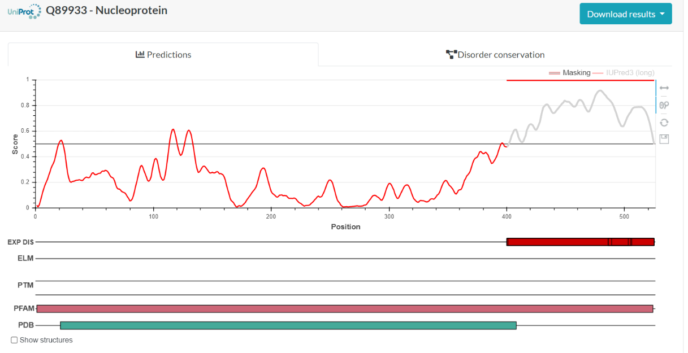
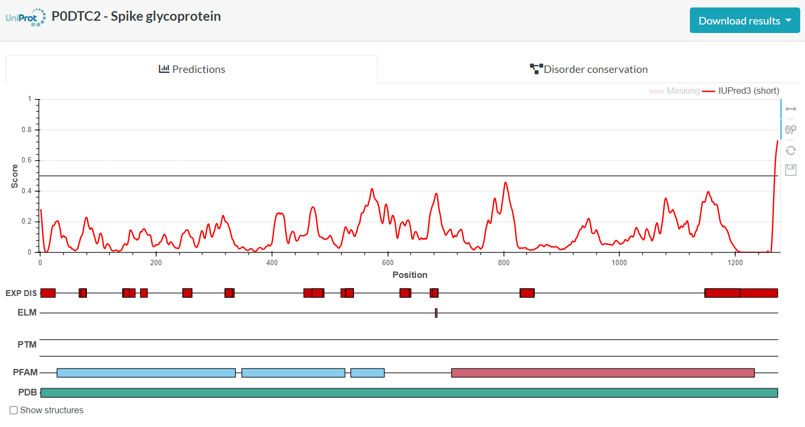

# IUPred3

**Avtorja**: Ana Marija Kodra, Neža Lanišek

**Datum predstavitve**: 2022-05-11

---
## Namen vaje
Spoznati spletno orodje IUPred3. S pomočjo tega orodja napovedati neurejene regije v proteinih in primerjati rezultate z eksperimentalnimi podatki.

---
## Program

Program: **[IUPred3](https://iupred3.elte.hu/)**

Avtorji programa: Gábor Erdős, Mátyás Pajkos, Zsuzsanna Dosztányi; [Eötvös Loránd University](https://www.elte.hu/en/)

Reference:
* Erdős, G.; Pajkos, M.; Dosztányi, Z. (2021) **IUPred3: prediction of protein disorder enhanced with unambiguous experimental annotation and visualization of evolutionary conservation.** *Nucleic Acids Res.* 49, 297–303. [10.1093/nar/gkab408](https://doi.org/10.1093/nar/gkab408)
* Dosztányi, Z. (2017) **Prediction of protein disorder based on IUPred.** *Protein Sci.* 27, 331–340. [10.1002/pro.3334](https://doi.org/10.1002/pro.3334)
* Dosztányi, Z.; Csizmók, V.; Tompa, P.; Simon, I. (2005) **The pairwise energy content estimated from amino acid composition discriminates between folded and intrinsically unstructured proteins.** *J. Mol. Biol.* 347, 827–839. [10.1016/j.jmb.2005.01.071](https://doi.org/10.1016/j.jmb.2005.01.071)

### Opis programa

Neurejene regije (IDPR; *intrinsically disordered protein region*) so regije v proteinih, ki nimajo ene same dobro definirane strukture, temveč lahko zavzamejo različna konformacijska stanja. Prisotne so v proteomu vseh organizmov, najbolj pa so razširjene pri evkariontih. Neurejene regije imajo pomembno funkcionalno vlogo pri mnogih celičnih procesih, predvsem pri signalizaciji in regulaciji celic, in so povezane z različnimi boleznimi. Sodelujejo tudi pri povezovanju različnih domen, sestavljanju makromolekularnih kompleksov in organizaciji nekaterih organelov. Nekatere neurejene regije proteinov lahko zavzamejo tudi urejeno strukturo – to lahko povzroči sprememba v redoks potencialu ali pa prisotnost urejene regije, s katero se neurejena regija poveže in tako tudi sama zavzame urejeno strukturo.

IUPred3 je program, ki združuje napoved neurejenih regij v proteinih z orodjem IUPred2 in napoved neurejenih vezavnih regij z orodjem ANCHOR2. Program pa lahko identificira tudi neurejene regije, ki pod določenimi pogoji lahko zavzamejo urejeno strukturo. Program je primeren za vse vhodne podatke, podane v pravi obliki, in ne glede na organizem, iz katerega prihaja protein, deluje enako.

IUPred3 temelji na metodi, ki oceni energijo interakcije med aminokislinskimi ostanki. Na podlagi znanih struktur globularnih proteinov se z uporabo interakcijske matrike, ki prikazuje parni statistični potencial, vsakemu aminokislinskemu ostanku dodeli vrednost energije na podlagi stikov, ki jih vzpostavi z drugimi aminokislinskimi ostanki v strukturi. Energije so ocenjene iz aminokislinskega zaporedja z uporabo matrike za oceno energije velikosti 20 × 20. Parametri v tej matriki so izračunani z metodo najmanjših kvadratov. Ocena energije interakcije je torej odvisna od vrste aminokislinskega ostanka in njegovih bližnjih sosedov. Osnovna predpostavka tega pristopa je, da so aminokislinski ostanki z ugodnimi energijami del urejene regije, medtem ko so aminokislinski ostanki z neugodnimi energijami del neurejene regije. Na koncu program ocenjeno vrednost energije interakcije pretvori v vrednost med 0 in 1. Za aminokislinske ostanke, ki jim program napove vrednost nad 0,5, je torej bolj verjetno, da so del neurejene regije, medtem ko je za aminokislinske ostanke, ki jim program napove vrednost pod 0,5, bolj verjetno, da so del urejene regije.

### Vhodni podatki

Kot vhodne podatke se v program lahko vnese *accession code* ali ID proteina iz UniProt-a, lahko pa se vnese aminokislinsko zaporedje v FASTA formatu ali naloži datoteka v FASTA formatu.

---
## Navodila

### Vhodni podatki

Kot vhodne podatke uporabite:
* aminokislinsko zaporedje nukleoproteina iz ošpic seva Edmonston B (*nucleoprotein*, UniProt ID [Q89933](https://www.uniprot.org/uniprot/Q89933))
* aminokislinsko zaporedje spike glikoproteina virusa SARS-CoV-2 (*spike glycoprotein*, UniProt ID [P0DTC2](https://www.uniprot.org/uniprot/P0DTC2))

### Postopek dela

1. Odprite spletno orodje [IUPred3](https://iupred3.elte.hu/).
2. Vnesite kodo zapisa  nukleoproteina (Q89933) in pod vrsto analize izberite možnost "IUPred3 long disorder".
3. Poženite program in okno z rezultati pustite odprto.
4. V novem oknu ponovno odprite [IUPred3](https://iupred3.elte.hu/).
5. Vnesite kodo zapisa spike glikoproteina (P0DTC2) in pod vrsto analize izberite možnost "IUPred3 short disorder".

### Pričakovani rezultati in razlaga

Rezultat program izriše v obliki grafa, pri katerem se na x osi nahaja zaporedna številka aminokislinskega ostanka v izbranem proteinu, na y osi pa je podana verjetnost za obstoj neurejene regije. Če protein analiziramo z vnosom kode zapisa, dobimo pod grafom podatke o strukturi proteina iz nekaterih drugih zbirk. Ena izmed takih zbirk je DisProt, ki vsebuje podatke o neurejenih regijah v proteinih.

Za nukleoprotein opazimo, da IUPred3 predvidi eno neurejeno regijo, ki se nahaja na C-koncu. Rezultat se ujema s podatki iz zbirke DisProt.
  

Za spike glikoprotein je v zbirki DisProt označenih več kratkih neurejenih regij tekom celotne dolžine proteina. IUPred3 ne predvidi niti ene izmed teh regij.

