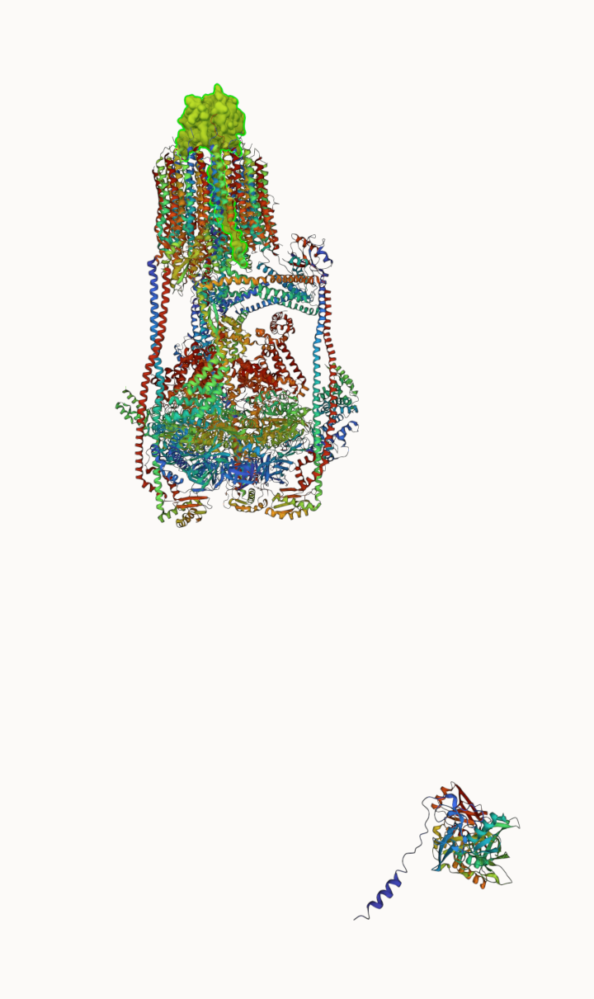

# Molstar

**Avtorja**: Vanja Ivošević

**Datum predstavitve**: 2022-05-18

---
## Namen vaje
Spoznati spletno ordje Molstar Viewer ter v tem orodju ogledati strukture kompleksnih makromolekul.

---
## Program

Program: **[Molstar](https://molstar.org/)**

Avtorji programa: David Sehnal, Sebastian Bittrich, Mandar Deshpande, Radka Svobodová, Karel Berka, Václav Bazgier, Sameer Velankar, Stephen K Burley, Jaroslav Koča, Alexander S Rose

Reference:
-  David Sehnal, Sebastian Bittrich, Mandar Deshpande, Radka Svobodová, Karel Berka, Václav Bazgier, Sameer Velankar, Stephen K Burley, Jaroslav Koča, Alexander S Rose: Mol* Viewer: modern web app for 3D visualization and analysis of large biomolecular structures, Nucleic Acids Research, 2021; 10.1093/nar/gkab31.

### Opis programa

Kompleksne biomolekularne strukture, kot so razni dinamični proteinski sklopi, membranski kompleksi, arhitektura genomov ali pa celotni organeli celic, eksperimentalno se določajo najbolj pogosto s tehnikami kot so kristalografija, elektronska mikroskopija, jedrna magnetna rezonanca in ostale. Te eksperimentalne podatke spletna orodja analizirajo ter vizualizirajo, ampak v zadnjih časih zaradi množičnih odkritij različnih biomolekularnih kompleksov postaja vse večji izziv razviti programska orodja, ki lahko te eksperimentalne podatke vizualizirajo, analizirajo ter z njimi ravnajo. Spletne strani postajajo vse bolj popularne za omenjene naloge zaradi večje praktičnosti.
Ena od teh spletnih strani je Molstar. Vloga Molstar-ja je omogočiti molekularno vizualizacijo in analizo ter zagotavljanje raznih orodij in storitev pomembnih za strukturne biologe in strukturne bioinformatike kot so na primer: prikazovanje eksperimentalnih podatkov, davanje raznih pripomb za makromolekularne komplekse v biološkem kontekstu etc. Molstar lahko vizualizira veliko bolj kompleksne molekularne strukture kot ostala dostopna spletna orodja, to je zlo pomembno, ker se s pomočjo Molstara lahko dobi prikaz struktur ribosomov, ovojnic raznih virusov in ostalih biološko pomembnih struktur. Uz sam prikaz, Molstar ponuja širok izbor storitev, s katerimi lahko ravnamo z prikazanimi strukturami kot so: različne opcije spreminjanja prikaza, njegove kvalitete in dizajna, prikaz aminokislinskega zaporedja ter orodja za fokusiranje na določene dele makrostruktur ter označevanje in ravnanje z temi fokusiranimi deli. Omogoča tudi geometrijske mertive kot so razdalja ali koti med atomi in vezmi ter njihovo označevanje, omogočena je tudi izdelava različnih 3D animacij, npr rotacije ter različne tranzicije. Velja še omeniti, da se v Molstaru tudi lahko prikažejo in urejajo veliko bolj manjše molekule.

### Vhodni podatki

PDB koda, PubChem koda (ponavadi za manjše molekule, ne nujno proteine), UniProt pristopna koda,…

---
## Navodila

### Vhodni podatki

Za vhodne podatke uporabimo:
-Struktura ATP sintaza pri ljudeh (UniProt ID: 6WM4)
-Struktura serinske peptidaze 4 (AlphaFold AC: A0A0A0MPH1)

### Postopek dela

1. Odpreti spletno orodje Molstar ter klinuti na Open Mol* Viewer.
2. Za uvajanje encima ATP sintaze se pod Source navede PDB in vpiše PDB kodo 6WM4, za uvajanje strukture encima serinske peptidaze 4 se pod Source navede AlfaFold DB in vpiše koda A0A0A0MPH1.
3. Če obstajajo prikazi molekul vode, v delu zaslona na desno- Nadzorna plošča (Control Panel) se pod sekcijo Components klikne simbol koša za smeti da se molekule vode zbrišejo.
4. Pod Polymer sekcijo se odabere Set Coloring -> Residue Property -> Sequence id da se proteinske verige v kompleksih obarvajo v mavričnem spektru.
5. V desnem delu zaslona (Toggle Menu) se klikne na znak kurzoja ter se pri vrhu zaslona pojavi nekolikor okencev, v tistem, ki je najbolj na levo, se odabere opcija Chain. Potem se v delu nad zaslonom (Sequence Panel) v smeri desno od dela kje piše “Sequence of” klikne na 6WM4-> Chain-> 4: V-type proton ATPase subunit G 1-> D (auth M) ter z kurzorjem označimo aminokislinsko zaporedje odabranega dela kompleksa. Po koncu tega se klikne na znakec čopiča ter se odabere želena barva za barvanje označenega dela, še za konec se klikne Apply Theme.
6. Vstopi se v Selection mode, razpon izbire se spremeni v Chain, na zaslonu se odabere kakršna koli veriga ter se klikne na znakec kocke, potem se klikne Create Component. Izstopi se iz Selection mode-a. V nadzorni plošči (Control Panel) desno od zaslona se pod sekcijo Components pojavi ta nova komponenta pod imenom Custom Selection. Klikne se na tri pike desno od imena ter se odabere Add Representation-> Gaussian Surface
7. V Toggle Menu-ju se klikne na znakec zaklopa kemere ter se klikne na Download.
8. Po shranjevanju slike strukture se v Nadzorni plošči klikne na Export Animation kjer se odabere preferenčna hitrost ter trajanje animacije pa potem spet na znakec zaklopa kamere, kje se odabere željena rezolucija ter se Auto-crop ugasne. Pod Export Animation se klikne Render in počaka. Ko se konča se odabere opcija Save Animation. 

### Pričakovani rezultati in razlaga

Shranjena je slika, na kateri je posebna proteinska veriga kompleksa ATP sintaze obarvana v eno barvo, dokler so ostale verige obarvane v mavričnem spektru. Druga veriga je klasificirana kot zasebna komponenta ter je prikazana v drugačnem dizajnu, prikazana je njena Gaussova površina. 
