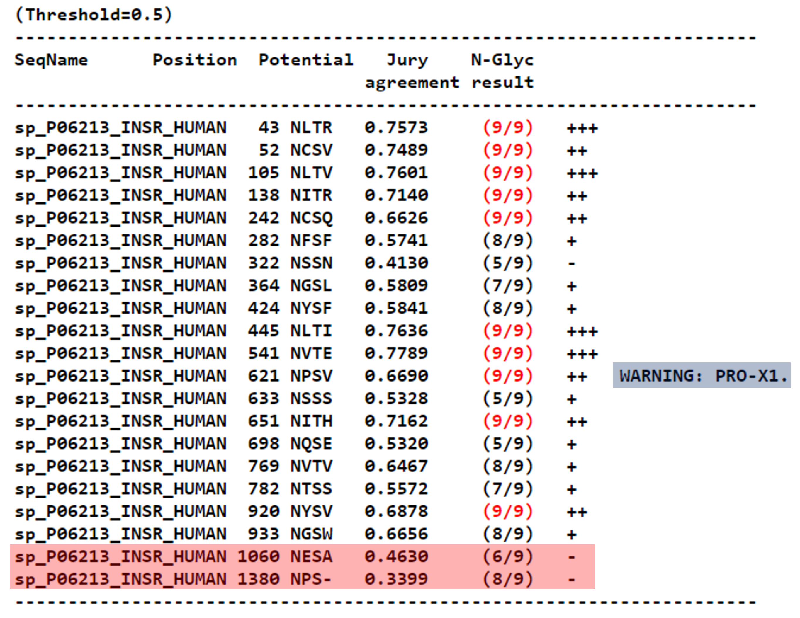
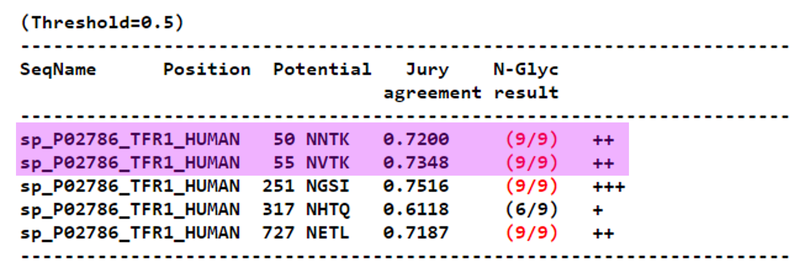

# NetNGlyc - N-glikozilacija človeških proteinov

**Avtorja:** Teja Spruk, Urša Štefan

**Datum predstavitve:** 2022-04-20

---

## Namen vaje

Ugotavljanje N-glikozilacije proteinov velja za enega izmed zahtevnejših in dolgotrajnejših eksperimentalnih postopkov, zato programi za napoved N-glikozilacijskih mest močno olajšajo delo biokemikov in molekularnih biologov. Naučili se bomo uporabljati program NetNGlyc, ki na podlagi anotiranih človeških proteinov iz UniProt-a z določeno stopnjo verjetnosti napove mesta N-glikozilacije podanih aminokislinskih zaporedij.

---

## Program

Program: **[NetNGlyc - 1.0](https://services.healthtech.dtu.dk/service.php?NetNGlyc-1.0)**

Avtorji programa: Gupta R, Brunak S. - [DTU Health Tech](https://www.healthtech.dtu.dk/english)

Reference:

- Gupta R, Brunak S. (2002) **Prediction of glycosylation across the human proteome and the correlation to protein function.** *Pacific Symposium on Biocomputing 2002:310-22.* PMID: 11928486.

### Opis programa

Glikozilacija vpliva na fizikalne in kemijske lastnosti proteinov, in sicer na njihovo proteolitično odpornost, topnost, stabilnost, lokalno strukturo, življenjsko dobo in imunogenost. Poznamo dve vrsti glikozilacije: N- in O-glikozilacijo.

Program NetNGlyc napoveduje mesta N-glikozilacije. To je kotranslacijski proces, ki se začenja v endoplazmatskem retikulumu in ima vpliv na zvijanje proteinov. Pri tem se na asparaginski ostanek veže oligosaharid GlcNac2Man9Glc3.

Pogoj za N-glikozilacijo je, da je asparagin, na katerega se vežejo ogljikovi hidrati, del sekvona Asn-Xaa-Ser/Thr. Prisotnost takega zaporedja pa ni nujno dovolj, da je dotični asparagin modificiran.

Program preverja, če ima vnešeni protein ustrezno signalno zaporedje, ker N-glikozilacija poteka le na membranskih oziroma sekrecijskih proteinih. Prav tako upošteva dejstvo, da je N-glikozilacija najpogostejša bližje N-koncu proteina, in sicer 12-14 aminokislinskih ostankov stran. Bližje kot smo C-koncu, manjša je verjetnost glikozilacije - 60 aminokislinskih ostankov stran pa glikozilacija skorajda ne obstaja.

Program obdela vhodne podatke z uporabo devetih različnih nevronskih mrež. Nevronska mreža predstavlja skupek algoritmov, ki je bil osnovan na podobnosti s človeškimi možgani, in je namenjen predvsem prepoznavi vzorcev. Da nevronska mreža deluje, jo je sprva potrebno na zadostnem številu primerov naučiti, kakšni so pričakovani rezultati ob danih znanih vhodnih podatkih. Naučeno pa nato uporabi za analizo neznanih vhodnih podatkov.

### Vhodni podatki in rezultati

Kot vhodne podatke v program vnesemo *accession code* iz UniProt-a ali FASTA zaporedje proteina. Program je namenjen uporabi na človeških proteinih.

---

## Navodila

Za uporabo programa na željenem proteinu moramo najprej pridobiti njegovo aminokislinsko zaporedje v FASTA formatu ali kodo Swiss-Prot ID/AC. Najpreprosteje je protein poiskati v [UniProt-u](https://www.uniprot.org/).

Kot vhodne podatke uporabite:


- **[INSR_HUMAN](https://www.uniprot.org/uniprot/P06213)**
```
>sp|P06213|INSR_HUMAN Insulin receptor OS=Homo sapiens OX=9606 GN=INSR PE=1 SV=4
MATGGRRGAAAAPLLVAVAALLLGAAGHLYPGEVCPGMDIRNNLTRLHELENCSVIEGHL
QILLMFKTRPEDFRDLSFPKLIMITDYLLLFRVYGLESLKDLFPNLTVIRGSRLFFNYAL
VIFEMVHLKELGLYNLMNITRGSVRIEKNNELCYLATIDWSRILDSVEDNYIVLNKDDNE
ECGDICPGTAKGKTNCPATVINGQFVERCWTHSHCQKVCPTICKSHGCTAEGLCCHSECL
GNCSQPDDPTKCVACRNFYLDGRCVETCPPPYYHFQDWRCVNFSFCQDLHHKCKNSRRQG
CHQYVIHNNKCIPECPSGYTMNSSNLLCTPCLGPCPKVCHLLEGEKTIDSVTSAQELRGC
TVINGSLIINIRGGNNLAAELEANLGLIEEISGYLKIRRSYALVSLSFFRKLRLIRGETL
EIGNYSFYALDNQNLRQLWDWSKHNLTITQGKLFFHYNPKLCLSEIHKMEEVSGTKGRQE
RNDIALKTNGDQASCENELLKFSYIRTSFDKILLRWEPYWPPDFRDLLGFMLFYKEAPYQ
NVTEFDGQDACGSNSWTVVDIDPPLRSNDPKSQNHPGWLMRGLKPWTQYAIFVKTLVTFS
DERRTYGAKSDIIYVQTDATNPSVPLDPISVSNSSSQIILKWKPPSDPNGNITHYLVFWE
RQAEDSELFELDYCLKGLKLPSRTWSPPFESEDSQKHNQSEYEDSAGECCSCPKTDSQIL
KELEESSFRKTFEDYLHNVVFVPRKTSSGTGAEDPRPSRKRRSLGDVGNVTVAVPTVAAF
PNTSSTSVPTSPEEHRPFEKVVNKESLVISGLRHFTGYRIELQACNQDTPEERCSVAAYV
SARTMPEAKADDIVGPVTHEIFENNVVHLMWQEPKEPNGLIVLYEVSYRRYGDEELHLCV
SRKHFALERGCRLRGLSPGNYSVRIRATSLAGNGSWTEPTYFYVTDYLDVPSNIAKIIIG
PLIFVFLFSVVIGSIYLFLRKRQPDGPLGPLYASSNPEYLSASDVFPCSVYVPDEWEVSR
EKITLLRELGQGSFGMVYEGNARDIIKGEAETRVAVKTVNESASLRERIEFLNEASVMKG
FTCHHVVRLLGVVSKGQPTLVVMELMAHGDLKSYLRSLRPEAENNPGRPPPTLQEMIQMA
AEIADGMAYLNAKKFVHRDLAARNCMVAHDFTVKIGDFGMTRDIYETDYYRKGGKGLLPV
RWMAPESLKDGVFTTSSDMWSFGVVLWEITSLAEQPYQGLSNEQVLKFVMDGGYLDQPDN
CPERVTDLMRMCWQFNPKMRPTFLEIVNLLKDDLHPSFPEVSFFHSEENKAPESEELEME
FEDMENVPLDRSSHCQREEAGGRDGGSSLGFKRSYEEHIPYTHMNGGKKNGRILTLPRSN
PS
```


- **[TFR1_HUMAN](https://www.uniprot.org/uniprot/P02786)**
```
>sp|P02786|TFR1_HUMAN Transferrin receptor protein 1 OS=Homo sapiens OX=9606 GN=TFRC PE=1 SV=2
MMDQARSAFSNLFGGEPLSYTRFSLARQVDGDNSHVEMKLAVDEEENADNNTKANVTKPK
RCSGSICYGTIAVIVFFLIGFMIGYLGYCKGVEPKTECERLAGTESPVREEPGEDFPAAR
RLYWDDLKRKLSEKLDSTDFTGTIKLLNENSYVPREAGSQKDENLALYVENQFREFKLSK
VWRDQHFVKIQVKDSAQNSVIIVDKNGRLVYLVENPGGYVAYSKAATVTGKLVHANFGTK
KDFEDLYTPVNGSIVIVRAGKITFAEKVANAESLNAIGVLIYMDQTKFPIVNAELSFFGH
AHLGTGDPYTPGFPSFNHTQFPPSRSSGLPNIPVQTISRAAAEKLFGNMEGDCPSDWKTD
STCRMVTSESKNVKLTVSNVLKEIKILNIFGVIKGFVEPDHYVVVGAQRDAWGPGAAKSG
VGTALLLKLAQMFSDMVLKDGFQPSRSIIFASWSAGDFGSVGATEWLEGYLSSLHLKAFT
YINLDKAVLGTSNFKVSASPLLYTLIEKTMQNVKHPVTGQFLYQDSNWASKVEKLTLDNA
AFPFLAYSGIPAVSFCFCEDTDYPYLGTTMDTYKELIERIPELNKVARAAAEVAGQFVIK
LTHDVELNLDYERYNSQLLSFVRDLNQYRADIKEMGLSLQWLYSARGDFFRATSRLTTDF
GNAEKTDRFVMKKLNDRVMRVEYHFLSPYVSPKESPFRHVFWGSGSHTLPALLENLKLRK
QNNGAFNETLFRNQLALATWTIQGAANALSGDVWDIDNEF
```

### Primer 1 - *inzulinski receptor* (INSR_HUMAN)

Inzulinski receptor je transmembranski protein, ki deluje kot tirozinska kinaza. Ob vezavi inzulina iz medceličnine nastale konformacijske spremembe sprožijo več zaporednih fosrforilacij znotraj celice, ki privedejo do ustreznega metabolnega odgovora.

#### Potek dela

1.  V [NetNGlyc](https://services.healthtech.dtu.dk/service.php?NetNGlyc-1.0) vnesemo ustrezni *accession code* (INSR_HUMAN) ali FASTA zaporedje.

2.  Ne spreminjamo nobenih nastavitev - po želji lahko obkljukamo gumb “**Show additional thresholds (0.32, 0.75, 0.90) in the graph(s)”.**

3.  Ko smo vnesli vse potrebno in izbrali željene nastavitve pritisnemo “**Send file**” in počakamo nekaj sekund, da nam program vrne rezultate.

Pridobljene rezultate primerjamo s pripisi v UniProt-u.

#### Analiza rezultatov in razlaga



*   Asn1060 in Asn1380 kljub pristonosti Asn-Xaa-Ser/Thr sekvona nista glikozilirana.

*   Pri Asn621 se pojavi opozorilo PRO-X1. Sodeč po UniProt-u aminokislinski ostanek ni glikoziliran. **Zakaj prisotnost prolina onemogoči glikozilacijo asparagina?**

### Primer 2 - *transferinski receptor 1* (TFR1_HUMAN)

Transferinski receptor 1 je membranski protein, ki sodeluje pri privzemu železa iz medceličnine.

#### Potek dela

1.  V NetNGlyc vnesemo *accession code* (TFR1_HUMAN) ali FASTA zaporedje.

2.  Ne spreminjamo nastavitev.

3.  Pritisnemo “**Send file**”.

4.  Kritično ovrednotimo rezultate.

#### Analiza rezultatov in razlaga



Rezultati, ki nam jih vrne program se ujemajo s tistimi v UniProt-u, razen pri Asn50 in Asn55.

Namig: **Katere domene sestavljajo transferinski receptor in kakšna je njihova usoda?**