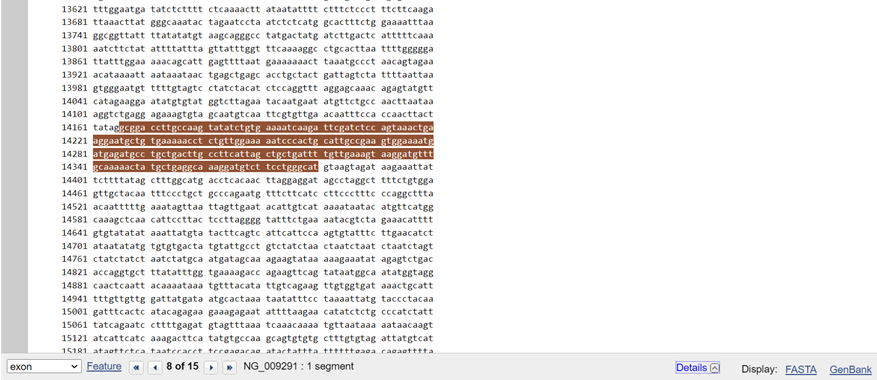
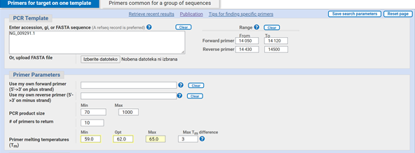
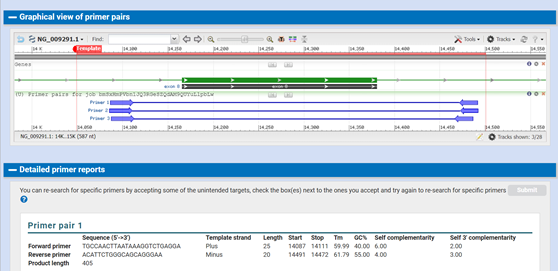

# Primer-BLAST

**Avtorja**: Ela Kovač, Tina Urh

**Datum predstavitve**: 2022-04-28

---
## Namen vaje
Namen vaje je poiskati primerne začetne oligonukleotide (primerje) za pomnožitev izbrane eksonske regije iz človeškega genomskega zaporedja.

---
## Program

Program: **[Primer-BLAST](https://www.ncbi.nlm.nih.gov/tools/primer-blast/)**

Avtorji programa: Jian Ye (*[National Center for Biotechnology Information](https://www.ncbi.nlm.nih.gov/)*, *[National Library of Medicine](https://www.nlm.nih.gov/)*, *[National Institutes of Health](https://www.nih.gov/)*), George Coulouris, Irena Zaretskaya, Ioana Cutcutache, Steve Rozen, Thomas L Madden

Reference:
- Ye J, Coulouris G, Zaretskaya I, Cutcutache I, Rozen S, Madden TL. **Primer-BLAST: a tool to design target-specific primers for polymerase chain reaction.** *BMC Bioinformatics.* 2012;13:134. [10.1186/1471-2105-13-134](https://doi.org/10.1186/1471-2105-13-134)
- Polymerase chain reaction. (citirano 17. 4. 2022). Dostopno na spletnem naslovu: [https://en.wikipedia.org/wiki/Polymerase_chain_reaction]

### Opis programa

Program Primer-BLAST je splošno orodje za oblikovanje ciljno specifičnih primerjev, ki so potrebni pri izvedbi PCR reakcije. Ponuja možnosti za izpolnjevanje različnih zahtev glede specifičnosti primerjev in uporablja iskanje BLAST (z lokalno poravnavo) za hitro identifikacijo čim večjega števila primerjev. Nato sledi globalna poravnava, ki omogoča še natančnejše oblikovanje primerjev (v primeru, da poravnava BLAST pokriva le del dolžine primerja). Pomembna lastnost Primer-BLASTa je tudi možnost postavljanja primerjev na podlagi meja eksonov ali intronov ter lokacij SNP-jev. Za osvežitev spomina je na spodnji shemi prikazana PCR reakcija, za katero potrebujemo ustrezne primerje:

### Vhodni podatki
Kot vhodne podatke lahko v program vnesemo Gene ID, accession code, zaporedje v obliki FASTA formata ali pa zaporedje že obstoječih primerjev.

---
## Navodila

### Vhodni podatki

- Albumin Homo sapiens (Gene ID: 213)

### Postopek dela

* V iskalnik vpišemo NCBI, kot database izberemo Gene in v iskalno vrstico vpišemo Albumin Homo sapiens.
* Na desni strani pod zavihkom Related information izberemo RefSeqGene, nato FASTA format in zopet na desni strani Highlight sequence features. 
* Skrajno levo spodaj lahko izberemo, da nam prikaže eksonske regije celotnega genomskega zaporedja. 

* Izberemo si 8. ekson in v desnem spodnjem oknu izberemo FASTA. To je torej zaporedje, ki ga želimo dobiti kot produkt PCR reakcije. Začetni oligonukleotidi (primerji) se morajo vezati med 100. in 50. nukleotidom pred tem zaporedjem. Sam primer je optimalne dolžine med 18 in 24 nukleotidov (če bo prekratek, nam ne bo dal dovolj specifičnih rezultatov, če bo predolg, pa bo faza hibridizacije v PCR reakciji potekala predolgo). 
* Desno zgoraj pod zavihkom Change region shown povečamo zaporedje pred in po eksonu (8. ekson sega od 14 166. do 14 380. nukleotida).

* Pod Selected region povečamo zaporedje tako, da bo segalo od 14 050.  do 14 500. nukleotida, nato pa pritisnemo Update view, da nam prikaže novo zaporedje v FASTA formatu.
* Na desni strani izberemo Pick primers in preusmeri nas na Primer-BLAST, kjer nam v iskalno okence tudi že kopira pravo NCBI referenčno sekvenco.
* Ker želimo, da je med koncem primerja in eksonsko regijo nekaj nukleotidov, na desni strani določimo dolžini primerja - v našem primeru bo začetni (forward primer) segal od 14 050. do 14 120. nukleotida, kar pomeni, da je do začetka eksonske regije približno 50 nukleotidov. Končni (reverse primer) pa naj sega od 14 430. do 14 500. nukleotida. 
* Malo nižje imamo prikazan zavihek Primer Parameters. Tu prva dva okenca pustimo prazna, izpolnimo ju v primeru, ko imamo že svoje primerje in želimo preveriti le njihovo specifičnost. Pod okencem, imenovanim PCR product size moramo preveriti, če se max usklajuje z našo regijo od začetka forward primerja do konca reverse primerja - v našem primeru regija sega od 14 000. do 14 500. nukleotida, kar pomeni, da lahko max pustimo na 1000. 
* Melting temperature oz. temperatura tališča (Tm) pove, kdaj bo dsDNA denaturirala do ssDNA. Najbolj optimalne so nastavitve za min. 59 ˚C, opt. 62 ˚C, max. 65 ˚C, max. razlika Tm med obema primerjema pa je 3-5 ˚C.

* Naslednjega okenca (Exon/intron selection) ne spreminjamo, razen v primeru, da bi v Primer-BLAST kopirali zaporedje z več eksoni. V takem primeru bi morali odkljukati okence, imenovano Intron inclusion, kar bi zagotovilo, da se intron ne bi prepisal. V primeru, da bi se nam intron prepisal, bi dobili podvojeno DNA, česar pa nočemo. 
* V zadnjem zavihku (Primer Pair Specificity Checking Parameters) lahko vidimo, kateri organizem smo izbrali (9606 označuje Homo sapiens). V tem zavihku ne potrebujemo spreminjati ali izpolnjevati nobenih okenc. 
* Zdaj smo pregledali vse zavihke in okenca, zato lahko pritisnemo Get primers in počakamo eno do dve minuti. 

* Kot rezultat dobimo seznam ustreznih primerjev, ki jih lahko med seboj primerjamo pod zavihkom Detailed primer reports. Podan je tip primerja, njegova dolžina, njegov začetek in konec, temperatura tališča in delež baznih parov. Ta je najbolj optimalen med 40 % in 60 %, saj zagotavlja dovolj močno vezavo primerja na DNA. Na koncu imamo podano še verjetnost samo-komplementarnosti, pri čemer ne želimo, da se primerja med seboj povežeta ali pa, da se primer veže sam nase. Pogledamo torej, da je self complementarity manj kot 8 in 3' self complementarity manj kot 5.

### Pričakovani rezultati in razlaga
* Kot rezultat bomo dobili nekaj forward in nekaj reverse primerjev, ki se bodo razlikovali v dolžini, temperaturi tališča, deležu GC parov ter komplementarnosti. Pozorni moramo biti na izbiro številk, saj ne smemo vzeti premalo nukleotidov pred in po eksonskem zaporedju ali pa napačne velikost PCR produkta. Ta se mora ujemati z dolžino od začetka forward primerja do konca reverse primerja. Paziti moramo tudi na to, da ne izberemo eksonov, ki so preveč na začetku oz. preveč na koncu celotnega zaporedja, saj se lahko zgodi, da ne bomo imeli dovolj nukleotidov za naš primer.

* Pri izbiri najustreznejšega primerja se odločimo za primerje, ki imajo delež GC parov med 40 % in 60 %, lahko pa tudi povečamo regijo, kjer nam program išče primerje. Ustrezni so le  primerji s samo-komplementarnostjo manj kot 8. oz. 5 in dolžino od 18 do 24 nukleotidov.

* Preverimo še, da zaporedje primerja ne vključuje sekundarnih struktur kot so npr. lasnične zanke.

* Če želimo podrobnejše informacije oz. »nevarnosti« ob poteku nadaljnje PCR reakcije, lahko zaporedje primerjev vnesemo v spletno orodje, imenovano PCR primer stats.