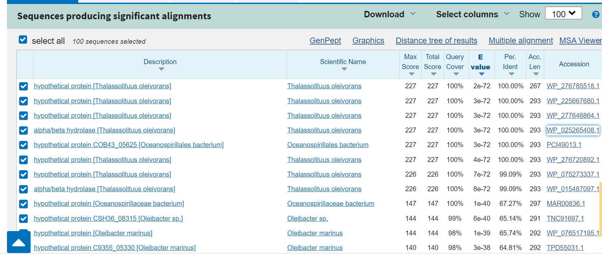
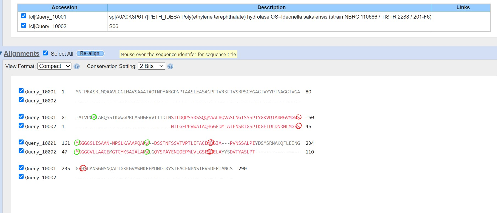
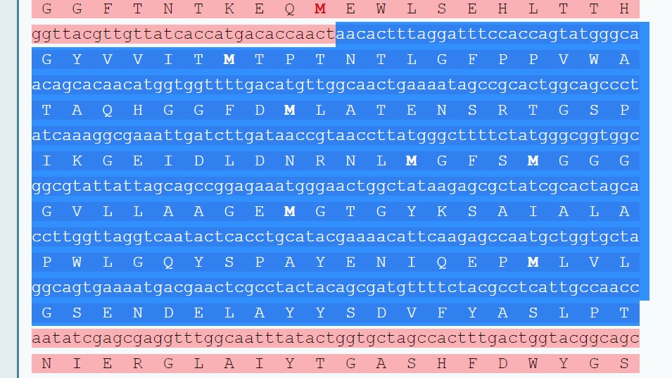
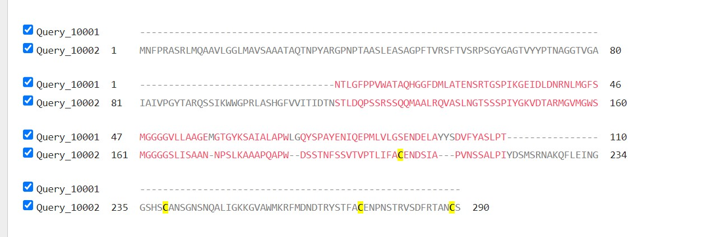
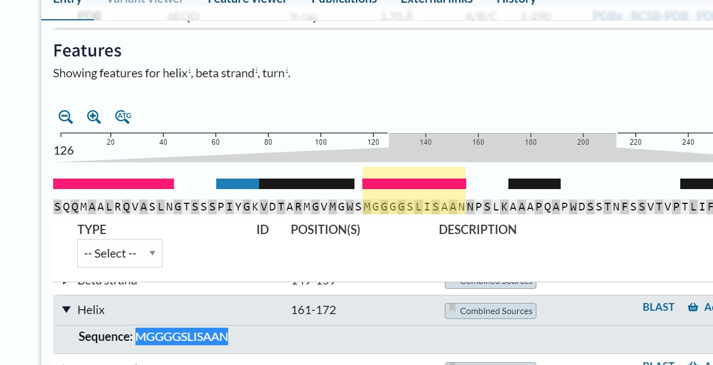
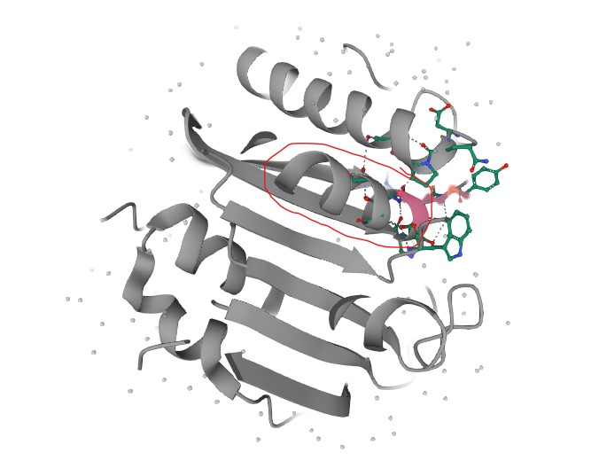
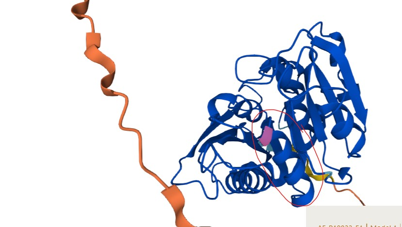
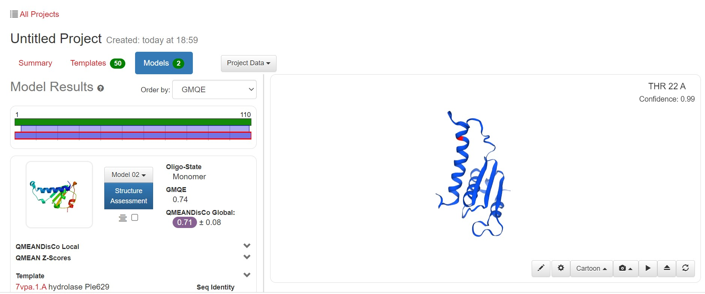
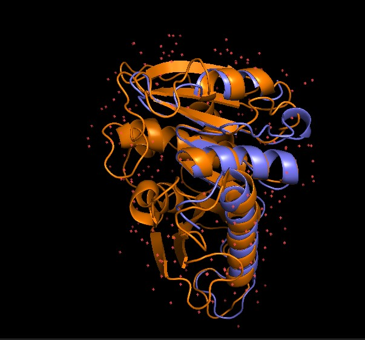

# S06

- **Avtor**: Maša Karčovnik
- **Datum izdelave**: 2023-05-12
- **Koda seminarja**: S06

---
## Vhodni podatek

Aminokislinsko zaporedje:
```
NTLGFPPVWATAQHGGFDMLATENSRTGSPIKGEIDLDNRNLMGFSMGGGGVLLA
AGEMGTGYKSAIALAPWLGQYSPAYENIQEPMLVLGSENDELAYYSDVFYASLPT
```

---
## Rezultati analiz

### Identifikacija

**Protein**: alfa/beta hidrolaza (alpha/beta hydrolase)

**Organizem**: [*Thalassolituus oleivorans*](https://en.wikipedia.org/wiki/Thalassolituus_oleivorans); gre za aearobno gramnegativno bakterijo, ki razgrajujejo naftne ogljikovodike. Zaradi potrebe po Na+ ionih za rast so močni halofili.


**Potencialna funkcija proteina**: sodeluje pri razgradnji in asimilaciji plastičnega poli(etilen tereftalata) (PET), kar organizmu omogoča, da uporablja PET kot vir energije in ogljika za rast in delovanje.

Identifikacija je bila narejena z uporabo NCBI BLAST, varianta blastn (zbirka nr), kjer je bilo najdeno 100 % ujemanje celotnega zeporedja z alfa/beta hidrolazo iz bakterije Thalassolituus oleivorans. 
Alfa/beta hidrolaza je superdružina hidrolitskih encimov zelo različnega filogenetskega izvora in katalitične funkcije, ki imajo podobno zvirje (osem beta listov, povezanih s šestimi alfa vijačnicami). V to superdružino hidrolaz vključuje proteaze, lipaze, peroksidaze, esteraze, epoksidne hidrolaze in dehalogenaze.

Prikaz zadetkov:



Koda zapisa z BLAST identificiranega proteina: GenBank [WP_025265408](https://www.ncbi.nlm.nih.gov/protein/WP_025265408)

Nato je bila identifikacija narejena še z uporabo NCBI BLAST, varianta blastn (zbirka swissprot), kjer je bilo najdeno 33,67 % ujemanje 89 % zaporedje s polietilenterftalatno hidralazo iz bakterije Ideonella sakaiensis. Ker ta portein pripada družini alfa/beta hidralaz, in ker smo pri poravnavi obeh zaporedij z orodjem Cobalt opazili ujemanje v vseh aktivnih mestih in vezavnih mestih za polietilentereftalat, ki so pri proteinu polietilen tereftalat hodrolaza anotirani v UniProtu in so znotraj dolžine našega vhodnega zaporedja, bi lahko sklepali, da imata proteina podobno funkcijo.

Prikaz poravnave (Ujemanje v aktivnih mestih je označeno z rdečo, v vezavnih mestih pa z zeleno)



Koda zapisa z BLAST identificiranega podobnega proteina: UniProt [A0A0K8P6T7](https://www.uniprot.org/uniprotkb/A0A0K8P6T7/entry#names_and_taxonomy)


Nukleotidno zaporedje:
```
AACACTTTAGGATTTCCACCAGTATGGGCAACAGCACAACATGGTGGTTTTGACATG
TTGGCAACTGAAAATAGCCGCACTGGCAGCCCTATCAAAGGCGAAATTGATCTTGAT
AACCGTAACCTTATGGGCTTTTCTATGGGCGGTGGCGGCGTATTATTAGCAGCCGGA
GAAATGGGAACTGGCTATAAGAGCGCTATCGCACTAGCACCTTGGTTAGGTCAATAC
TCACCTGCATACGAAAACATTCAAGAGCCAATGCTGGTGCTAGGCAGTGAAAATGAC
GAACTCGCCTACTACAGCGATGTTTTCTACGCCTCATTGCCAACC

```
Z iskanjem s tlastn smo z vhodnim aminokislinskim zaporedjem poiskali celoten genom organizma Thalassolituus oleivorans. Iskano zaporeje se v celoti 100 % ujema z 1 680 672 do 1 682 001 aminokislinskim ostankom v genomu. V GenBanku smo poiskali ta genom ([CP006829.1](https://www.ncbi.nlm.nih.gov/nucleotide/CP006829.1?report=genbank&log$=nucltop&blast_rank=1&RID=5WRKGBTZ016)), in s pomočjo orodja Translate tool - Expasy identificirali nukleotidno zaporedje, pripadajoča našemu aminokislinskemu zaporedju. 




### Splošna karakterizacija
Za zapis GenBank [WP_025265408](https://www.ncbi.nlm.nih.gov/protein/WP_025265408) ni na voljo pripisov glede značilnosti proteinskega produkta. 
Iz pripisov za celoten genom organizma lahko razberemo da razgrajuje plastiko ([CP006829.1](https://www.ncbi.nlm.nih.gov/nucleotide/CP006829.1?report=genbank&log$=nucltop&blast_rank=1&RID=5WRKGBTZ016)), torej bi vhodno aminokislinsko zaporedje zapisovalo za protein, ki je podoben polietilen tereftalat hidrolazi, ki je dobro anotiran v UniProt-u [A0A0K8P6T7](https://www.uniprot.org/uniprotkb/A0A0K8P6T7/entry#names_and_taxonomy).


#### Lokalizacija in post-translacijske modifikacije
Z iskanjem z blastp (privzete nastavitve) po zbirki Uniprot/SwissProt (dobro anotirani zapisi) z vhodnim aminokislinskim zaporedjem lahko identificiramo 2 proteina (gre za hidrolazi:
[polieteilen tereftalat hidrolaza](https://www.uniprot.org/uniprotkb/A0A0K8P6T7/entry#subcellular_location) in [lipaza 1](https://www.uniprot.org/uniprotkb/P19833/entry#sequences)

Obe zaporedji imata z izhodnim zaporedjem 34 % oziroma 35 % identičnost. S poravnavo zaporedij s programom Cobalt, lahko opazimo ohranjenost aminokislinskih ostankov predvsem v aktivih in vezavnih mestih med polietilen tereftalat hidralazo in vhodnim aminokislinskim zaporedjem, medtem ko lipaza 1 nima anotiranih aktivnih mest. Z iskanjem z blastp (privzete nastavitve) po zbirki Uniprot/SwissProt (dobro anotirani zapisi) z aminokislinskim zaporedjem za lipazo 1 smo ugotovili, da se obe najdeni zaporedji dobro ujemata (75 % zaporedje polietilen tereftalat hidralaze ima 45 % identičnost z lipazo 1.) 

Polietilen tereftalat hidrolaza ze nahaja v zunajceličnem prostoru, kar se sklada z njeno nalogo, saj cepi dolga poliesterska vlakna, ki ne morejo prehajati skozi celično membrano, zato sklepamo, da se tudi naš protein nahaja zunaj celične membrane, saj najvejetneje cepi dolge ogljikovodikove verige. Na podlagi primerjave med omenjenima proteinoma pa ne moremo sklepati o postranslacijskih modifikacijah iskanega proteina, saj smo s primerjavo aminokislinskih zaporedij ugotovili, da le ta niso ohranjena. 




#### Izražanje proteina v rekombinantni obliki
Glede na to, da gre za zunajcelični prokariontski protein, ki najverjetneje nima postranslacijskih modifikacij, bi lahko bil primeren eskpresijski sistem za izražanje osnovan na bakterijskem ekspresijskem sistemu.

#### Ohranjeni motivi
V vseh treh zaporedjih je dobro ohranjen motiv vijačnice (161-172 aminokislinski ostanek v polietilen tereftalat hidrolati), z aktivnim in vezavnim mestom:




---

### Strukturna katakterizacija
Struktura polietilen tereftalat hidrolaze je bila določena z X-žarkovno kristalografijo in jo lahko najdemo v zbirki PDB. [6ij3](https://www.ebi.ac.uk/pdbe/entry/pdb/6IJ3)



V strukturi lahko najdemo motiv vijačni, ki sige od 161 do 172 aminokislinskega ostanka, kot je anotirano v UniProt-u. Ta motiv je prisoten tudi v modelu lipaze 1, ki je bil narejen z AlphaFold-om.



Obe vijačnicih na slikah sta označeni z rdečo.


### Primerjava struktur
Strukturo proteina vhodnega aminokislinskega zaporedje smo zmodelirali s programom SWISS-MODEL:



S PyMol-om smo primerjali strukturi zmodeliranega proteina in polietilen tereftalat hidralaze. Strukturi obeh proteinov se zelo dobro ujemata.



---

Tako vhodno aminokislinsko zaporedje kot tudi njegova struktura se dobro ujemata s proteinom polietilen tereftalat hidralaza, zato lahko sklepamo, da sta gena za proteina ortologa in imata proteina podobne funkcijske značilnosti.