# S07

- **Avtor**: Mia Kobal
- **Datum izdelave**: 2023-05-12
- **Koda seminarja**: S07

---
## Vhodni podatek

Zaporedje: DNETLFDIIQYKAPLATSTAVRARMQTLGNSLVMFSQGVPFFQAGDDLLRSKSLDRNSFN
SGDWFNRLDFTYQSNNWGVGLPPAGDNQSMWPTMQPLLANPALRPTPEDI

---
## Rezultati analiz

### Identifikacija
Identifikacija se nanaša na protein, ki ga kodira gen, katerega del predstavlja  [zaporedje](#vhodni-podatek).

**Protein**: pululanaza (pullulanase)

**Organizem**: [*Anaerolineales bacterium*](https://www.ncbi.nlm.nih.gov/Taxonomy/Browser/wwwtax.cgi?id=2073117)

**Potencialna funkcija proteina**: Pululanaza je razvejevalni encim, ki hidrolizira alfa-1,6-glukozidne povezave v škrobu, amilopektinu, pululanu in sorodnih oligosaharidih. To omogoči učinkovito pretvorbo razvejanih polisaharidov v manjše sladkorje. 

Identifikacija proteina je bila narejena z uporabo NCBI BLAST, varianta blastp v zbirki nr. Značilna podobnost je bila najdena za 100 % zaporedja, zaporedje je v tem delu podobno zaporedju predpostavljene pululanaze z 92,73 % identičnostjo, E-vrednost je 3e-63. 

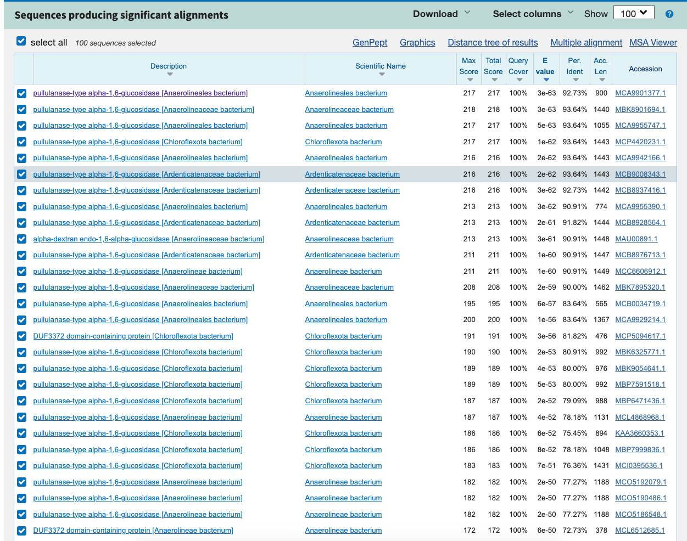
***Prikaz zadetkov***

Koda zapisa, ki jo poda BLAST za GenBank: [MCA9901377.1](https://www.ncbi.nlm.nih.gov/protein/MCA9901377.1?report=genbank&log$=prottop&blast_rank=1&RID=5Z4KW7DV013). Zaporedje je delno (*pullulanase-type alpha-1,6-glucosidase, partial*), katerega vir je bil megagenom. 

Aminokislinsko zaporedje: 
>MCA9901377.1  
    HLRNFTALKFSEDDLSVARIALKGQIAISVQDGDGQTIDAAGLQIPGVLDDLYPYDGDLGVTFADGLPTL
    TVWAPTARQVRLHLFDDANPNTEAEIVTMRPTPSNGTWAITGEADWAGKYYLYEVQVYVPTESSVQTNLV
    TDPYSFSLSTNSTRSQIVDLTDPATMPEGWTDVVKPGIAAPEDIVIYELHIRDFSVNDPSVPEELRGTYG
    AFTVMDSNGMQHLAALSAAGLTHLHLLPTFDIATIDEDKSTWVTPSFEELSSLPADSEEQQALIAAVRDQ
    DPFNWGYDPFHYSVPEGSYAVNPEGINRIVEYRDMVQALNEIGLRVVVDVVYNHTNASGQSDFSVLDRIV
    PGYYHRLNSTGRVETSTCCQNTATEHDMMRKLMVDSVVTWATAYKIDAFRFDLMGHHMKEDMLAVRAALD
    ALTLEADGVDGKSIYIYGEGWDFGEVGGNARGINATQFNLAGTGIGTFSDRLRDAARGGSPFGGQTEQGF
    LNGLLVYPNETDQGSETEQLVRLQNFMDIIQVGLAGNLSDFTFVNARGETVTGDLVLYNGSPAGYTSDPQ
    EQITYISKHDNETLFDIIQYKAPLGTSTAVRARMQTLGNSIVMFSQGVPFFQAGDDLLRSKSLDRNSYNS
    GDWFNRLDFTYQSNNWGVGLPPSGDNQGMWPTMQPLLANPDLAPTPADIAFARDTFRELLQIRSGSPLFR
    LQTAVQVQDRLQFHNVGPDQIPGVIVMSLSDVTGEDIDPNYDLMVVVFNATPDAVSFANEGFSNLPFSLH
    PVQQSSVDGVVKTAVFDEASGTFTVPAWTTAVFVLPQGTIGTPSLTEEVAIEEETTAEPAATEEATAVEE
    SEAATEEAHSEEAAHGEAEMVEDAPGTPWVLWLSALGGGFVVALLVAWISQRRQHGNNYH

### Splošna karakterizacija

Za zapis GenBank [MCA9901377.1](https://www.ncbi.nlm.nih.gov/protein/MCA9901377.1?report=genbank&log$=prottop&blast_rank=1&RID=5Z4KW7DV013) je podan protein na UniProtu s kodo [A0A957BLQ8](https://www.uniprot.org/uniprotkb/A0A957BLQ8/entry). Protein je slabo anotiran, zanj ni na voljo pripisov glede značilnosti. Zato s pomočjo celotnega zaporedja identificiramo dobro anotirana zaporedja, katera imajo aminokislinska zaporedja, ki so podobna podanemu zaporedju.

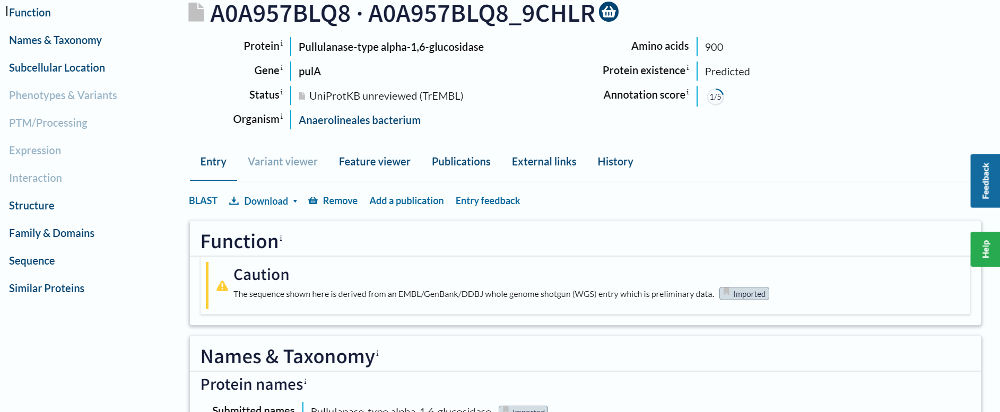
***UniProt identificiranega zaporedja***

Pri uporabi BLAST, variante blastp, po zbirki UniProt/SwissProt (dobro anotirani zapisi), dobimo za celotno zaporedje [MCA9901377.1](https://www.ncbi.nlm.nih.gov/protein/MCA9901377.1?report=genbank&log$=prottop&blast_rank=1&RID=5Z4KW7DV013) 66 zadetkov. Gre za pululanaze oziroma razvejevalne encime. 

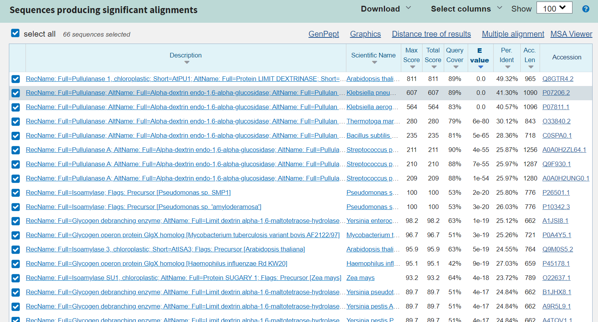
***Prikaz zadetkov***

Za primerjavo z identificiranim zaporedjem je bil izbran drugi zadetek. Zaporedje ima 41 % identičnost v poravnanem delu, ki obsega 89 % iskalnega zaporedja. Koda zapisa v UniProtu: [P07206](https://www.uniprot.org/uniprotkb/P07206/entry). Protein je pululanaza, identificirana v organizmu [Klebsiella pneumoniae](https://en.wikipedia.org/wiki/Klebsiella_pneumoniae). Zanj je pripisano, da se nahaja v celični membrani, skupaj s signalim peptidom obsega 1090 aminokislinskih ostankov. 

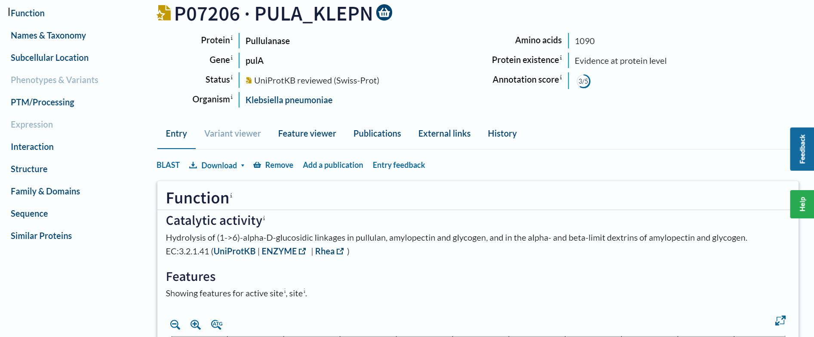
***UniProt dobro anotiranega zaporedja***

#### Zanimajo nas odgovori na naslednja vprašanja:
- Kje v izvornem organizmu/celici se protein nahaja? 

Glede na relativno visoke podobnosti podanega zaporedja z dobro anotiranim zaporedjem [P07206](https://www.uniprot.org/uniprotkb/P07206/entry) lahko sklepam, da je identificiran protein pululanaza, ki se nahaja v celični membrani. 

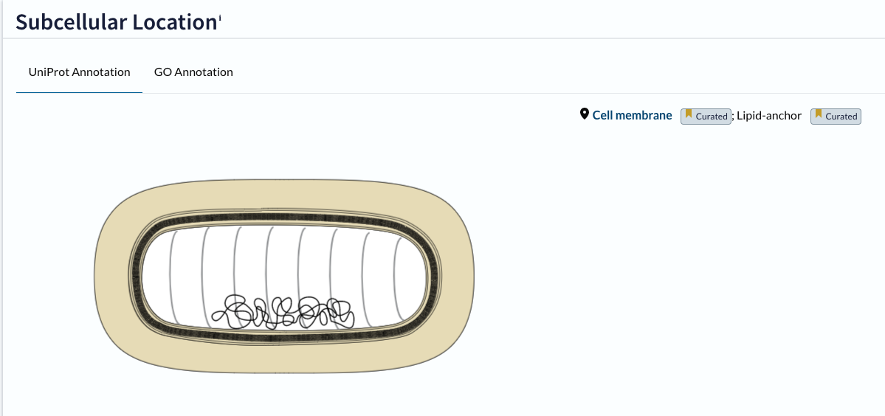
***Nahajanje proteina [P07206](https://www.uniprot.org/uniprotkb/P07206/entry)***

- Katere post-translacijske modifikacije ima?  

Zaporedje [MCA9901377.1](https://www.ncbi.nlm.nih.gov/protein/MCA9901377.1?report=genbank&log$=prottop&blast_rank=1&RID=5Z4KW7DV013) ne vsebuje signalnega zaporedja. Ta je del aminokislinskega zaporedja [P07206](https://www.uniprot.org/uniprotkb/P07206/entry) in obsega ostanke 1-19. To je razvidno tudi iz poravnave (uporaba Clustal Omega)

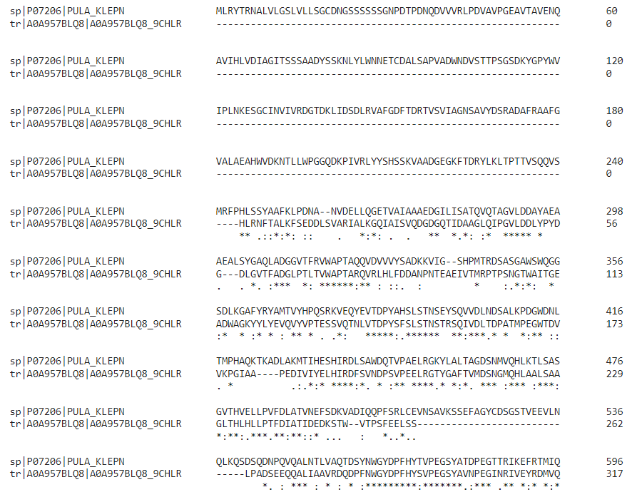

***Poravnava***

Zaporedje [MCA9901377.1](https://www.ncbi.nlm.nih.gov/protein/MCA9901377.1?report=genbank&log$=prottop&blast_rank=1&RID=5Z4KW7DV013) zato prevedemo po zbirki UniProt z uporabo blastp. Najdenih je več zadetkov, štiri z največjo identičnostjo skupaj z MCA9901377.1 in P07206 poravnamo. S pomočjo poravnave lahko identificiramo mogoče post-translacijske modifikacije. Pri proteinu [P07206](https://www.uniprot.org/uniprotkb/P07206/entry) se pojavi lipidacija aminokislinskega ostanka 20 - ta je prvi po signalnem zaporedju. Glede na poravnavo, se modificirani cistein pojavi še v treh zaporedjih. V zaporedju MCA9901377.1 to mesto sicer ni ohranjeno, vendar lipidacije kot post-translacijske modifikacije ne moremo izključiti.

***Lipidacija***

- Če želimo pripraviti protein v rekombinantni obliki, kateri gostiteljski organizem je najbolj smiselno izbrati in kateri del proteina bi izražali? 

Glede na to, da so podobna zaporedja identificirana v bakterijah, je najbolj smiselen gostiteljski organizem bakterija. Sicer pride do post-translacijske modifikacije, vendar to lahko limitiramo na prvi aminokislinski ostanek po odcepu signalnega zaporedja, zato ni velik problem. 

- So znani kakšni homologi (ortologi, paralogi)? Kaj je znanega o njih (funkcija, modifikacije, regulacija, aktivno mesto, ...)? 

Homologi so glede na zadetke v BLAST-u znani. Njihova funkcija je v veliki večini znana - v veliki večini so razvejevalni encimi za glikogen (torej so glikozidaze, ki razgrajujejo glikogen na manjše oligosaharide). Za nekatere je znana tudi struktura. Modifikacije lahko skelapmo iz poravnave s proteinom P07206, torej lipidacija. Aktivno mesto je znano za P07206, iz česar lahko tudi sklepamo o aktivnem mestu homologov. 

- Predstavlja naš protein encim ali gre za kak drug protein?
  - Če gre za encim – ali je aktivno mesto v primerjavi z aktivnimi homologi ohranjeno?
  
       Protein danega zaporedja je encim, in sicer pululanaza. Aktivno mesto v danem zaporedju ni znano, na podlagi primerjave in poravnave z znanim zaporedjem P07206 lahko o njem sklepamo. V P07206 proteinu sta aktivni mesti dve, in sicer aminokislinska ostanaka D in E (684 in 713 - vključeno tudi 19 ostankov signalnega zaporedja). Pri poravnavi s še tremi zaporedji sta ostanka vedno D in E, tudi pri podanem zaporedju. Tako lahko z veliko verjetnostjo sklepamo, da sta aktivni mesti v proteinu podanega zaporedja dve aktivni mesti, aminokislinska ostanka pa sta aspartat in glutamat. 
       
 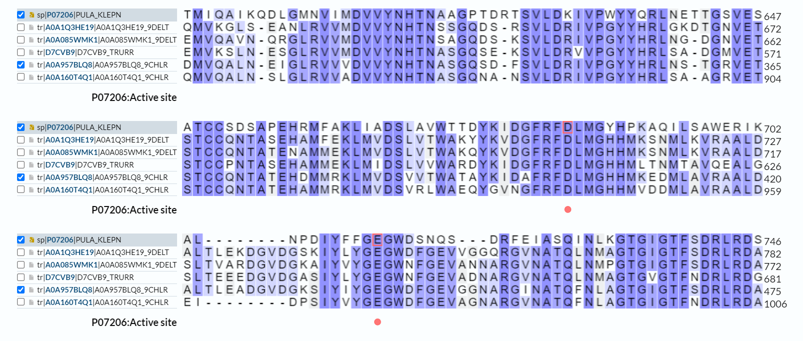
 ***Aktivno mesto***
  
- Kaj so najbolj ohranjene regije v skupini, ki jo predstavlja ta protein in njegovi homologi? 

Glede na poravnavo zaporedji je regija, ki je najbolje ohranjena imenovana kar domena. Aminokislinski ostanki so med zaporedji enaki, prav tako je teh aminokislin veliko. 

***Domena***

- So v zaporedju kakšne ponavljajoče se regije oz. motivi?

Glede na poravnavo s proteino P07206 lahko sklepamo, da se v proteinu danega zaporedja ponavlajajo motivi beta stukrture in vijačnic. 

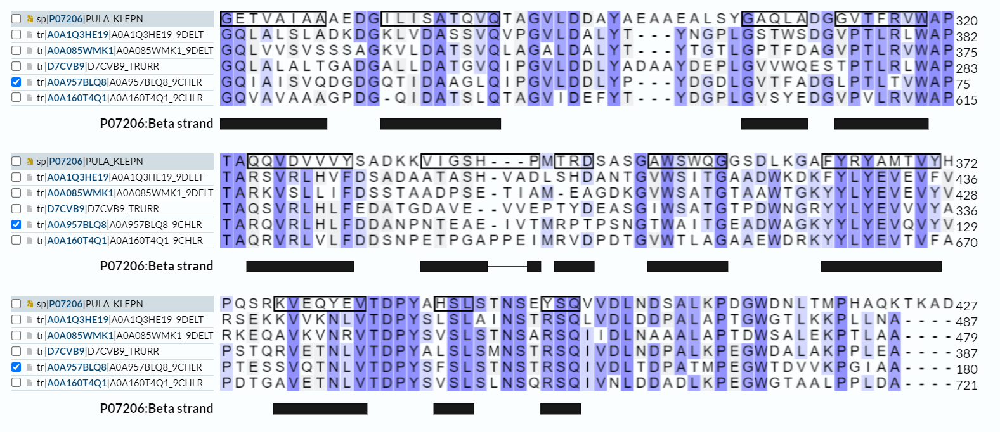
***Beta strukture***

- S katerimi proteini ali drugimi molekulami bi lahko ta protein potencialno interagiral?

Glede na to, da sklepamo (glede na poravnavo), da je protein v celični membrani, lahko sklepamo tudi, da interagira z molekulami membrane. Torej fosfolipidi, morda s sladkorji, membranskimi proteini. 

### Strukturna katakterizacija
#### Zanimajo nas odgovori na naslednja vprašanja:
- Je znana struktura tega proteina ali njegovega dela?

Sama struktura proteina podanega zaporedja ni znana. 
Glede na poravnavo s proteinom P07206 bi lahko sklepali, da je sekundarna struktura iz mnogih beta struktur, (alfa) vijačnic in zavojev med njimi. Sklepali bi lahko tudi, da so ti motivi v zaporedju velikokrat ponovljeni. 

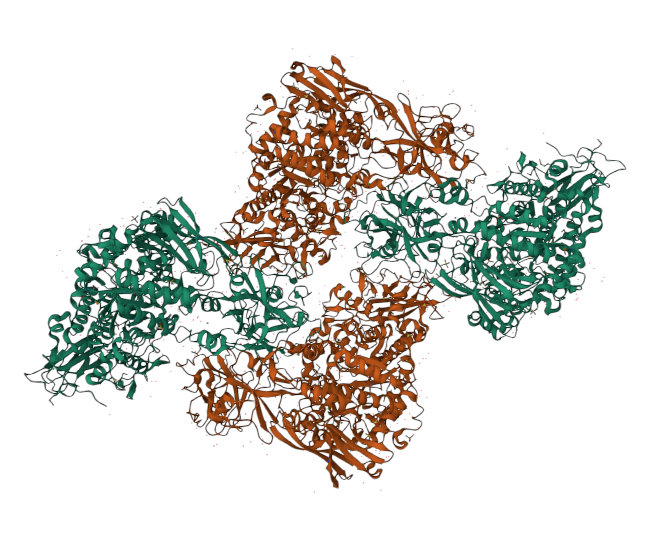
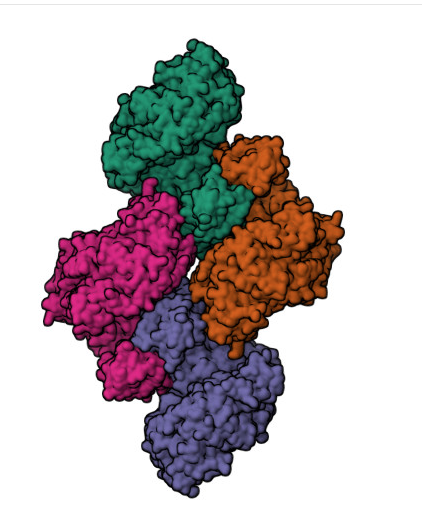

***Struktura proteina P07206***

- Je znana struktura homologov? Katerih?

Za sicer slabo anotiran protein neopululanaze (UniProt: [A0A085WMK1](https://www.uniprot.org/uniprotkb/A0A085WMK1/entry#structure)) je s pomočjo AlphaFold predvidevana stuktura, ki vključuje beta stukture in alfa vijačnice. Prav tako sta s pomočjo AlphaFold predvidevani stukturi glukozidaz [A0A1Q3HE19](https://www.uniprot.org/uniprotkb/A0A1Q3HE19/entry) in [D7CVB9](https://www.uniprot.org/uniprotkb/D7CVB9/entry) (oba sta slabo anotirana proteina). Strukturi sta precej podobni A0A085WMK1. 

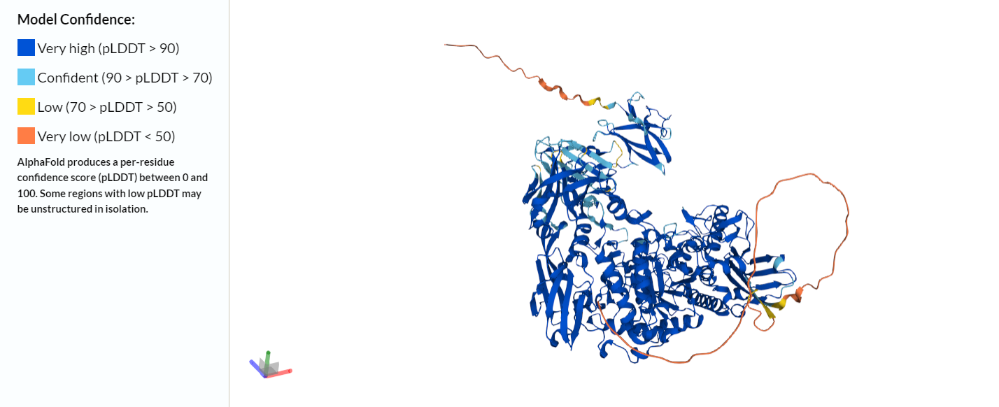
***Predvidevana stuktura proteina A0A085WMK1***

- Pripravite model proteina oz. njegovega dela, ki bi predstavljal funkcionalen topen protein.

S pomočjo [Swiss-Model](https://swissmodel.expasy.org/repository/uniprot/A0A957BLQ8) lahko pripravimo model proteina (glede na UniProt kodo [A0A957BLQ8](https://www.uniprot.org/uniprotkb/A0A957BLQ8/entry)) 

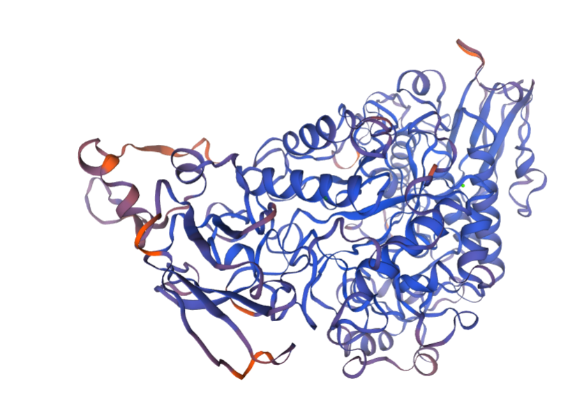
***V Swiss-Modelu pripravljena struktura proteina***

Samo strukturo ne moremo razdeliti na domene, niti v primerjavi s homologi - ti tudi nimajo (poznano) razdeljenih domen. 

- Primerjajte model oz. eksperimentalno strukturo z eksperimentalno strukturo homologa, osredotočite se na funkcijsko pomembne regije.

Predvidevana struktura si ni ravno podobna z eksperimentalno določeno strukturo proteina P07206, čeprav sta si v zaporedju podobna. Podan protein nima predvidevanih velikega števila beta ploskev in alfa vijačnic, vendar se te vseeno pojavijo. Glede na primerjavo z ostalimi dobljenimi homologi, vsaj tistimi ki imajo predvidevano stukturo s pomočjo AlphaFold, je predvidevana struktura podobnejša. A ker te strukture niso eksperimentalno določene, z veliko gotovostjo ne moremo veliko sklepati o strukturi. Jasno pa je, da se v strukturi proteina pojavijo motivi alfa vijačnic in beta ploskev.  

