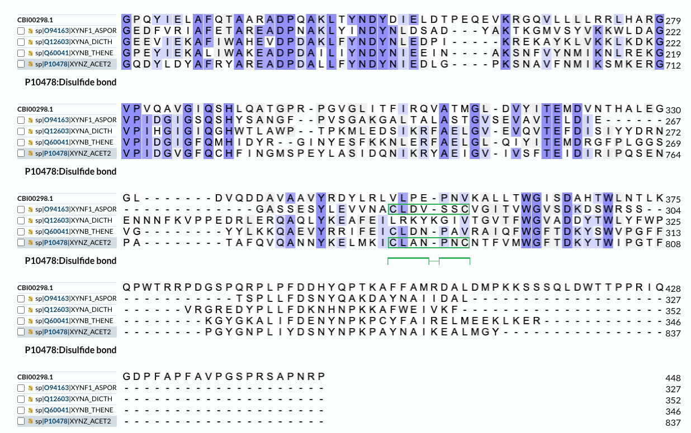
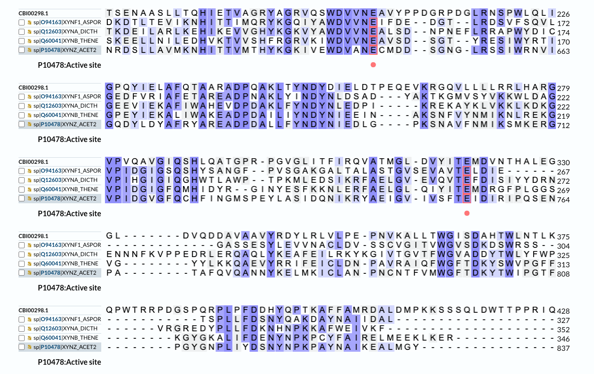
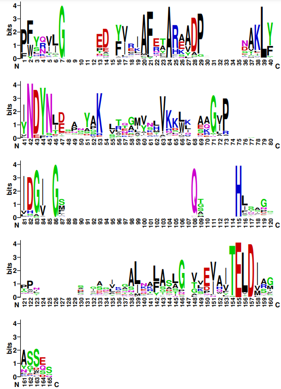
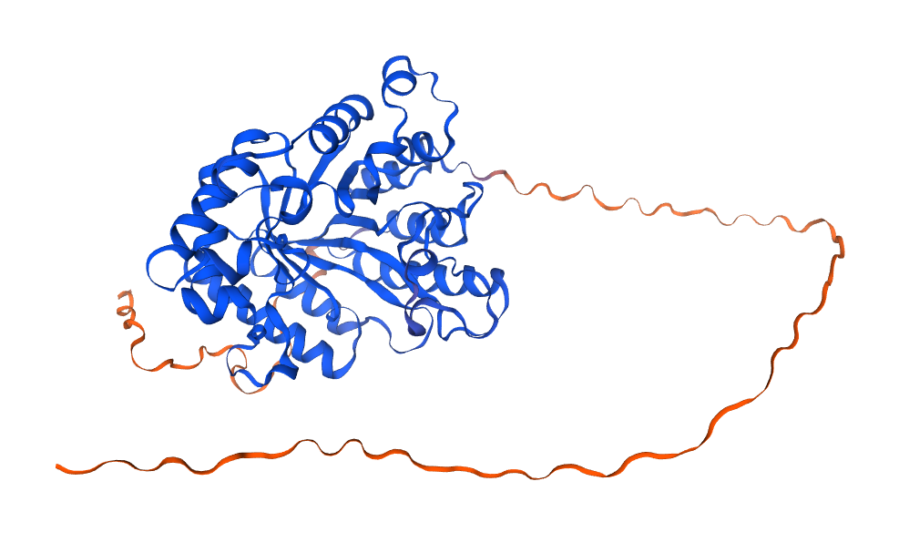
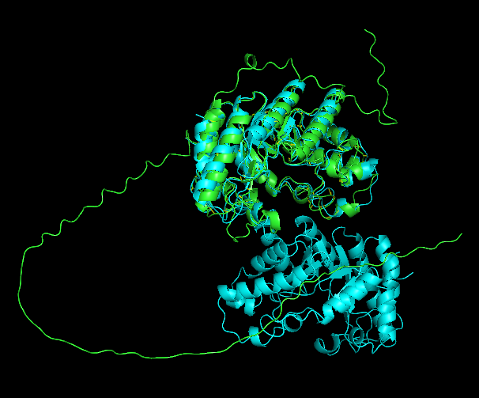
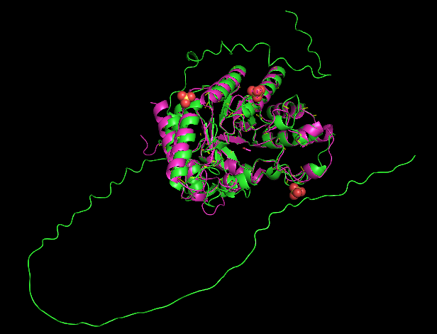

# Predloga za skupino A

- **Avtor**: Patricija Kolander
- **Datum izdelave**: 2023-5-12
- **Koda seminarja**: S08

---
## Vhodni podatek

Zaporedje: 

>seq1
PWLQLIGPQYIELAFQTAARADPQAKLTYNDYDIELDTPEQEVKRGQVLLLLRRLHARGV
PVQAVGIQSHLQATGPRPGVGLITFIRQVATMGLDVYITEMDVNTHALEG

---
## Rezultati analiz

### Identifikacija
Identifikacija se nanaša na protein, ki ga kodira gen, katerega del predstavlja  [zaporedje](#vhodni-podatek).

**Protein**: Ksilanaza (po iskanju Blastp, iskanje po zbirki metagenomskih zaporedji). Glede na iskanje z Blastp, po zbirki nr; endo - 1,4 - beta ksilanaza.

**Organizem**: Gre za organizem iz metagenomskega vzorca. Glede na podobnost z ostalimi proteini po iskanju z Blastp, bi lahko sklepali, da  gre za bakterijo.

**Potencialna funkcija proteina**: 

Protein ima  endo-hidrolitično aktivnost, cepi 1,4-d-ksilozidno vez v ksilanu. Sposoben je razgrajevanja ksilana v ksilozo in tako ragrajevanja hemiceluloze v celični steni.
Protein smo identificirali preko iskanja z Blastp, zbirka metagenomskih zaporedji, najbolši zadetek glede na E vrednost in  identičnost je: (Genbank:https://www.ncbi.nlm.nih.gov/protein/CBI00298.1?report=genbank&log$=prottop&blast_rank=1&RID=6FBEXJZE016) (100,0%)

### Splošna karakterizacija
Zanimajo nas odgovori na naslednja vprašanja:

- Kje v izvornem organizmu/celici se protein nahaja?

Celice ga najverjetneje izločajo, kar sklepamo iz podobnih proteinov, ki so anotirani.

- Katere post-translacijske modifikacije ima?

Glede na poravnavo s podobnimi proteini, bi lahko sklepali, da protein nima posttranslacijskih modifikacij. Podobni proteini imajo prisoten cisteinski mostiček, ki pa ga v našem proteinu verjetno ni, saj so cisteini na poravnanih mestih spremenjeni v valin.

- Če želimo pripraviti protein v rekombinantni obliki, kateri gostiteljski organizem je najbolj smiselno izbrati in kateri del proteina bi izražali?

Bakterijske gostiteljske organizme, saj protein ni modificiran.

- So znani kakšni homologi (ortologi, paralogi)? Kaj je znanega o njih (funkcija, modifikacije, regulacija, aktivno mesto, ...)? 

Da, protein ima 71 procentno identičnost s proteinom Endo-1,4-beta-xylanase [Acidicapsa dinghuensis], ki pa ni tudi njegov ortolog. Ta protein sem našla s primerjanjem zaporedja s pomočjo Blastp v zbirki nr. Encim ni anotiran.
Homologen je tudi protein UniProt ID: A5IL00. Ta ni preverjen, nima znanih posttranslacijskih modifikacij, veže pa SO4 ione.  
(GenBank: https://www.ncbi.nlm.nih.gov/protein/WP_263341278.1?report=genbank&log$=prottop&blast_rank=1&RID=5VY0DRKF013).
S primerjanjem aminokislinskega zaporedja z Blastp po zbirki SwissProt/UniProtKB sem identificirala homologne proteine, z najvišjo stopnjo ujemanja med 31 in 34,5 procentov, Uniprot ID: Q60041, O94163, Q12603, P10478. Iz tega lahko sklepamo, da ima naš protein nekaj homologov, vendar nima ortologov.
Vsi encimi spadajo med ksilanaze in vsebujejo enako aktivno mesto. P10478 in O94163 imata prisoten cisteinski mostiček, ostali pa so brez post translacijskih modifikacij. P10478 ima prisotna vezavna mesta za kalcijeve ione.

- Predstavlja naš protein encim ali gre za kak drug protein? 

Encim.

- Če gre za encim – ali je aktivno mesto v primerjavi z aktivnimi homologi ohranjeno?

Da, po primerjavi s štirimi sorodnimi proteini, lahko vidimo, da sta E aminokislinska ostanka v aktivnem mestu prisotna tudi v našem proteinu.

- Kaj so najbolj ohranjene regije v skupini, ki jo predstavlja ta protein in njegovi homologi? 

V Prosite sem identificirala domeno GH10, ki je prisotna v vseh homologih.

- So v zaporedju kakšne ponavljajoče se regije oz. motivi? 
Glede na poravnavo zaporedji, ustvarjeno s spletnim orodjem WebLogo, bi lahko trdili, da so najbolj ohranjene regije NDYN in TELD, kar se sklada z rezultati primerjave zaporedji homologov z UniProt align (slika zgoraj).

- S katerimi proteini ali drugimi molekulami bi lahko ta protein potencialno interagiral?

Z orodjem Prosite sem ugotovila, da ima protein P10478 vezavno domeno za kalcijeve ione. Ta v našem proteinu verjetno ni prisotna. To potrdimo glede na samo dolžino proteina in približno 30 procentno ujemanje med njima. Homolog A5IL00 interagira tudi s SO4 ioni. Mesta interakcij niso anotirana, zato s svojim znanjem ne znam napovedati, če so prisotne tudi v našem proteinu.

### Strukturna katakterizacija
Zanimajo nas odgovori na naslednja vprašanja:

- Je znana struktura tega proteina ali njegovega dela? 

Struktura ni znana, ustvarila sem jo s pomočjo SwissModel. Obstaja pa z AlphaFold določena struktura ksilaze, pridobljene iz metagenomskega vzorca (?).

- Je znana struktura homologov? Katerih?

Znana je struktura homologa P10478 (RCSB PDB: https://www.rcsb.org/structure/1XYZ) ter ne anotiranega A5IL00 (RCSB PDB: https://www.rcsb.org/structure/3NIY).

- Pripravite model proteina oz. njegovega dela, ki bi predstavljal funkcionalen topen protein.

Model sem pripravila s pomočjo SwissModel. 

- Primerjajte model oz. eksperimentalno strukturo z eksperimentalno strukturo homologa, osredotočite se na funkcijsko pomembne regije.

Pri primerjavi svojega modela z 1XYZ oziroma Uniprot ID: P10478, RMSD: 1.218

Pri primerjavi svojega modela z 3NIY oziroma Uniprot ID: A5IL00, RMSD: 0.731

Glede na poravnavo opazimo, da se strukturi našega proteina in 3NIY bolj ujemata. 