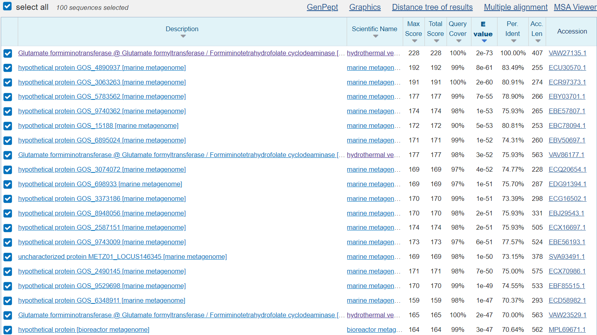
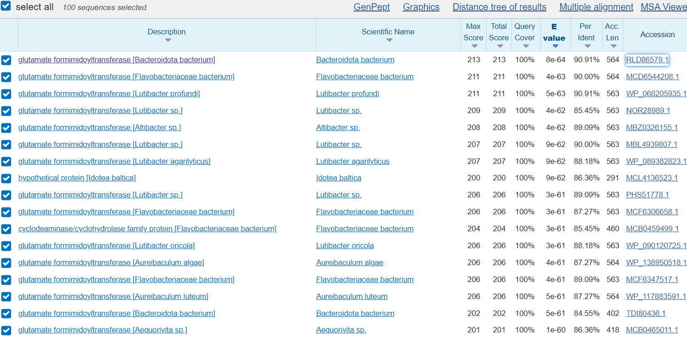
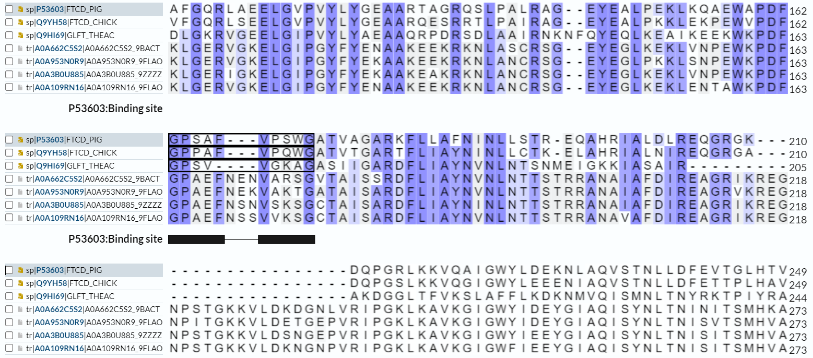

# S15

- **Avtor**: Karin Rak
- **Datum izdelave**: 2023-05-12
- **Koda seminarja**: S15

---
## Vhodni podatek

KLGERIGKELGIPGYFYEKAAKEAKRKNLANCRSGEYEGLKEKLVNPEWKPDFGPAEFNSNVSKSGCTAISARDFLIAYNINLNTTSTRRANAIAFDIREAGRIKREGNP

---
## Rezultati analiz

### Identifikacija

**Protein**: formimidoiltransferaza ciklodeaminaza

Podano vhodno aminokislinsko zaporedje smo vnesli v blastp pri standardnih nastavitvah, rezultate smo iskali med metagenomskimi zaporedji (env_nr database). Rezultat z najnižjo E vrednostjo (2e-73) in največjim odstotkom identičnosti (100%) ima [GenBank ID VAW27135.1](https://www.ncbi.nlm.nih.gov/protein/VAW27135.1?report=genbank&log$=prottop&blast_rank=1&RID=6CD3XVDY016) in [UniProt ID A0A3B0U885](https://www.uniprot.org/uniprotkb/A0A3B0U885/entry).

**Organizem**: *Bacteroidota bacterium*

Podano vhodno aminokislinsko zaporedje smo vnesli v blastp pri standardnih nastavitvah, rezultate smo iskali med neredundantnimi proteinskimi zaporedji (nr database). Rezultat z najnižjo E vrednostjo (8e-64) in največjim odstotkom identičnosti (90,91%) ima [GenBank ID RLD86579.1](https://www.ncbi.nlm.nih.gov/protein/RLD86579.1?report=genbank&log$=prottop&blast_rank=1&RID=6CFHVPWV016) in [UniProt ID A0A662C5S2](https://www.uniprot.org/uniprotkb/A0A662C5S2/entry). Glede na to, da je ujemanje formimidoiltransferaze ciklodeaminaze v *Bacteroidota bacterium* z glutamat formimidoiltransferazo, lahko zgolj sklepamo, da formimidoiltransferaza ciklodeaminaza pripada temu organizmu, ne moramo pa z gotovostjo trditi. [Na strani](https://www.genome.jp/dbget-bin/www_bget?enzyme+4.3.1.4) do katere sem prišla prek [Wikipedije](https://en.wikipedia.org/wiki/Formimidoyltransferase_cyclodeaminase) sem zasledila, da se formimidoiltransferaza ciklodeaminaza v evkariontih pojavlja kot bifunkcionalen encim, ki ima še glutamat formimidoiltransferazno aktivnost. To pa je kontradiktorno, saj je v mojem primeru glutamat formimidoiltransferaza v prokariontskem organizmu. Lahko pa predpostavljamo, da sta si proteina homologa.

**Potencialna funkcija proteina**: 

Formimidoiltransferaza ciklodeaminaza katalizira pretvorbo formiminoglutamata in tetrahidrofolata v formiminotetrahidrofolat in glutamat.

### Splošna karakterizacija

- Kje v izvornem organizmu/celici se protein nahaja?
    
Protein se najverjetneje nahaja v citoplazmi.

- Katere post-translacijske modifikacije ima?

Verjetno ni ohranjenih post-translacijskih modifikacij.

To sem ugotovila s primerjavo štirih zaporedij različnih organizmov: iz metagenoma, iz *Bacteroidota bacterium*, *Sus scrofa* in *Gallus gallus*. *Bacteroidota bacterium* ima največje ujemanje z danim proteinom v neredundančni zbirki, *Sus scrofa* in *Gallus gallus* pa v anotirani Swiss-Prot zbirki. Od naštetih ima samo *Sus scrofa* eno post-translacijsko modifikacijo, to je fosforilacija serina 520. V bakterijskih celicah post-translacijskih modifikacij ne pričakujemo.

- Če želimo pripraviti protein v rekombinantni obliki, kateri gostiteljski organizem je najbolj smiselno izbrati in kateri del proteina bi izražali?

Kot gostiteljski organizem so primerne bakterijske celice, ker protein nima post-translacijskih modifikacij. Izrazila bi cel encim iz bakterije, saj lahko odsotnost kakšnega dela vpliva na njegovo funkcijo.

- So znani kakšni homologi (ortologi, paralogi)? Kaj je znanega o njih (funkcija, modifikacije, regulacija, aktivno mesto, ...)?

Dano zaporedje vnesemo v blastp in iščemo med anotiranimi zaporedji v Swiss-Prot zbirki pri ostalih standardnih nastavitvah. Dobimo 9 rezultatov, katere lahko uvrstimo med ortologe (glejte sliko s15-Blast_SwissProt_rezultati).

1. [Q9YH58](https://www.uniprot.org/uniprotkb/Q9YH58/entry) - formimidoiltransferaza ciklodeaminaza [*Sus scrofa*]

Spodbuja in omogoča vezavo vemantinskih filamentov, ki izhajajo iz Golgijevega aparata. Ima transferazo in deaminazno aktivnost. Aktivno mesto za formimidoiltransferazo je H82, za ciklodeaminazo pa D412. Med aktivnima mestoma je vezavno mesto za folat, ki sega od G163 do G172. Dotični protein ima eno post-translacijsko modifikacijo, to je fosforilacija serina na mestu 520.

2. [P53603](https://www.uniprot.org/uniprotkb/P53603/entry) - formimidoiltransferaza ciklodeaminaza [*Gallus gallus*]

Spodbuja in omogoča vezavo vemantinskih filamentov, ki izhajajo iz Golgijevega aparata. Ima transferazo in deaminazno aktivnost. Aktivno mesto za formimidoiltransferazo je H82, za ciklodeaminazo pa D412. Med aktivnima mestoma je vezavno mesto za folat, ki sega od G163 do G172. Dotični protein nima post-translacijskih modifikacij.

3. [Q9HI69](https://www.uniprot.org/uniprotkb/Q9HI69/entry) - glutamat formimidoiltransferaza [*Thermoplasma acidophilum*]

Katalizira prenos formilne skupine z N-formilglutamata na tetrahidrofolat. Kot substrat lahko veže tudi triglutamatno oblika 5-formiltetrahidrofolata. Katalizira lahko tudi prenos formimino skupine N-formiminoglutamata na tetrahidrofolat. Kot encim lahko nadomesti tudi YgfA in katalizira ireverzibilno od ATP odvisno pretvorbo 5-formiltetrahidrofolata do 5, 10-meteniltetrahidrofolata. Aktivno mesto za formimidoiltransferazo je H81, vezavno mesto za folat, pa sega od G164 do G172. Dotični protein nima post-translacijskih modifikacij.

4. [Q91XD4](https://www.uniprot.org/uniprotkb/Q91XD4/entry) - formimidoiltransferaza ciklodeaminaza [*Mus musculus*]

Spodbuja in omogoča vezavo vemantinskih filamentov, ki izhajajo iz Golgijevega aparata. Ima transferazo in deaminazno aktivnost. Aktivno mesto za formimidoiltransferazo je H82, za ciklodeaminazo pa D412. Med aktivnima mestoma je vezavno mesto za folat, ki sega od G163 do G172. Dotični protein ima eno post-translacijsko modifikacijo, to je fosforilacija serina na mestu 520.

5. [O88618](https://www.uniprot.org/uniprotkb/O88618/entry) - formimidoiltransferaza ciklodeaminaza [*Rattus norvegicus*]

Spodbuja in omogoča vezavo vemantinskih filamentov, ki izhajajo iz Golgijevega aparata. Ima transferazo in deaminazno aktivnost. Aktivno mesto za formimidoiltransferazo je H82, za ciklodeaminazo pa D412. Med aktivnima mestoma je vezavno mesto za folat, ki sega od G163 do G172. Dotični protein ima eno post-translacijsko modifikacijo, to je fosforilacija serina na mestu 520.

6. [O95954](https://www.uniprot.org/uniprotkb/O95954/entry) - formimidoiltransferaza ciklodeaminaza [*Homo sapiens*]

Spodbuja in omogoča vezavo vemantinskih filamentov, ki izhajajo iz Golgijevega aparata. Ima transferazo in deaminazno aktivnost. Aktivno mesto za formimidoiltransferazo je H82, za ciklodeaminazo pa D412. Dotični protein ima tri post-translacijske modifikacije, to so fosforilacije serina na mestih 316, 386 in 520.

7. [Q99XR4](https://www.uniprot.org/uniprotkb/Q99XR4/entry) - glutamat formimidoiltransferaza [*Streptococcus pyogenes*]

Katalizira prenos formilne skupine z N-formilglutamata na tetrahidrofolat. Kot substrat lahko veže tudi triglutamatno oblika 5-formiltetrahidrofolata. Katalizira lahko tudi prenos formimino skupine N-formiminoglutamata na tetrahidrofolat. Kot encim lahko nadomesti tudi YgfA in katalizira ireverzibilno od ATP odvisno pretvorbo 5-formiltetrahidrofolata do 5, 10-meteniltetrahidrofolata. Aktivno mesto za formimidoiltransferazo je H82, vezavno mesto za folat, pa sega od G163 do G172. Dotični protein nima post-translacijskih modifikacij.

8. [Q54JL3](https://www.uniprot.org/uniprotkb/Q54JL3/entry) - formimidoiltransferaza ciklodeaminaza [*Dictyostelium discoideum*]

Ima transferazo in deaminazno aktivnost. Aktivno mesto za formimidoiltransferazo je H82, za ciklodeaminazo pa D413. Med aktivnima mestoma je vezavno mesto za folat, ki sega od G163 do G172. Dotični protein nima post-translacijskih modifikacij.

9. [Q6KZM5](https://www.uniprot.org/uniprotkb/Q6KZM5/entry) - glutamat formimidoiltransferaza [*Picrophilus torridus*]

Katalizira prenos formilne skupine z N-formilglutamata na tetrahidrofolat. Kot substrat lahko veže tudi triglutamatno oblika 5-formiltetrahidrofolata. Katalizira lahko tudi prenos formimino skupine N-formiminoglutamata na tetrahidrofolat. Kot encim lahko nadomesti tudi YgfA in katalizira ireverzibilno od ATP odvisno pretvorbo 5-formiltetrahidrofolata do 5, 10-meteniltetrahidrofolata. Aktivno mesto za formimidoiltransferazo je H86, vezavno mesto za folat, pa sega od G168 do G176. Dotični protein nima post-translacijskih modifikacij.

Paralogov nisem našla, sklepam pa, da bi lahko bila formimidoiltransferaza ciklodeaminaza iz organizma *Bacteroidota bacterium*.

Homolognost sem potrdila z izrisom filogenetksgea drevesa z orodje Clustal Omega. V četrti vrstici se nahaja naš protein, v peti pa protein iz *Bacteroidota bacterium*. Vidimo, da sta si ta dva najbolj sorodna.

- Predstavlja naš protein encim ali gre za kak drug protein?

Ja, naš protein je encim - formimidoiltransferaza ciklodeaminaza.

  - Če gre za encim – ali je aktivno mesto v primerjavi z aktivnimi homologi ohranjeno?
  
Ja, je encim z ohranjenim aktivnim mestom. V njem je ena aminokislina, to je histidin, v našem proteinu na mestu 82.

- Kaj so najbolj ohranjene regije v skupini, ki jo predstavlja ta protein in njegovi homologi?

Najbolj ohranjena je regija PDFGP, ki se nahaja pred vezavnim mestom, glicin in prolin (v našem proteinu G164 in P165) pa sta že del vezavnega mesta.

- So v zaporedju kakšne ponavljajoče se regije oz. motivi?

Ne, v zaporedju ne opazim ponavljajočih regij ali motivov. Sicer so dobro ohranjeni aminokislinski ostanki levicna, ampak so preredki in preveč narazen, da bi lahko tvorili levcinsko zadrgo.

- S katerimi proteini ali drugimi molekulami bi lahko ta protein potencialno interagiral?

Glede na to, da so trije od homologov glutamat formimidoiltransferaze, ki se nahajajo v prokariontskih celicah in ima vezavno mesto za folat je možno, da lahko formimidoiltransferaza ciklodeaminaza kot substrat veže tudi triglutamatno oblika 5-formiltetrahidrofolata, N-formiminoglutamat in 5-formiltetrahidrofolat. Tudi aminokislina v aktivnem mestu je enaka in na lokacijsko podobnem mestu.

### Strukturna katakterizacija
Zanimajo nas odgovori na naslednja vprašanja:

- Je znana struktura tega proteina ali njegovega dela?

Ja, določen je [model strukture](https://www.uniprot.org/uniprotkb/A0A3B0U885/entry#structure), ki je nastal s programom AlphaFold.

- Je znana struktura homologov? Katerih?

1. [P53603](https://www.uniprot.org/uniprotkb/P53603/entry) - formimidoiltransferaza ciklodeaminaza [*Sus scrofa*] - [struktura](https://www.uniprot.org/uniprotkb/P53603/entry#structure) določena z X-žarkovno kristalografijo

2. [P53603](https://www.uniprot.org/uniprotkb/P53603/entry) - formimidoiltransferaza ciklodeaminaza [*Gallus gallus*] - znan je le [model strukture](https://www.uniprot.org/uniprotkb/Q9YH58/entry#structure), ki je določen z AlphaFoldom

3. [Q9HI69](https://www.uniprot.org/uniprotkb/Q9HI69/entry) - glutamat formimidoiltransferaza [*Thermoplasma acidophilum*] - znan je le [model strukture](https://www.uniprot.org/uniprotkb/Q9HI69/entry#structure), ki je določen z AlphaFoldom

4. [Q91XD4](https://www.uniprot.org/uniprotkb/Q91XD4/entry) - formimidoiltransferaza ciklodeaminaza [*Mus musculus*] - znan je le [model strukture](https://www.uniprot.org/uniprotkb/Q91XD4/entry#structure), ki je določen z AlphaFoldom

5. [O88618](https://www.uniprot.org/uniprotkb/O88618/entry) - formimidoiltransferaza ciklodeaminaza [*Rattus norvegicus*] - [struktura](https://www.uniprot.org/uniprotkb/O88618/entry#structure) določena z X-žarkovno kristalografijo

6. [O95954](https://www.uniprot.org/uniprotkb/O95954/entry) - formimidoiltransferaza ciklodeaminaza [*Homo sapiens*] - znan je le [model strukture](https://www.uniprot.org/uniprotkb/O95954/entry#structure), ki je določen z AlphaFoldom

7. [Q99XR4](https://www.uniprot.org/uniprotkb/Q99XR4/entry) - glutamat formimidoiltransferaza [*Streptococcus pyogenes*] - znan je le [model strukture](https://www.uniprot.org/uniprotkb/Q99XR4/entry#structure), ki je določen z AlphaFoldom

8. [Q54JL3](https://www.uniprot.org/uniprotkb/Q54JL3/entry) - formimidoiltransferaza ciklodeaminaza [*Dictyostelium discoideum*] - znan je le [model strukture](https://www.uniprot.org/uniprotkb/Q54JL3/entry#structure), ki je določen z AlphaFoldom

9. [Q6KZM5](https://www.uniprot.org/uniprotkb/Q6KZM5/entry) - glutamat formimidoiltransferaza [*Picrophilus torridus*] - znan je le [model strukture](https://www.uniprot.org/uniprotkb/Q6KZM5/entry#structure), ki je določen z AlphaFoldom

- Pripravite model proteina oz. njegovega dela, ki bi predstavljal funkcionalen topen protein.

Podano vhodno zaporedje smo vnesli v [SwissModel](https://swissmodel.expasy.org/) in kot rezultat dobili model, ki je zasnovan na osnovi homologije. Ker protein nima transmembranske regije, je topen in po zbranih podatkih tudi funkcionalen.

- Primerjajte model oz. eksperimentalno strukturo z eksperimentalno strukturo homologa, osredotočite se na funkcijsko pomembne regije.

Podano vhodno aminokislinsko zaporedje smo vnesli v blastp pri standardnih nastavitvah, rezultate smo iskali v PDB podatkovni zbirki. Dobimo tri rezultate. S svojim bi primerjal drugi zadetek, ker prikazuje oktamer. To je tudi oblika v kateri se naš protein v celuci nahaja. Funkcijsko pomembne regije, to je aktivno mesto H82 in vezavno mesto G163-G172, po do sedaj zbranih podatkih sovpadajo.

