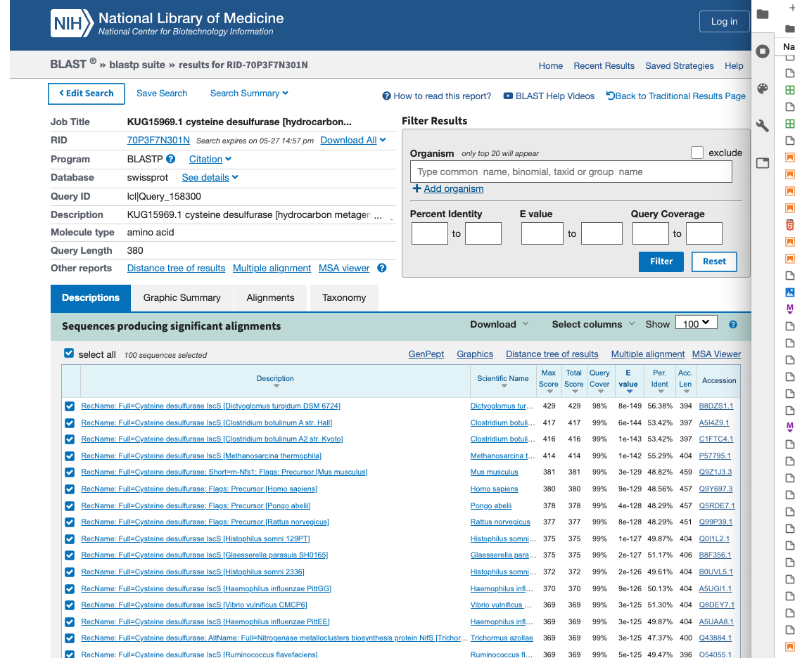
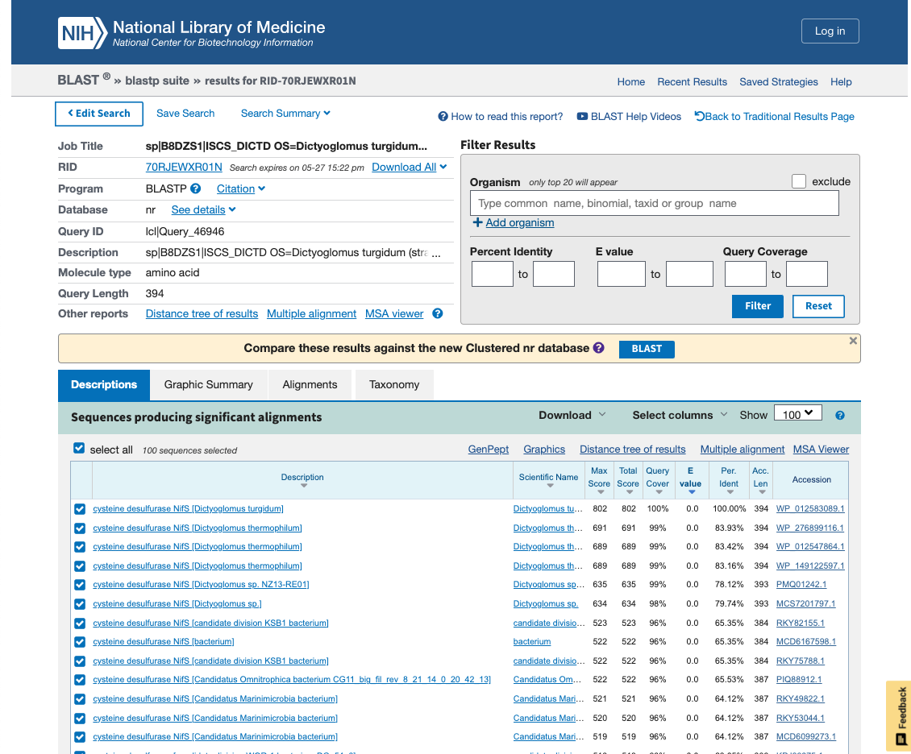
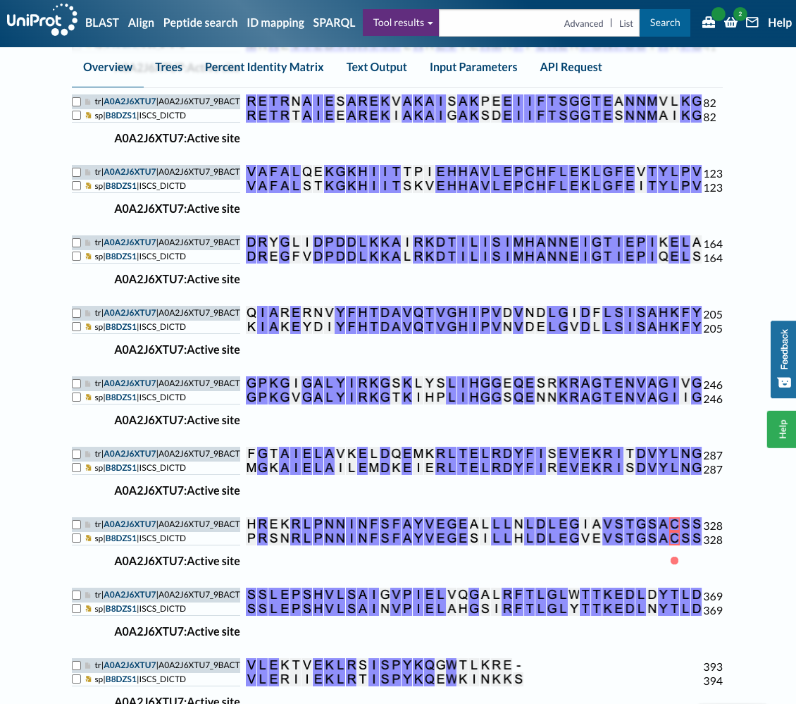
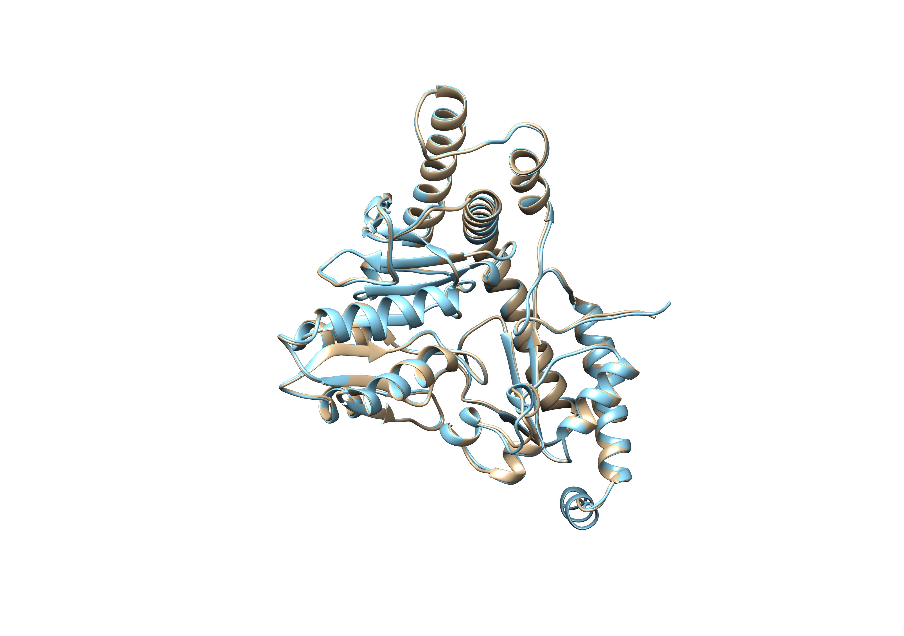

# S21

- **Avtor**: Špela Auer
- **Datum izdelave**: 2023-05-26
- **Koda seminarja**: S21


## Vhodni podatek

Zaporedje:
```
EVTYLPVTGEGLVELSTLEASIRPDTILISVMHANNEVGTIQPLEEIGRLAAERDIYLHS
DAVQSVGKIPVNVDDLGVDLLSLSAHKLYGPKGVGALYIRKGTKLESIIQ
```
---
## Rezultati analiz

### Identifikacija
Identifikacija se nanaša na protein, ki ga kodira gen, katerega del predstavlja  [zaporedje](#vhodni-podatek).

**Protein**: Cysteine desulfurase-cisteinska desulfuraza (UniprotID:B8DZS1)

**Organizem**: Dictyoglomus turgidum DSM 6724

**Potencialna funkcija proteina**: Protein katalizira pretvorbo cisteina v alanin.

Protein iz aminokislinskega zaporedja sem identificirala s programom Blastp v zbirki env_nr. Protein KUG15969 je bil prvi zadetek z identičnostjo 100 %. E vrednost je 1e-70, Query cover je 100 %.


Potem sem zaporedje tega proteina dala v Blastp po zbirki swissprot. Prvi zadetek z identičnostjo 58,38 %, query cover je 98 %, 8e-149 je približek proteina, ki je podano z izhodiščnim zaporedjem.



### Splošna karakterizacija
GenBank: Cysteine desulfurase IscS, id: B8DZS1
Ti odgovori se nanašajo na približek proteina, saj točnega proteina ne gre določiti.

- Kje v izvornem organizmu/celici se protein nahaja? V citoplazmi
- Katere post-translacijske modifikacije ima? Modificirana baza na mestu 203 (N6-(pyridoxal phosphate)lysine)
- Če želimo pripraviti protein v rekombinantni obliki, kateri gostiteljski organizem je najbolj smiselno izbrati in kateri del proteina bi izražali? Insektne celice, izražamo del z aktivnim mestom, brez signalnega peptida.
- So znani kakšni homologi (ortologi, paralogi)? Kaj je znanega o njih (funkcija, modifikacije, regulacija, aktivno mesto, ...)? Ima homologe Cysteine desulfurase NifS. Homologi imajo enako nalogo. Nahajajo se v citoplazmi, aktivno mesto na 326-cistein, ima PTM-modificiran aminokislinski ostanek na 203.


Homologe sem poiskala z Blastp iskanju po nr. Dala sem zaporedje z UniprotID: B8DZS1. Homologi so proteini Cysteine desulfurase NifS.

- Predstavlja naš protein encim ali gre za kak drug protein? Encim
  - Če gre za encim – ali je aktivno mesto v primerjavi z aktivnimi homologi ohranjeno? Je encim, aktivno mesto je na mestu 326-cistein, med homologi je ohranjeno.
  

  
- Kaj so najbolj ohranjene regije v skupini, ki jo predstavlja ta protein in njegovi homologi? Aktivno mesto, vsa vezavna mesta.

- So v zaporedju kakšne ponavljajoče se regije oz. motivi? Ne
- S katerimi proteini ali drugimi molekulami bi lahko ta protein potencialno interagiral? Ta protein ima za ligand 2Fe-2S. Nanj se veže L-cisteinin prenašalec žvepla-H.

Rezultate karakterizacije predstavite na smiseln način in podkrepite s prilogami (slike)!

### Strukturna katakterizacija
Zanimajo nas odgovori na naslednja vprašanja:
- Je znana struktura tega proteina ali njegovega dela? Ne, je le napovedana z AlphaFoldom.
- Je znana struktura homologov? Katerih? Ne, so samo napovedani z AlphaFoldom.
- Pripravite model proteina oz. njegovega dela, ki bi predstavljal funkcionalen topen protein. Moj približek proteina je v citoplazmi, torej je že sam po sebi topen. Vzela bi celoten protein.
- Primerjajte model oz. eksperimentalno strukturo z eksperimentalno strukturo homologa, osredotočite se na funkcijsko pomembne regije. Ne morem primerjati z eksperimentalno strukturo, ker imajo homologi le napovedano strukturo. So pa napovedane strukture zelo podobne.



Rezultate karakterizacije predstavite na smiseln način in podkrepite s prilogami (slike)!