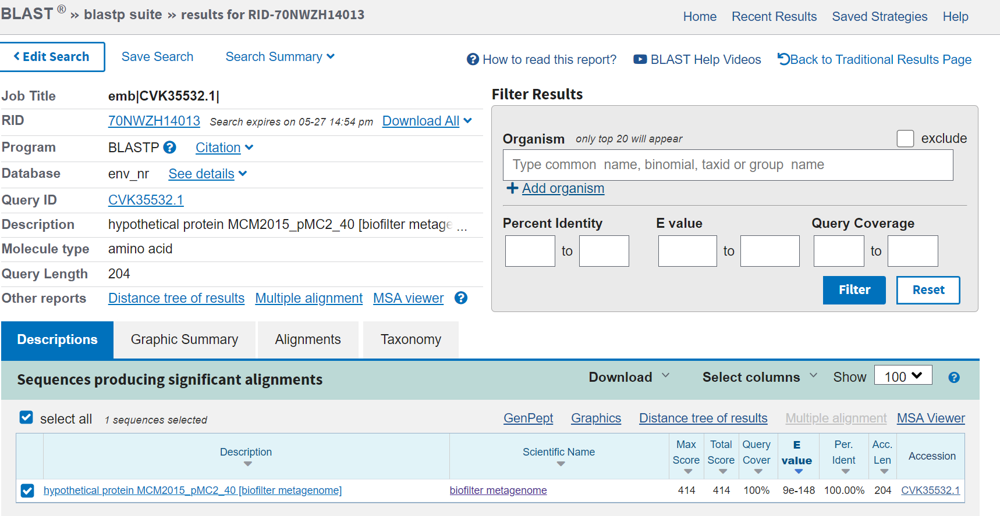
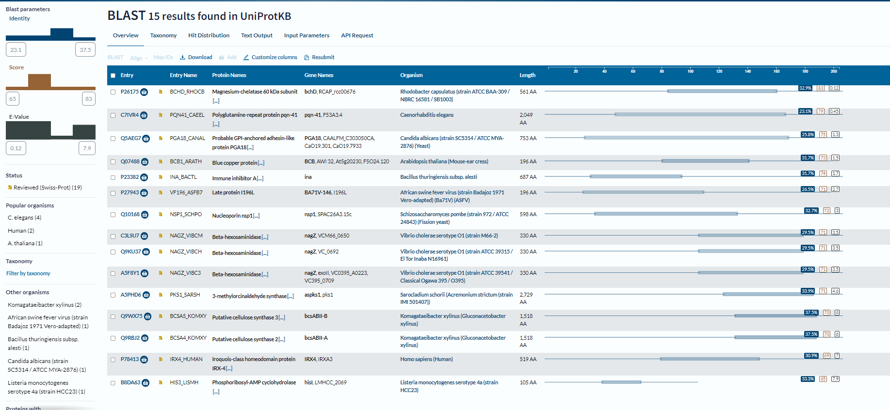
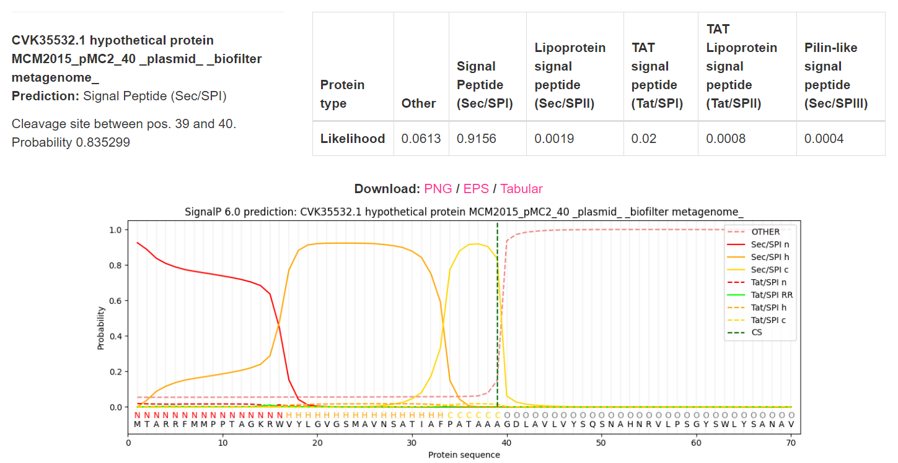
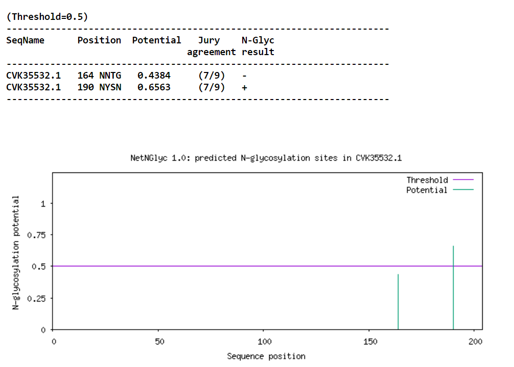
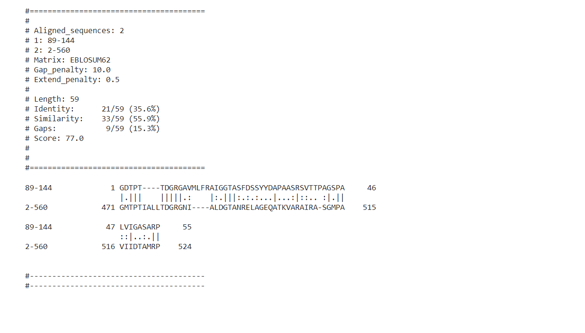

# S23

- **Avtor**: Tonja Jeromelj
- **Datum izdelave**: 2023-05-26
- **Koda seminarja**: S23

---
## Vhodni podatek

Zaporedje: MTARRFMMPPTAGKRWVYLGVGSMAVNSATIAFPATAAAGDLAVLVYSQSNAHNRVLPSG
YSWLYSANAVPHHCYKVCAGGETSAPSPGDTPTTDGRGAVMLFRAIGGTA

---
## Rezultati analiz

### Identifikacija
Identifikacija se nanaša na protein, ki ga kodira gen, katerega del predstavlja  [zaporedje](#vhodni-podatek).

**Protein**: hipotetični protein MCM2015_pMC2_40

**Organizem**: metagenomski izvor (verjetno bakterijski), izhaja iz biopurifikacijskih sistemov(biofilter metagenom)

**Potencialna funkcija proteina**: Ni znana. Hipotetični protein sicer vsebuje domeno, ki je podobna podenoti D iz magnezijeve kelataze (magnesium chelatase). Ta je odgovorna za vezavo celotne Mg-kelataze na celično membrano. Ker pa je protein hipotetičen, zaenkrat iz tega podatka ne moremo tvoriti nobenih zaključkov.

Protein sem identificirala s pomočjo blastp v zbirki metagenomskih proteinov. Edini zadetek s 100% ujemanjem čez celotno zaporedje je hipotetični protein. . 

Identifikacijo sem nadaljevala z iskanjem homologov tega hipotetičnega proteina. Na UniProtu sem uporabila blast po zbirki SwissProt. Dobila sem 15 zadetkov, ki niso bili preveč obetavni. E faktor za zadetke je znašal od 0,12 do 7,9.  

Poskusila sem uporabiti blast tudi po zbirki neanotiranih proteinov in zopet sem dobila 137 zadetkov, z izjemno visokimi E faktorji (do 9,7). Čeprav bi lahko že iz teh rezultatov sklepala, da protein nima obstoječih homologov sem vseeno poravnala nekaj najboljših zadetkov iz blasta po SwissProtu z zaporedjem mojega proteina v Clustal Omega. Na podlagi matrike podobnosti sem skušala določiti najbližji homolog. Tudi ti rezultati so potrdili moje sklepanje. Najvišji procentualni delež identičnosti je znašal 25,00%. Ko sem ta protein skušala najti na Uniprotu, sem opazila, da ima ta zadetek v UniProt blastu E faktor, ki znaša 2,7. Zaključila sem, da hipotetični protein MCM2015_pMC2_40 nima obstoječih homologov, s katerimi sem želela določiti funkcijo in lastnosti mojega proteina. O mojem proteinu torej ni bilo možno izvedeti veliko, saj njegov obstoj zaenkrat še ni dokazan.

### Splošna karakterizacija
Zanimajo nas odgovori na naslednja vprašanja:
- Kje v izvornem organizmu/celici se protein nahaja?

  Ker je protein hipotetičen in homolognih proteinov nima, tega ne moremo določiti.

- Katere post-translacijske modifikacije ima?
  
  Za napoved post-translacijskih modifikacij sem uporabila NetNglyc, ki, kot nam že ime pove, napove mesta v aminokislinskem zaporedju, kjer lahko potencialno pride do N-glikozilacije. Uporabila sem tudi SignalP, da sem določila prisotnost signalnega peptida. N-glikozilacija namreč redko poteče na proteinih brez signalnega peptida. SignalP z visoko verjetnostjo napoveduje signalni peptid in cepitveno mesto med 39. in 40. aminokislinskim ostankom. 

  Analiza s programom NetNglyc pa napoveduje eno mesto  N-glikozilacije. 

- Če želimo pripraviti protein v rekombinantni obliki, kateri gostiteljski organizem je najbolj smiselno izbrati in kateri del proteina bi izražali? 
  
  Protein je na podlagi raziskovalnega članka, v katerem je bil objavljen, po vsej verjetnosti bakterijskega izvora, zato je to verjetno najbolj ustrezen organizem. Več podatkov nimamo.

- So znani kakšni homologi (ortologi, paralogi)? Kaj je znanega o njih (funkcija, modifikacije, regulacija, aktivno mesto, ...)? 
  
  Homologi niso znani.

- Predstavlja naš protein encim ali gre za kak drug protein? 
  
  Ne moremo določiti.

  - Če gre za encim – ali je aktivno mesto v primerjavi z aktivnimi homologi ohranjeno?
    
    Ne moremo sklepati, da gre za encim, homologov nima.
  
- Kaj so najbolj ohranjene regije v skupini, ki jo predstavlja ta protein in njegovi homologi? 

  Glede na podatke iz GenBanka lahko razberemo, da hipotetični protein vsebuje bshD regijo (BEACH domain). Enako vsebuje tudi eden izmed zadetkov iz UniProt blasta za naš protein. Za dodatno potrditev o podobnosti teh regij sem opravila lokalno poravnavo z EMBOSS WATER. Rezultati so pokazali 35,6% identičnost regij in 55,9% podobnost.  

- So v zaporedju kakšne ponavljajoče se regije oz. motivi? 

  Ne.

- S katerimi proteini ali drugimi molekulami bi lahko ta protein potencialno interagiral? 

  Ne moremo določiti, ker nima obstoječih homologov.

### Strukturna karakterizacija
Zanimajo nas odgovori na naslednja vprašanja:
- Je znana struktura tega proteina ali njegovega dela?

  Struktura ni znana, niti ni napovedana.

- Je znana struktura homologov? Katerih? 
  
  Obstoječih homologov protein nima.

- Pripravite model proteina oz. njegovega dela, ki bi predstavljal funkcionalen topen protein. 

  Glede na to, da ne moremo določiti kateri deli proteina so topni sem v SwissModel pripravila model celotnega proteina. Ker nima obstoječih homologov je model strukture relativno nezanesljiv. 

- Primerjajte model oz. eksperimentalno strukturo z eksperimentalno strukturo homologa, osredotočite se na funkcijsko pomembne regije.

  Eksperimentalne strukture ni, prav tako protein nima znanih homologov.
