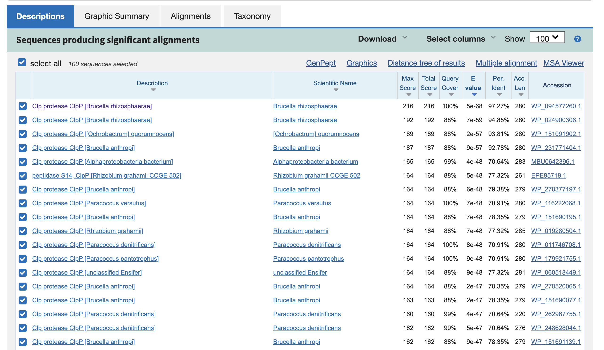
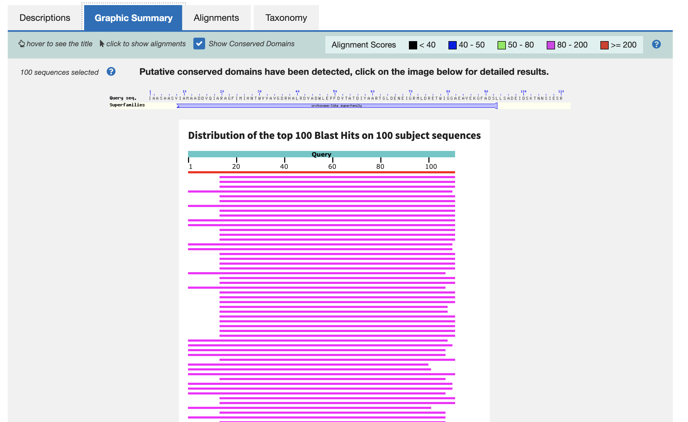
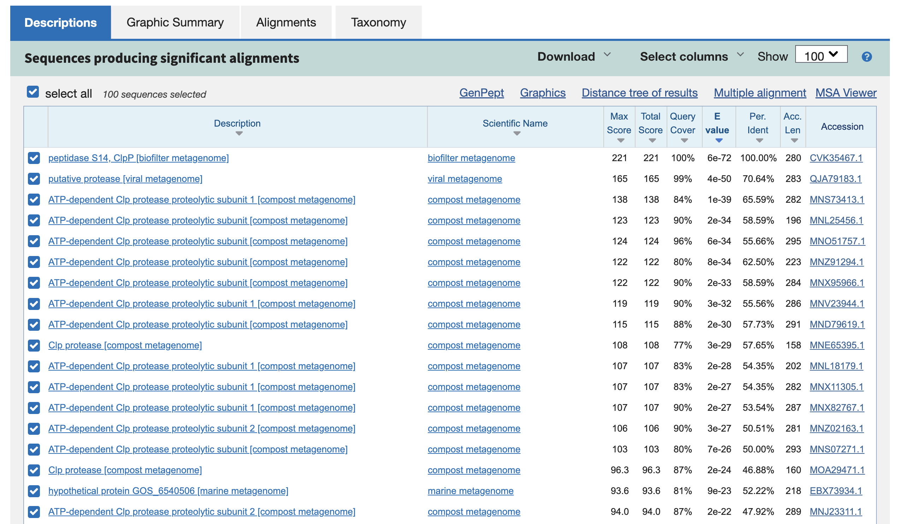
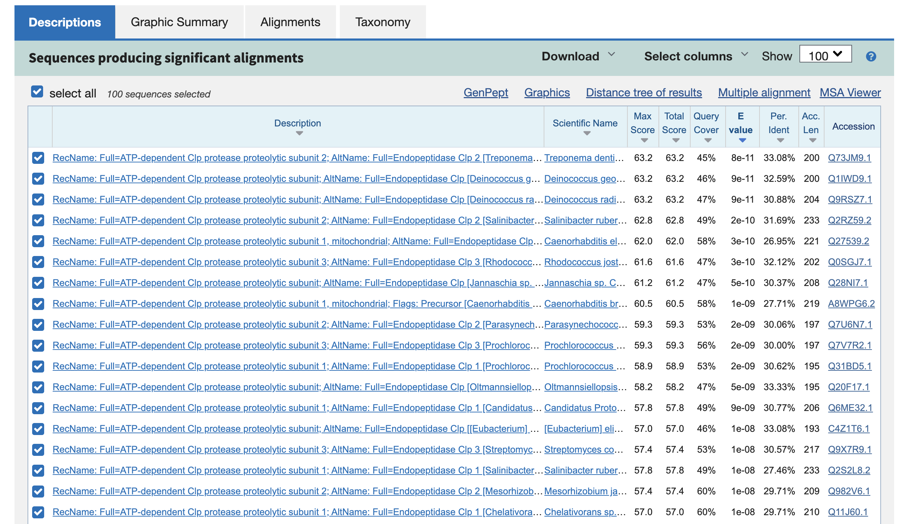
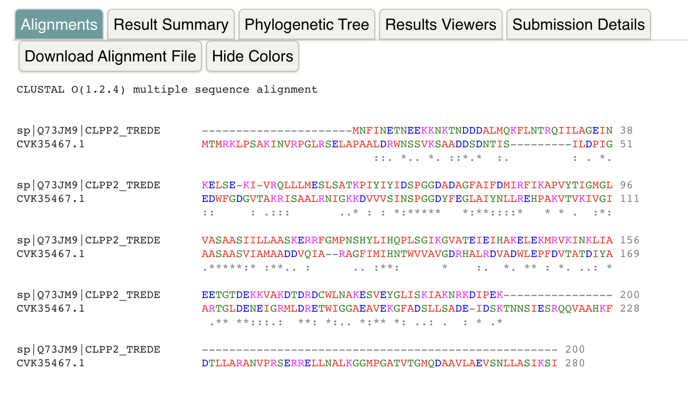
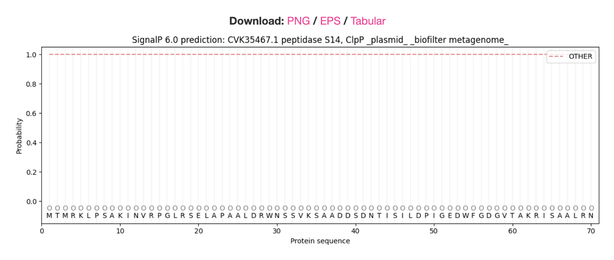
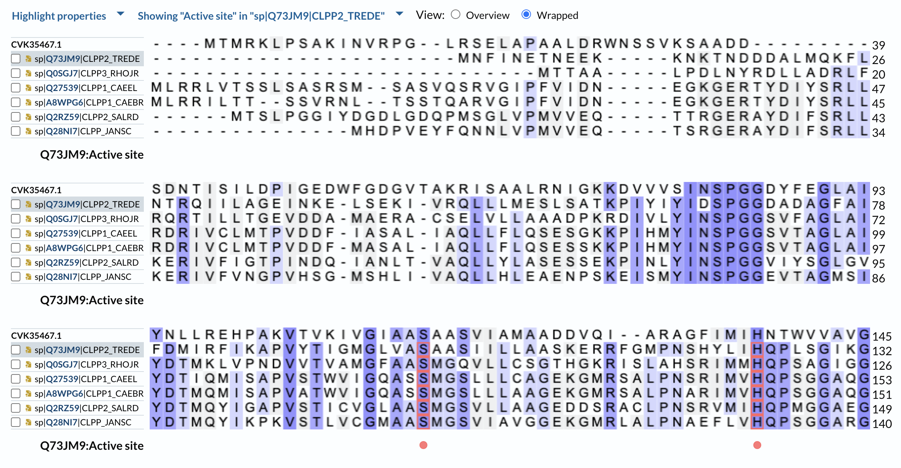
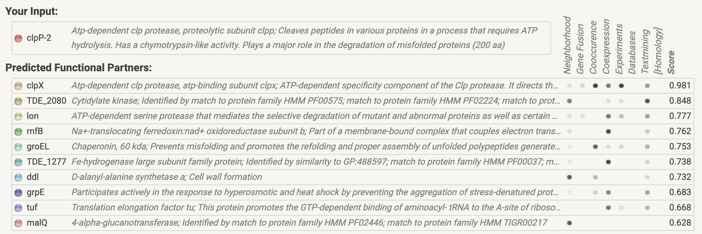
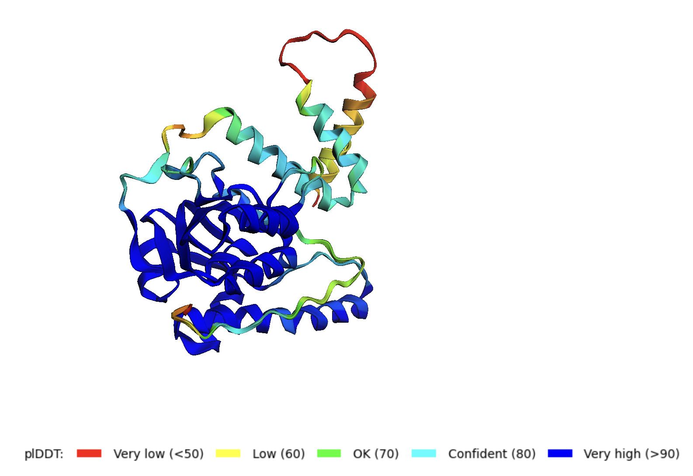

# S35

- **Avtor**: Taja Mužič
- **Datum izdelave**: 2023-05-27
- **Koda seminarja**: S35

---
## Vhodni podatek

Zaporedje:
```
IAASAASVIAMAADDVQIARAGFIMIHNTWVVAVGDRHALRDVADWLEPFDVTATDIYAA
RTGLDENEIGRMLDRETWIGGAEAVEKGFADSLLSADEIDSKTNNSIESR
```
---
## Rezultati analiz

### Identifikacija
Identifikacija se nanaša na protein, ki ga kodira gen, katerega del predstavlja [zaporedje](#vhodni-podatek).

**Protein**: Clp proteza ClpP (Clp protease ClpP)

**Organizem**: [*Brucella rhizosphaerae*](https://en.wikipedia.org/wiki/Brucella_rhizosphaerae) 

**Potencialna funkcija proteina**: Serinska peptizada - cepi peptidne vezi v proteinih; ATP-odvisna proteoliza - kataliza hidrolize peptidne vezi, ki jo poganja hidroliza ATP. Pri proteolizi pride do razgradnje proteina (delno) na peptide ali pa (v celoti) na aminokisline.

Identifikacija je bila narejena z uporabo NCBI BLAST, varianta Blastp. Uporabila sem zbirko non-redundant protein sequences (nr). Pri enem od rezultatov je bilo zajeto celotno iskano zaporedje proteina (100%), imel je 97,27% identičnost in nizko e vrednost. Koda zapisa z BLAST identificiranega proteina: GenBank [WP_094577260.1](https://www.ncbi.nlm.nih.gov/protein/WP_094577260.1?report=genbank&log$=prottop&blast_rank=1&RID=70VYJSZS013).

Tabeliran prikaz Blastp:



Grafični prikaz Blastp:



Nato sem naredila tudi identifikacijo z varianto Blastp, zbirka Metagenomic proteins (env_nr). Eden od zadetkov je imel 100% identičnost in zajeto je bilo celotno zaporedje iskanega zaporedja.



Koda zapisa z BLAST identificiranega zaporedja: GenBank [CVK35467.1](https://www.ncbi.nlm.nih.gov/protein/CVK35467.1?report=genbank&log$=prottop&blast_rank=1&RID=70NC0U90013). To zaporedje predstavlja celotno zaporedje mojega proteina.

Aminokislinsko zaporedje:
```
>CVK35467.1
MTMRKLPSAKINVRPGLRSELAPAALDRWNSSVKSAADDSDNTISILDPIGEDWFGDGVTAKRISAALRN
IGKKDVVVSINSPGGDYFEGLAIYNLLREHPAKVTVKIVGIAASAASVIAMAADDVQIARAGFIMIHNTW
VVAVGDRHALRDVADWLEPFDVTATDIYAARTGLDENEIGRMLDRETWIGGAEAVEKGFADSLLSADEID
SKTNNSIESRQQVAAHKFDTLLARANVPRSERRELLNALKGGMPGATVTGMQDAAVLAEVSNLLASIKSI
```
### Splošna karakterizacija

Za zapis GenBank [CVK35467.1](https://www.ncbi.nlm.nih.gov/protein/CVK35467.1?report=genbank&log$=prottop&blast_rank=1&RID=70NC0U90013) ni na voljo pripisov glede značilnosti proteinskega produkta. Z uporabo NCBI BLAST sem identificirala najbolj podoben anotiran protein. Iskala sem z zaporedjem CVK35467.1, uporabila sem varianto Blastp, zbirka UniProtKB/Swiss-Prot. Identificirani proteini so proteolitične podenote od ATP-odvisne Clp protezae. Pri rezultatih je bilo zajetih 40-60% iskanega zaporedja, in sicer osrednji del zaporedja. Identičnost je bila povsod okoli 30%.

Tabeliran prikaz Blastp:



Grafični prikaz Blastp:


Prvo zaporedje v zapisu Uniprot [Q73JM9](https://www.uniprot.org/uniprotkb/Q73JM9/entry#function) ima 33.08% identičnost, zajema 45% zaporedja in ima nizo e vrednost. Podobno je tudi pri drugem zadetku. Po pregledu ovbeh na UniProt sem (na prvi pogled) ocenila, da imata anotirane enake značilnosti oz. lastnosti. Iz tega sem sklepala, da ne bi bilo tako velike razlike, ali bi delala s prvim ali drugim. Zato sem nadaljne analize delala z zaporedjem v zapisu Q73JM9. Gre za proteoloitično podenoto 2 od ATP-odvisne Clp protezae (ATP-dependent Clp protease proteolytic subunit 2) iz organizma [*Treponema denticola*](https://en.wikipedia.org/wiki/Treponema_denticola). Za ta protein je zapisano, da se nahaja v citosolu. Obsega 200 ak ostankov, nima anotiranega nobenega signalnega peptida. Zaporedje celotnega proteina (ki ga kodira gen, katerega del predstavlja [zaporedje](#vhodni-podatek)) je sicer dolgo 280 ak.

Naredila sem poravnavo med zaporedjema CVK35467.1 in zaporedjem v zapisu Q73JM9. Poravnavo sem naredila v Clustal Omega. Vidi se, da ima zapredje CVK35467.1 na začetku in na koncu del, ki ga zaporedje v zapisu Q73JM9 nima. Verjetno se ta dva dela zaporedja odcepita.



Zanimalo me je, ali ima zaporedje CVK35467.1 na začetku signalni peptid. Zapordeje se namreč začne z M (kar je značilno za signalni peptid). Uporabila sem orodje Signal peptide prediction. Izkazalo se je, da zaporedje nima signalnega peptida.



#### Lokalizacija in post-translacijske modifikacije

Sicer anotirani protein nima visoke podobnosti z zaporedjem CVK35467.1, vendar je to ena višjih podobnosti, ki sem jih našla. Zato iz tega (in na podlagi ostalih ugotovitev) sklepam, da je protein pod zaporedjem CVK35467.1 od ATP-odvisna proteaza, bolj natančo serinska proteaza. Protein se izloča v citoplazmi.

Da bi ugotovila, ali ima protein kakšne post-translacijske modifikacije, sem naredila BLAST na UniProt. Iskala sem po bazi UniProtKB SwissProt (anotirana zaporedja). Iskala sem z zaporedjem CVK35467.1. Ko sem dobila rezultate, sem naredila poravnavo nekaj zaporedij. Iz poravnave je razvidno, da protein nima anotiranih nobenih post-translacijskih modifikacij. Je pa pri vseh, tudi pri iskanem zaporedju, zelo dobro ohranjeno aktivno mesto. V aktivenm mestu sta S in H.



Za serinske proteze je značilno, da imajo "klasično" katalitično triado Ser/His/Asp. Take so tudi najbolj razširjene v naravi. Obstajajo pa tudi tako "neklasične" serinske proteaze, kjer opazimo variacijo katalitične triade. Te različice vključujejo triade Ser/His/Glu, Ser/His/His in Ser/Glu/Asp. Vključujejo tudi diade Ser/Lys in Ser/His. Pri proteinu sta v aktivnem mestu samo S in H, zato gre verjetno za "neklasično" serinsko proteazo (diada Ser/His).

#### Izražanje proteina v rekombinantni obliki

Gre za majhen protein, zato bi se ga vrjetno dalo izolirati v bakterijskem ekspresijskem sistemu. Sploh pa zato, ker glede na obstoječe anotacije podobnih proteinov post-translacijske modifikacije naj ne bi bile prisotne. Protein je dolg je 280 ak ostankov (majhen), zato bi izražala cel protein.

#### Homologi

Protein ima homologe, ampak ti homologi niso anotirani. Pri iskanju po anotirani zbirki sem dobila rezultate, ki obsegajo samo 43% iskalnega zaporedja in približno 30% identičnost. Iz tega ne morem trditi, da so to homologi. Pri neanotirani zbirki pa obsegajo rezultati celotno zaporedje (100% iskanega zaporedja). Podobnost v primerjavi med zaporedji je dober dokaz, da sta dve zaporedji homologni, zato sem naredila primerjavo med zaporedji.

Najprej sem naredila identifikacijo z blastp, zbirka non-redundant protein sequences (nr). Iskala sem z zaporedjem CVK35467.1. Izbrala sem naključna zaporedja in z njimi, ter z iskanim zaporedjem (CVK35467.1), naredila poravnavo v CCOBALT (multiple alignment tool). Rezultati so pokazali, da so si neanotirana zaporedja med precej podobna, zato lahko sklepam, da so to homologi. Prav tako imajo vsi (neanotirani) homologi enako ime, zato verjetno opravljajo enako funkcijo. Iz teh ugotovitev, lahko sklepam, da so to homologi proteina, vendar niso anotirani.

Poravnava neanotiranih zaporedij:


Nato sem naredila še identifikacijo z blastp, zbirka UniProtKB/Swiss-Prot. Iskala sem z zaporedjem CVK35467.1. Spet sem si izbrala naključna zaporedja in z njimi naredila poravnavo v COBALT. Rezultati so pokazali, da so si zaporedja med sabo podobna. Ker pa obsegajo zaporedja samo 43% iskalnega zaporedja, ne morem trditi, da so proteini homologi iskanega proteina.

Grafični prikaz blastp (anotirani):


Protein je encim (proteaza) in ima dobro ohranjeno aktivno mesto. Ker homologi niso anotirani ne morem z zagotovostjo trditi, da imajo ohranjeno aktivno mesto. Poravnava v UniProt z zaporedji, ki so obsegala samo 43 % iskalnega zaporedja pokaže, da je aktivno mesto povsod zelo dobro ohranjeno. Iz tega sklepam, da imajo tudi (neanotirani) homologi dobro ohranjeno aktivno mesto.

#### Interakcije

Za potencialne interakcije proteina sem pogledala, s katerimi proteini interagira protein pod UniProt zapisom Q73JM9 (CLPP-2). Interakcije sem pogledala s STRING.


Znane so interakcije tega proteina s tuf, TDE_2080, groEL, Ion in clpX. Predvidene so tudi interakcije z ddl, malQ, grpE, rnfB, TDE_1277.



### Strukturna katakterizacija

Ni znane strukture proteina (ali dela proteina). Prav tako ni znane strukture homologov.
Za protein pod zapisom CVK35467.1 je v UniProt (zapis A0A1A7GD23) predlagan AlphaFold model. Ampak ta zapis ni anotiran.

Za strukturo proteina sem uporabila AlphaFold. Vnesla sem zaporedje pod zapisom CVK35467.1.

Struktura proteina (AlphaFold):

