# S37

- **Avtor**: Laura Simonič
- **Datum izdelave**: 2023-05-25
- **Koda seminarja**: S37

---
## Vhodni podatek

Zaporedje: 
```
GREAILRVHIKDKPIDEEVDLEILAKRTPGFTGADLANMVNEAALLAARRGKTKIFMEEM
EESIERVIAGPEKKTRVISDKEKRLVAFHEAGHAVVSYMLPNTDKLHKIS
```
---
## Rezultati analiz

### Identifikacija
Identifikacija se nanaša na protein, ki ga kodira gen, katerega del predstavlja  [zaporedje](#vhodni-podatek).

**Protein**: protein celične delitve ftsh (cell division protein ftsh)

**Organizem**: gre za neidentificiran anaerobni organizem izoliran iz jarka, kontaminiranega z ogljikovodiki (hydrocarbon-contaminated ditch). Podobna zaporedja (identificirana s pomočjo NCBI BLAST, varianta blastp znotraj zbirke non-redundant protein sequence) pripadajo družini anaerobnih bakterij - *Syntrophomonadaceae* (identičnost do 94.55%, E vrednosti do 6e-63).

Prikaz najdenih podobnih zaporedij z največjo podobnostjo:

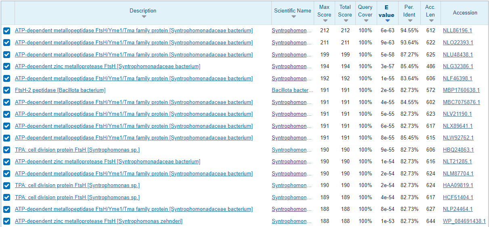

**Potencialna funkcija proteina**: Najverjetneje deluje kot procesivna, ATP-odvisna cinkova metalopeptidaza za citoplazemske in membranske proteine ter igra vlogo v kontroli kvalitete integralnih membranskih proteinov.

Identifikacija je bila narejena s pomočjo NCBI BLAST, varianta blastp (zbirka metagenomic proteins). Značilna podobnost je bila najdena s celotnim zaporedjem cell division protein (100% identičnost, E vrednost 5e-69)

Tabelirani prikaz zadetkov:


Koda zapisa BLAST identificiranega proteina: GenBank [KUG05215.1](https://www.ncbi.nlm.nih.gov/protein/KUG05215.1?report=genbank&log$=prottop&blast_rank=1&RID=70NGJUCJ013)

Aminokislinsko zaporedje:
```
>KUG05215.1 cell division protein ftsh [hydrocarbon metagenome]
MDRALKNIAIYVLIVMIAVFALKLTSAPVEQAKTLSEPEFYTKVSQGQVAEAVVEVDELVYNISGKLADG
TSYVATVSKETEIVALLREKKVDYTTQPVPPPSIWMTLLSTLLPIVLLIAFLMFIMNQTQGGGNKVMQFG
KSRARLMTGEEVKITFEDVAGAEEAKEEMQEVVEFLKNPNKFIQIGAKIPKGVLLFGAPGTGKTLMAKAV
AGEAGVPFFSISGSDFVEMFVGVGAARVRDLFEQAKKSAPCIVFIDEIDAVGRQRGAGLGGGHDEREQTL
NQLLVEMDGFSTNEGIIVMASTNRPDILDPALLRPGRFDRHILIDKPDVRGREAILRVHIKDKPIDEEVD
LEILAKRTPGFTGADLANMVNEAALLAARRGKTKIFMEEMEESIERVIAGPEKKTRVISDKEKRLVAFHE
AGHAVVSYMLPNTDKLHKISIIPRGRAGGYTLLLPEEDRNYITKSHLLDEITTLLGGRVAEALVLNDIST
GAQNDLERASSIVRKMITEFGMSDELGPITFGHKSEEVFLGRDFSRDRDYSDAIAYAIDKEASKYIHESY
NKAEQLLTEQMEKLHEVAEFLLVHETMEAQDFLKIMEGRELETEAEVESDSDDETDIQA
```

### Splošna karakterizacija
Za zapis GenBank [KUG05215.1](https://www.ncbi.nlm.nih.gov/protein/KUG05215.1?report=genbank&log$=prottop&blast_rank=1&RID=70NGJUCJ013) ni na voljo pripisov glede značilnosti proteinskega produkta, zato so za karakterizacijo proteina bila v pomoč anotirana aminokislinska zaporedja, ki so podomna zaporedju identificiranega proteina.


### Lokacija in post-translacijske modifikacije
V vnosu proteina na UniProt-u kot [A0A0W8E998](https://www.uniprot.org/uniprotkb/A0A0W8E998/entry) je zapisano, da bi se protein naj nahajal v membrani (ni specificirano kateri, a če sklepamo da gre za prokariontski organizem, lahko predvidevamo da v celični).

Z iskanjem z blastp (privzete nastavitve) po zbirki UniprotKB/Swiss-Prot (dobro anotirani zapisi) z zaporedjem KUG05215.1 je identificiranih 100 proteinov, pri katerih gre za ATP-odvisno cinkovo metaloproteazo FtsH:

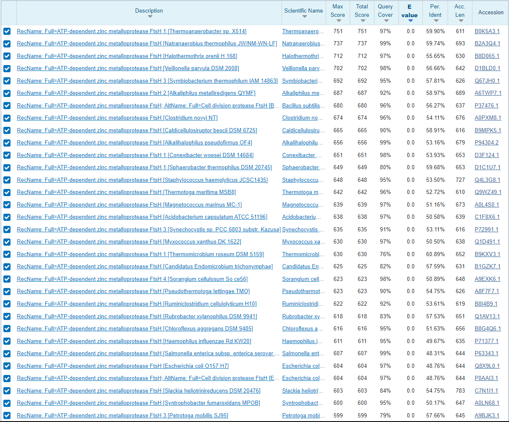

V večini zadetki pokrivajo bolj ali manj celotno dolžino iskalnega aminokislinskega zaporedja:

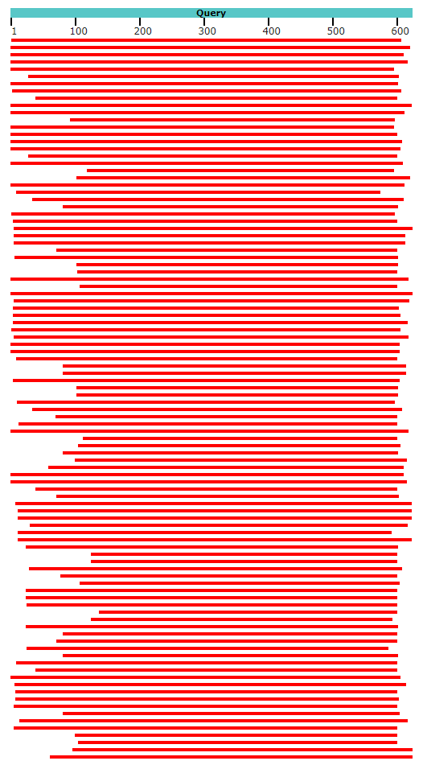

Najbolj podobno zaporedje (skoraj 60% identičnosti v poravnanem delu, ki predstavlja kar 97% iskanega zaporedja) je zaporedje vnešeno v Uniprot kot [B0K5A3](https://www.uniprot.org/uniprotkb/B0K5A3/entry). Gre od ATP-odvisno cinkovo metaloproteazo FtsH1 (ATP-dependent zinc metalloprotease FtsH 1), ki pripada organizmu, ki spada v eno izmed vrst znotraj genusa temrofilnih in anaerobnih bakterij [*Thermoanaerobacter*](https://en.wikipedia.org/wiki/Thermoanaerobacter) seva X514 (Thermoanaerobacter sp. (strain X514) (species)). Ta protein je v celični membni in prehaja čez njo na večih mestih. Zaporedje ne vsebuje signalnega peptida in je dolgo 611 amoinokislinskih ostankov.

Na podlagi relativno visoke podobnosti z iskalnim zaporedjem lahko sklepamo, da je protein z zaporedjem KUG05215.1 od ATP odvisna cinkova metaloproteaza, ki se nahaja v celični membrani organizma. Ta zaključek podpirajo tudi prostala zaporedja z visoko podobnostjo, ki so bila najdena v zbirki swissprot. Nobeno izmed dobro anotiranih zaporedij nima zabeleženega signalnega peptida.

Poravnava KUG05215.1 z [B0K5A3](https://www.uniprot.org/uniprotkb/B0K5A3/entry):

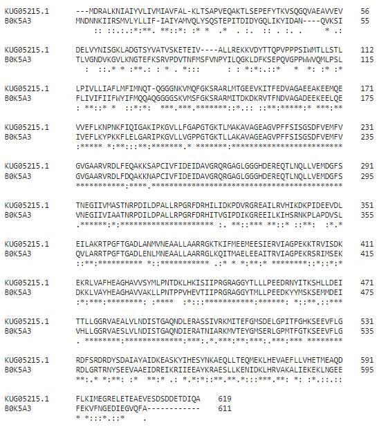

Iz poravnave je razvidno, da 12 AK ostankov na koncu iskalnega zaporedja ne predstavlja metaloproteaze. Iskanje tega nujemajočega dela zporedja po blastp, ne vrne signifikantne podobnosti (E-vrednosti nad 1).

Iskanje zaporedja KUG05215.1 po zbirki Uniprot z balstp, ki smo ga izvedli preko [Blast@UniProt](https://www.uniprot.org/blast), je vrnilo:
- podobnost čez bolj ali manj celotno zaporedje (ponekod ni podobnosti zgolj na kratkem končnem delu iskalnega zaporedja) ATP-odvisnih zinkovih metaloproteaz FtsH iz vrst, ki pripadajo družini Syntrophomonadaceae. Primer enega izmed njih je [A0A7X8LMZ2](https://www.uniprot.org/uniprotkb/A0A7X8LMZ2/entry) (612 AK ostankov, 92% podobnost)
- 100% podobnost z vnosom [A0A0W8E998](https://www.uniprot.org/uniprotkb/A0A0W8E998/entry) iz enakega metanogenoma, kot je bilo izolirano izhodiščno [zaporedje](#vhodni-podatek) (po celotni dolžini)

Narejena je bila poravnava teh zaporedij z dodanimi dobro anotiranimi zaporedji, ki so bila najdena v zbirki UniProtKB reference proteomes + Swiss-Prot. Nobeno izmed najdenih zaporedij nima zabeleženih post-translacijskih modifikacij.

### Izražanje proteina v rekombinantni obliki

Glede na to da gre za membranski protein brez post-translacijskih modifikacij in da gre nasplošno najverjetneje za izolat iz bakterijskega organizma, bi bila najverjetneje najbolj primerna uporaba bakterijskega ekspresijskega sistema.

Na podlagi primerjave s podobnimi proteini smo ugotovili, da bolj ali manj celotno zaporedje, z izjemo kratkega dela na koncu zaporedja predstavlja zapis za aktivno od ATP odvisno cinkovo metaloproteazo. Tako bi bilo smiselno izražati kar celotno zaporedje, a bi pri tem lahko prišlo do zapletov oz. bi se to lahko izkazalo za precej kompleksno nalogo, saj bi lahko prišlo do agregacije zaradi hidrofobnega dela proteina. 

### Homologi
Glede na to, da je bil iskalni protein izoliran iz okoljskega vzorca in ne vemo točno iz katerega organizma je bil izoliran je težko določiti ali gre za izoliran protein ali za homologe le tega. V vseh priemrih gre za od ATP-odvisne cinkove metaloproteaze iz različnih družin bakterij (velikokrat točen organizem ni določen), ki so včasih poimenovane tudi kot protein celične delitve FtsH, ali pa kot od metalopeptidaza namesto metaloproteaza.

Vsi ti proteini delujejo kot proteaze citosolnih kot tudi membranskih proteinov, ki za delovanje potrebujejo cink (kofaktor) - metaloproteaze. Dobro anotirana zaporedja homologov so sestavljena iz dveh citoplazemskih regij, med katerima sta dve transmembranski regiji, ki ju lučuje ekstracelularna domena. Vnosi homologov ne vsebujejo nobenih post-translacijskih modifikacij in so v večini vnešeni brez signalnega peptida. V večini vsebujejo daljšo regijo za vezavo molekule ATP ter po tri AK ostanke, ki predstavljajo vezavno mesto za ion cinka. Vsem je skupno eno aktivno mesto, ki ga predstavlja glutamat in je v poravnavah dobro ohranjen v vseh zaporedjih.

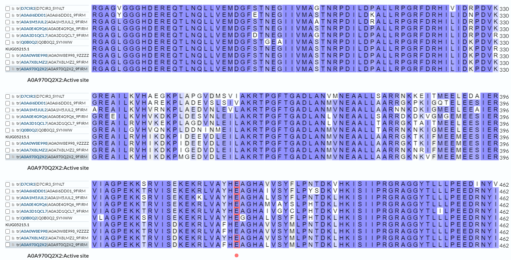
 
 V veliki večini je v anotacijah zapisano, da gre za homoheksamer. V splošnem jih sestavljajo tri domene, ki so jim vsem skupne - AAA+ ATP-azna domena, peptidaza M41 in AAA ATPaza, AAA+ lid domena.

Tudi pri našem proteinu gre z veliko verjetnostjo za encim z enako funkcijo. Kot je vidno na zgornji sliki je aktivno mesto iskalnega proteina pod vnosom [A0A0W8E998](https://www.uniprot.org/uniprotkb/A0A0W8E998/entry) v primerjavi z aktivnimi homologi dobro ohranjeno.

Nasplošno je zaporedje proteina dobro ohranjeno preko vseh homologov, kar je prikazano na odseku logo-ta poravnave 17 AK zaporedij iskalnega zaporedja in njegovih homologov.

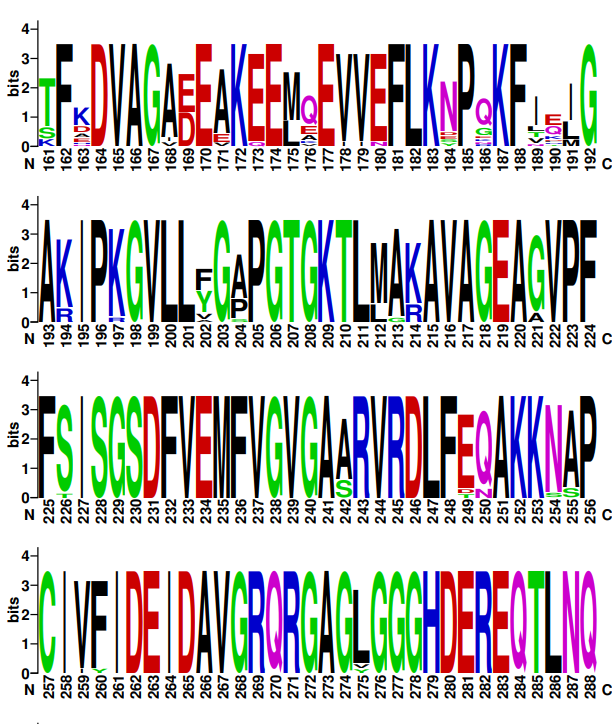

Največja ohranjenost je prisotna v regiji, ki je pod dobro anotiranimi proteini zabeležena kot ena izmed dveh regij zapisa citoplazemsko domeno proteina (C-končna). Prav tako so dobro ohranjena mesta za vezavo cinkovega iona, ki so vidna v WebLogo-tu na spodnji sliki pa so prikazana v poravnavi parih anotiranih zaporedij z iskalnim zaporedjem.


Z izjemo enega zaporedja [B0K5A3](https://www.uniprot.org/uniprotkb/B0K5A3/entry), ki ima vezavno mesto molekule ATP označeno bolj na začetku zaporedja in s popolnoma drugačnim zaporedjem AK ostankov kot ostala zaporedja homologov, je tudi to vezavno mesto dobro ohranjeno v homolognih proteinih. Je pa na mestu v poravnavi, kjer se nahaja v preostalih proteinih mesto vezave za ATP (AK zaporedje GPPGTGKT), to zaporedje aminokislinskih ostankov prisotno tudi v tem proteinu.

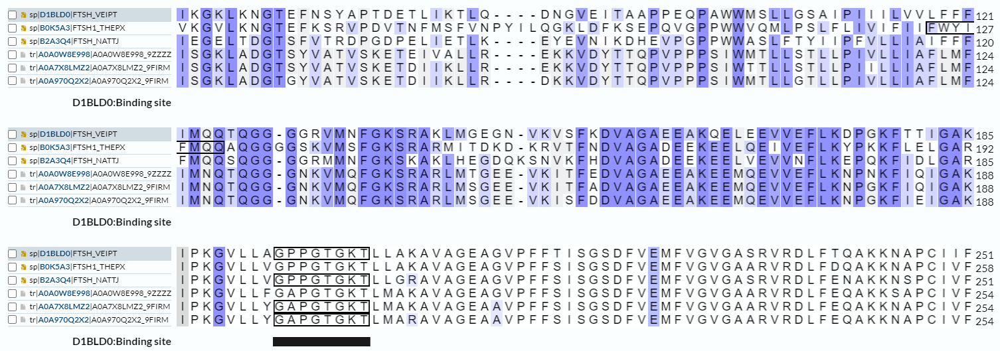

### Zaporedje in interakcije
Zaporedje vsebuje kratke podobnost/podvojitve znotraj zaporedja, kar je prikazano na točkovnem diagramu.

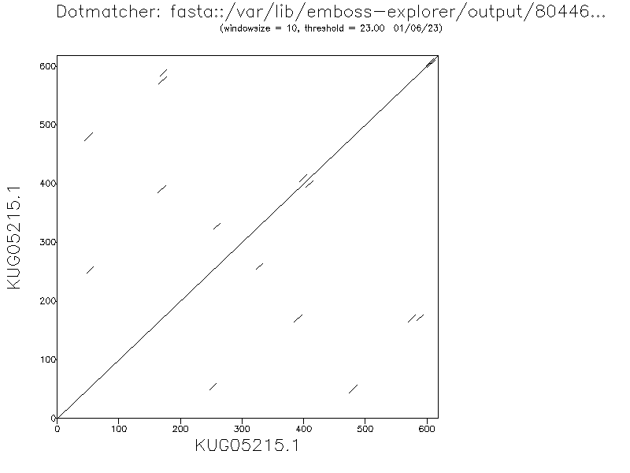

Na podlagi primerjav s podobnimi zaporedji, smo prišli do zaključka, da protein skoraj zagotovo veže molekule ATP in koordinira cinkove ione. Interakcije s proteini niso vnešene v zapis dobro anotiranih homologov, a je njihova funkcija povezana s cepitvijo proteinov, zato skoraj zagotovo iskalni protein vstopa v interakcije tudi s proteini.


### Strukturna katakterizacija
Struktura proteina še ni znana (ni vnešena v zbirko PDB). 
Homologi z določeno strukturo so bili poiskani s pomočjo izvedbe blastp po zbirki PDB, ki vsebuje že eksperimentalno določene strukture.


Eden izmed homologov (predstavlja 96% iskalnega zaporedja iin ima 53% identičnost), za katerega je določena struktura je veriga A od ATP odvisne cinkove metaloproteaze FtsH organizma [*Thermotoga maritima*](https://en.wikipedia.org/wiki/Thermotoga_maritima) PDBID [7TDO](https://www.rcsb.org/structure/7TDO) in UniProtID [Q9WZ49](https://www.uniprot.org/uniprotkb/Q9WZ49/entry).  Struktura je bila določena s Krio-EM. Gre za simetrični heksamer, kjer se monomeri povežejo v obroč.

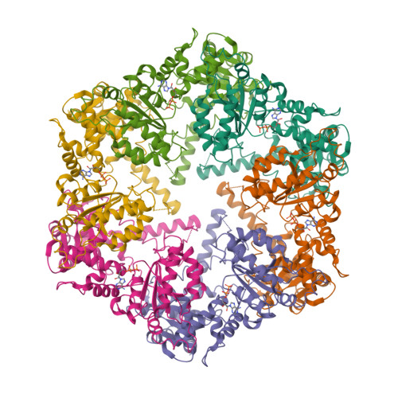

Narejena je bila poravnava predvidene strukture iskalnega proteina, ki je bila zgenerirana v [AlphaFold-u](https://alphafold.ebi.ac.uk/entry/A0A0W8E998) in eksperimentalno določene strukture verige A od ATP odvisne cinkove metaloproteaze FtsH *Thermotoga maritima* v programu Chimera.

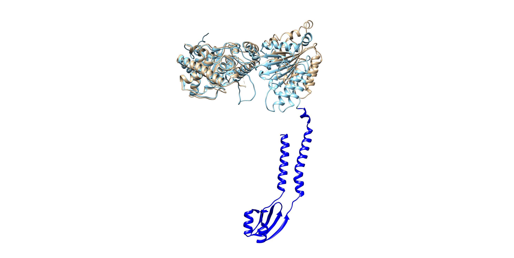

Jasno je razvidno, da predvidena struktura iskalnega proteina na začetnem N-koncu strukture vsebuje velik del, ki v eksperimentalno določeni strukturi ni prisoten (na sliki prikazan s temno modro). Preostal del strukture določene z AlphaFoldom vsebuje bolj ali manj enake strukturne elemente, ki imajo tudi zelo podobno prostorsko ureditev. Najboljše ujemanje struktur je prisotno na C-koncu obeh proteinov, ki predstavljata enega izmed citosolnih delov v obeh proteinih. Ravno ta dela vsebujeta vezavna mesta ter aktivno mesto proteinov (pri iskalnem proteinu smo to predvidevali preko primerjave s homologi).

 Prav tako je še zmeraj precej dober strukturni približek (97% iskalnega zaporedja in 49% identičnost) veriga A od ATP odvisne cinkove metaloproteaze FtsH iz [*Escherichia coli*](https://en.wikipedia.org/wiki/Escherichia_coli) PDBID [7VHP](https://www.rcsb.org/structure/7VHP).

Če želimo topen protein je potrebno vzeti ali citosolno ali pa ekstracelularno domeno proteina. Na podlagi vseh do zdaj opisanih primerjav s homologi je bilo zaključeno, da se vsa vezavna mesta in aktivno mesto iskalnega proteina nahajajo v C-končni citosolni domeni proteina. Na podlagi poravnave dobro anotiranih homologov iskalnega proteina z označenimi citosolnimi domenami:

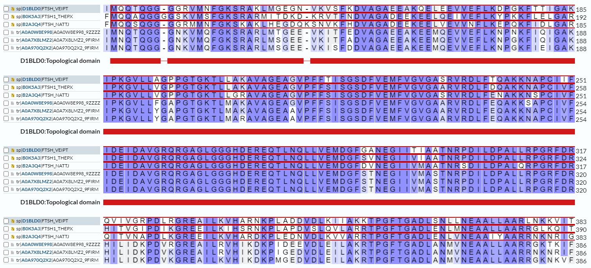

je bil identificiran metionin na 126 mestu v AK zaporedju iskalnega proteina kot začetek citosolne domene le-tega. Na podlagi tega je bil narejen v Chimeri narejen model tega dela strukture, ki je bila zgenerirana v AlphaFold-u. 

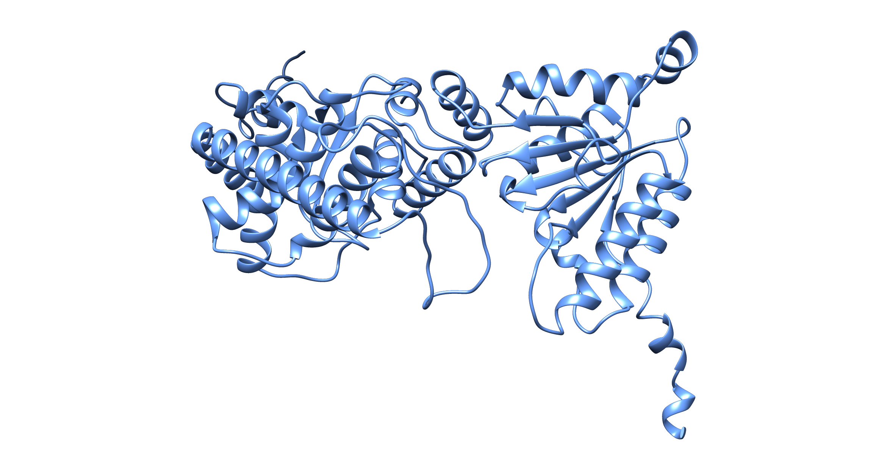
---
## VIRI:

- Liu, W., Schoonen, M., Wang, T. et al. Cryo-EM structure of transmembrane AAA+ protease FtsH in the ADP state. Commun Biol 5, 257 (2022). https://doi-org.nukweb.nuk.uni-lj.si/10.1038/s42003-022-03213-2
- Stephen F. Altschul, Thomas L. Madden, Alejandro A. Schäffer, Jinghui Zhang, Zheng Zhang, Webb Miller, and David J. Lipman (1997), "Gapped BLAST and PSI-BLAST: a new generation of protein database search programs", Nucleic Acids Res. 25:3389-3402.
- The UniProt Consortium, UniProt: the Universal Protein Knowledgebase in 2023, Nucleic Acids Research, Volume 51, Issue D1, 6 January 2023, Pages D523–D531, https://doi.org/10.1093/nar/gkac1052
- Madeira F, Pearce M, Tivey ARN, et al. Search and sequence analysis tools services from EMBL-EBI in 2022. Nucleic Acids Research. 2022 Jul;50(W1):W276-W279. DOI: 10.1093/nar/gkac240. PMID: 35412617; PMCID: PMC9252731.
- Crooks GE, Hon G, Chandonia JM, Brenner SE WebLogo: A sequence logo generator,
Genome Research, 14:1188-1190, (2004)


