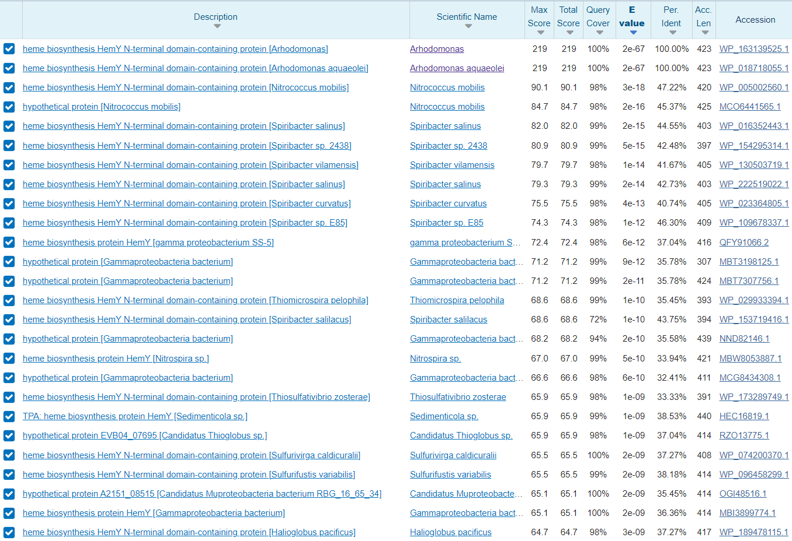
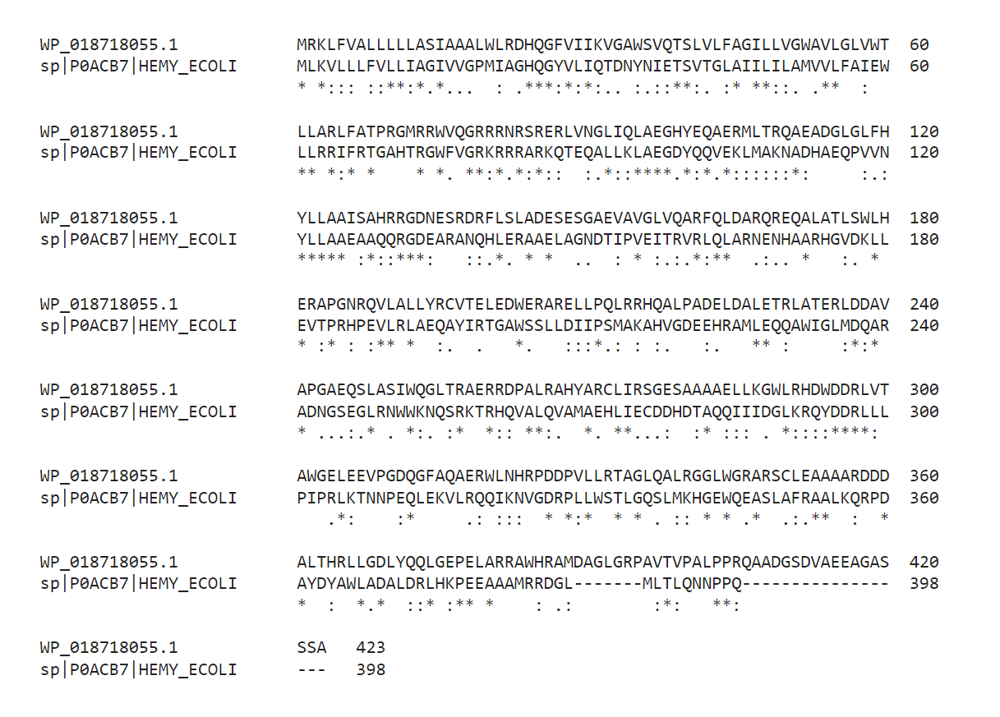
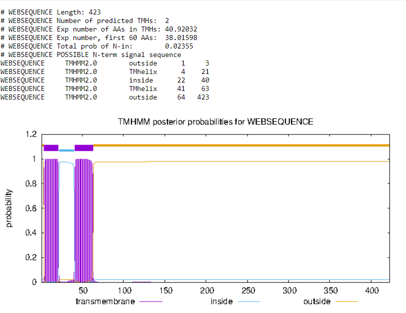
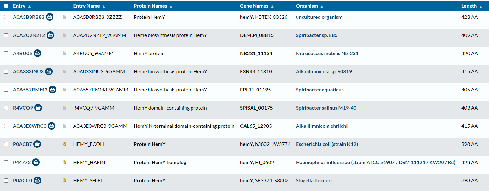
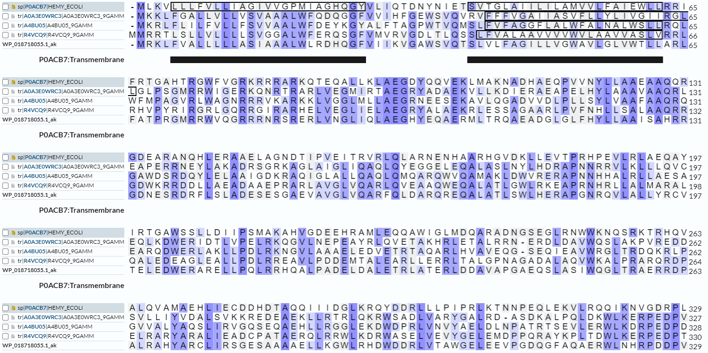
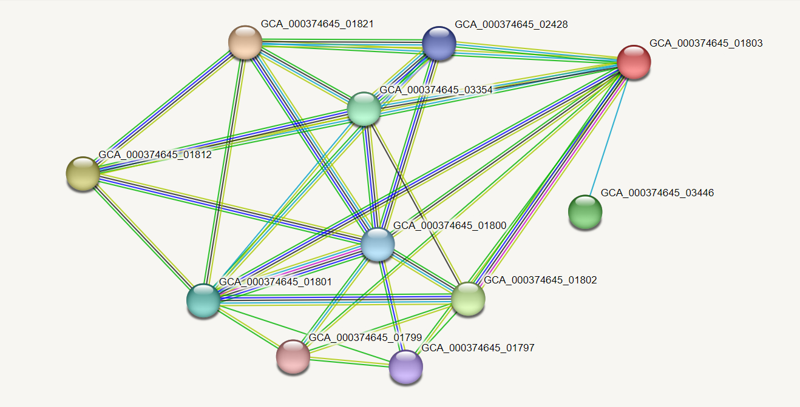
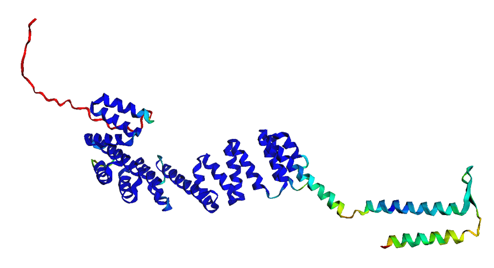
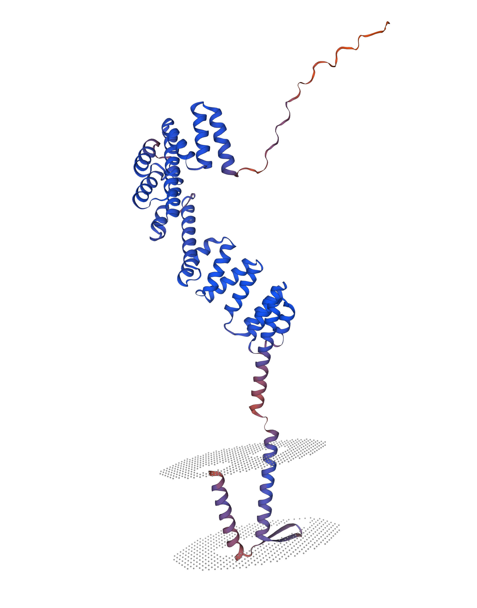
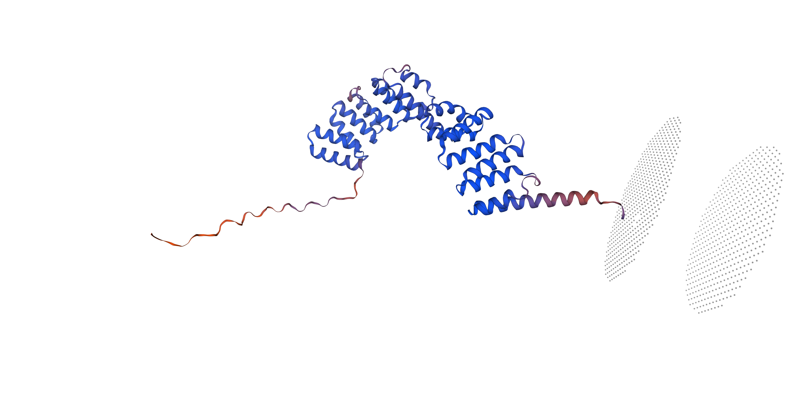

# S41

- **Avtor**: Lara Zupanc
- **Datum izdelave**: 2023-05-26
- **Koda seminarja**: S41

---
## Vhodni podatek

Zaporedje:
```
ADELDALETRLATERLDDAVAPGAEQSLASIWQGLTRAERRDPALRAHYARCLIRSGESA
AAAELLKGWLRHDWDDRLVTAWGELEEVPGDQGFAQAERWLNHRPDDPVL
```

---
## Rezultati analiz

### Identifikacija

**Protein**: HemY

**Organizem**: [*Arhodomonas aquaeolei*](https://en.wikipedia.org/wiki/Arhodomonas_aquaeolei); paličasta gram negativna bakterija

**Potencialna funkcija proteina**: sodeluje pri sintezi protohema IX oz. [hema B](https://en.wikipedia.org/wiki/Heme_B)

Protein je bil identificiran z uporabo NCBI BLAST - blastp (zbirka nr). Značilna podobnost je bila najdena za celotno zaporedje, in sicer je prevedeno zaporedje podobno zaporedju predpostavljenega proteina HemY (100 % identičnost, E vrednost = 2e-67).

Prikaz tabele z zadetki:



Koda zapisa z BLAST identificiranega proteina: GenBank [WP_018718055.1](https://www.ncbi.nlm.nih.gov/protein/WP_018718055.1)

Aminokislinsko zaporedje:
```
>WP_018718055.1_ak
MRKLFVALLLLLASIAAALWLRDHQGFVIIKVGAWSVQTSLVLFAGILLVGWAVLGLVWTLLARLFATPR
GMRRWVQGRRRNRSRERLVNGLIQLAEGHYEQAERMLTRQAEADGLGLFHYLLAAISAHRRGDNESRDRF
LSLADESESGAEVAVGLVQARFQLDARQREQALATLSWLHERAPGNRQVLALLYRCVTELEDWERARELL
PQLRRHQALPADELDALETRLATERLDDAVAPGAEQSLASIWQGLTRAERRDPALRAHYARCLIRSGESA
AAAELLKGWLRHDWDDRLVTAWGELEEVPGDQGFAQAERWLNHRPDDPVLLRTAGLQALRGGLWGRARSC
LEAAAARDDDALTHRLLGDLYQQLGEPELARRAWHRAMDAGLGRPAVTVPALPPRQAADGSDVAEEAGAS
SSA
```

### Splošna karakterizacija
Za zapis GenBank [WP_018718055.1](https://www.ncbi.nlm.nih.gov/protein/WP_018718055.1) ni na voljo pripisov glede značilnosti proteina. Da sem prišla do podatkov o proteinu, sem si pomagala z iskanjem po zbirki Uniprot/SwissProt, kjer so dobro anotirana zaporedja proteinov z aminokislinskim zaporedjem, podobnim aminokislinskemu zaporedju identificiranega proteina.

#### Lokalizacija, domene in post-translacijske modifikacije
Z iskanjem z blastp po zbirki Uniprot/SwissProt (dobro anotirani zapisi) z zaporedjem WP_018718055.1_ak sem identificirala 2 proteina, kjer eden izmed rezultatov predstavlja protein HemY iz *E. coli*.


Prvi zadetek pokriva večinski del iskalnega zaporedja:


Najbolj podobno je zaporedje v zapisu Uniprot [P0ACB7](https://www.uniprot.org/uniprotkb/P0ACB7). Ta ima skoraj 30 % identičnost v poravnanem delu, ki obsega 87 % iskalnega zaporedja. Gre za protein HemY iz organizma [*Escherichia coli*](https://sl.wikipedia.org/wiki/Escherichia_coli). Protein HemY se nahaja v notranji celični membrani in sodeluje pri sintezi protohema IX (protoheme IX). Sklepam, da ne gre za encim, saj v zaporedju ni prisotnih aktivnih mest. Protein obsega 398 aminokislinskih ostankov. 

Na osnovi podobnosti z iskalnim zaporedjem lahko sklepam, da je protein z zaporedjem WP_018718055.1_ak **protein HemY**, ki se nahaja v notranji celični membrani bakterije *Arhodomonas aquaeolei*.

Poravnava proteina z zaporedjem WP_018718055.1_ak z anotiranim zaporedjem P0ACB7 z orodjem Clustal Omega:



Iz poravnave je razvidno, da ima protein le nekaj ohranjenih mest, ki so razporejena po celotnem zaporedju. Prisotnih je nekaj krajših ohranjenih regij dolgih okoli 4-5 aminokislinskih ostankov. Anotiran protein je v primerjavi s preučevanim proteinom krajši za 25 aminokislinskih ostankov.

##### Domene in motivi proteina

Na osnovi podobnosti z anotiranim zaporedjem P0ACB7 lahko sklepam tudi kakšne domene sestavljajo moj protein:


Protein z anotiranim zaporedjem P0ACB7 je sestavljen iz dveh citosolnih in dveh transmembranskih domen ter ene periplazemske domene. Iz zgornje poravnave sem izračunala koliko aminokislinskih ostankov v preučevanem proteinu je enakih s tem proteinom. Transmembranske domene preučevanega proteina imajo 30 % identičnost glede na protein z anotiranim zaporedjem P0ACB7. Njihova identičnost je višja kot pri periplazmatski in C-končni domeni (25 % identičnost) in to pomeni, da so bolj ohranjene. Najbolj ohranjena pa je N-končna domena, katere identičnost je 50 %. Eden izmed potencialnih razlogov za to visoko identičnost je verjetno njeno kratko zaporedje dolgo le 4 aminokislinske ostanke. Glede na vrednost identičnosti, obstaja možnost, da so te domene ohranjene tudi pri proteinu HemY iz *Arhodomonas aquaeolei*. Moje sklepe o domenah proteina sem potrdila še z uporabo orodja [TMHMM - 2.0](https://services.healthtech.dtu.dk/services/TMHMM-2.0), ki napove, kje se nahajajo transmembranske domene. V orodje sem vnesla zaporedje proteina HemY iz *Arhodomonas aquaeolei* in dobila rezultat prikazan spodaj:



Ti rezultati se ujemajo s tem, kar sem opisala zgoraj. Torej preučevani protein ima 2 transmembranski domeni, ki sta na grafu prikazani z vijolično barvo. Z oranžno barvo je prikazan del proteina, ki se nahaja na citosolni strani in z modro del, ki se nahaja v periplazmatskem prostoru.

Protein vsebuje strukturni motiv TPR (tetratricopeptide repeat). Motiv TPR je sestavljen iz 3-16 tandemskih ponovitev 34 aminokislinskih ostankov in posreduje pri interakcijah protein-protein. Pri proteinu z anotiranim zaporedjem P0ACB7 se pojavita dve regiji, ki vsebujeta ta motiv: TPR1 in TPR2. Preučevani protein ima v teh regijah skoraj 35 % identičnost, iz česar lahko sklepam, da se ta motiv lahko pojavi tudi pri tem proteinu.


##### Post-translacijske modifikacije

Za nadaljnjo poravnavo in iskanje post-translacijskih modifikacij, sem najprej poiskala nekaj zaporedij z iskanjem po zbirki Uniprot z blastp (iskanje preko [BLAST@UniProt](https://www.uniprot.org/blast)). Izbrala sem nekaj dobljenih zadetkov, ki so približno enakih dolžin (okoli 400 aminokislinskih ostankov) in njihova identičnost je 40-50 %. Tem zaporedjem sem dodala še dodatne zadetke z iskanjem po delu zbirke SwissProt (dobro anotirana zaporedja) ter naredila poravnavo v orodju UniProt. Ta omogoča identifikacijo potencialno ohranjenih mest post-translacijskih modifikacij.

Prikaz izbranih zaporedij za poravnavo:



Pri izbranih zaporedjih sem opazila, da ni prisotnih nobenih post-translacijskih modifikacij. To je smiselno, saj gre za proteine iz bakterijskih organizmov.

Spodaj je prikazan del poravnave:


#### Izražanje proteina v rekombinantni obliki
Glede na to, da gre za protein, ki se nahaja v notranji celični membrani bakterij in ni prisotnih nobenih post-translacijskih modifikacij, bi za izražanje uporabili bakterijski ekspresijski sistem.

#### Homologi
Paralogi proteina niso znani, ima pa protein nekaj ortologov. Od teh je le eden z anotiranim zaporedjem:
- protein HemY iz *E. coli* ([P0ACB7](https://www.uniprot.org/uniprotkb/P0ACB7))

Ostali ortologi, pa niso anotirani. Spodaj je napisanih nekaj teh ortologov:
- HemY iz organizma *Spiribacter salinus* ([WP_016352443.1](https://www.ncbi.nlm.nih.gov/protein/WP_016352443.1?report=genbank&log$=prottop&blast_rank=10&RID=7E0K0BM0016))

- HemY iz organizma *Nitrococcus mobilis* ([WP_005002560.1](https://www.ncbi.nlm.nih.gov/protein/WP_005002560.1?report=genbank&log$=prottop&blast_rank=4&RID=7E0K0BM0016))

- HemY iz organizma *Alkalilimnicola ehrlichii* ([WP_116303109.1](https://www.ncbi.nlm.nih.gov/protein/WP_116303109.1?report=genbank&log$=prottop&blast_rank=5&RID=7E0K0BM0016))

Na sliki je prikazana poravnava s homologi:



Pri proteinu in njegovih homologih so ohranjene transmembranske domene. Ohranjenih je tudi nekj aminokislinskih ostankov na določenih mestih ter krajša aminokislinska zaporedja. 

#### Interakcije
Prikaz interakcij proteina HemY iz organizma *Arhodomonas aquaeolei*:



Vseh 10 prikazanih proteinov, s katerimi protein HemY (rdeča barva) potencialno interagira, je neanotiranih in iz organizma *Arhodomonas aquaeolei*. Njihova funkcija je sodelovanje pri procesih, kot so biosinteza hema, presnova hema, biosinteza organodušikovih spojin in še nekaj drugih procesov. 

#### Strukturna karakterizacija
Struktura preučevanega proteina ni znana. Prav tako ni znana tudi nobena struktura homologov. 

Predviden model proteina HemY iz organizma *Arhodomonas aquaeolei*:
- AlphaFold2:



- SWISS-MODEL:



Na zgornjih slikah je prikazan model celotnega proteina.

Model topnega proteina ne vsebuje transmembranskih domen. Za gradnjo topnega proteina sem vzela zaporedje preučevanega proteina, ki se začne na mestu 64 in poteka do konca zaporedja proteina.
Problem se pojavi pri gradnji modela funkcionalnega proteina. Znano je le, da je protein vključen v pozno stopnjo sinteze protohema IX, ni pa znano kakšna je njegova funkcija pri tem. Ker to ni znano, ne morem zgraditi funkcionalnega modela proteina, saj ne morem določiti kateri del proteina je pomemben za ohranjanje njegove funkcije.

Predviden model topnega proteina (SWISS-MODEL):



Pri homologih proteina ni določenih eksperimentalnih struktur, zato tega modela z njimi ne morem primerjati.