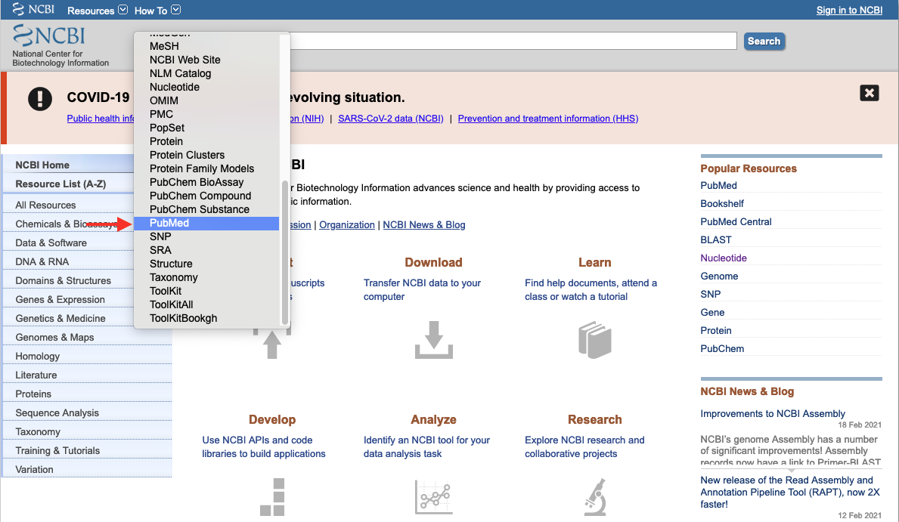
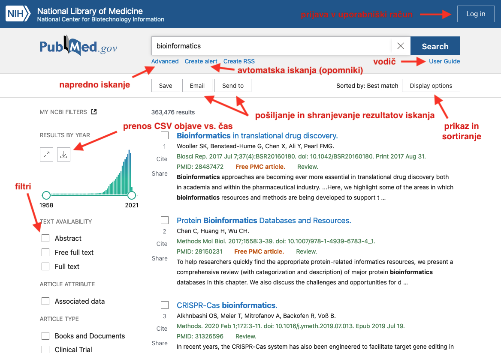

# VAJA: Iskanje po PubMed

V okviru te vaje si bomo ogledali nekaj vidikov iskanja po tej zbirki in sicer:
* filtriranje rezultatov glede na tip članka, leto ipd.,
* kompleksno iskanje z večimi termini.

Pri tem bomo uporabljali "novo" verzijo vmesnika, ki je na voljo od konca leta 2019 in je dosegljiv na naslovu [https://pubmed.ncbi.nlm.nih.gov/](https://pubmed.ncbi.nlm.nih.gov/). Z iskanjem lahko začnemo tudi na osnovni strani Entrez ([https://www.ncbi.nlm.nih.gov/](https://www.ncbi.nlm.nih.gov/)), kjer na vrhu iz menija izberemo Pubmed (slika spodaj). Če bi nastavitev pustili na *All Databases* se nam prikažejo posamezne zbirke na strežniku in število zadetkov v vsaki izmed njih (poizkusite na enem primeru).

---
## Naloga 1

### Vprašanja
Odgovorite na naslednja vprašanja:
1. S pomočjo enostavnega iskanja ugotovite, koliko je člankov, ki so indeksirani v tej zbirki, pri katerih se kjerkoli pojavi beseda **coronavirus**.
2. Koliko od teh člankov ima prosto dostopno celotno besedilo?
3. Koliko člankov je na temo kliničnih preizkusov (*Clinical Trial*)?
4. Koliko od člankov na temo kliničnih preizkusov ima prosto dostopno celotno besedilo?
5. Koliko člankov v zvezi s koronavirusom (še vedno smo pri iskalnem pojmu **coronavirus**) je preglednih (t.j. *Review*)?

### Razlaga
Do zgoraj navedenih vprašanj se lahko dokopljemo z uporabo filtrov, ki se nahajajo na levi strani (slika spodaj). Še več filtrov najdemo čisto na koncu seznama filtrov pod povezavo *Additional filters*. Na spletni strani je še nekaj uporabnih funkcij, naj jih naštejemo zgolj nekaj:
* *Display options*, kjer lahko nastavimo sortiranje zadetkov ter število prikazanih zadetkov na stran,
* shranjevanje in pošiljanje rezultatov (npr. za uvoz v program za upravljanje referenc),
* prenos datoteke formata CSV s frekvenco objav po letih (oglejte si to za primer koronavirusa!),
* ustvarjanje avtomatskih iskanj, kar nam omogoča, da za neko tematiko dobimo e-pošto z novimi članki,
* prijava v uporabniški račun, kjer si lahko shranjujemo bibliografijo in upravljamo z avtomatskimi iskanji.

---
## Naloga 2

### Uvod
Zgornji primer je, ne glede na uporabljene filtre, primer enostavnega iskanja. Če želimo izvesti kompleksnejšo poizvedbo, jo lahko zapišemno neposredno v iskalno polje za enostavno iskanje, a moramo pri tem poznati sintakso. To si poenostavimo z uporabo naprednega iskanja - povezava [**Advanced**](https://pubmed.ncbi.nlm.nih.gov/advanced/) pod osnovnim iskalnim poljem.

Graditelj naprednega iskanja (PubMed Advanced Search Builder) nam omogoča, da posameznemu iskalnemu pojmu pripišemo, kje v referenci se naj nahaja (npr. v naslovu, povzetku), določimo časovno obdobje objave ipd., vse to pa združujemo z osnovnimi operatorji [Boolove algebre](https://en.wikipedia.org/wiki/Boolean_algebra) (AND, OR, NOT).

### Vprašanja
Vaša naloga je, da poiščete, koliko člankov ima v naslovu besedo *SARS*, bili so pa objavljeni med letoma 2009 in 2019 (vključno s celotnima omenjenima letoma). Koliko pa je bilo takih člankov med letoma 2020 (od 1. januarja) pa do danes?

Zanima nas še, koliko od člankov, ki ima v naslovu *SARS*, ima v naslovu in/ali povzetku še besedo *cats* (mačke).

### Razlaga
Opazili boste, da ko gradite kompleksno iskanje se vam le-to z ustrezno sintakso zapisuje v izkalno škatlo (*Query box*) in ob sprožitvi iskanja se vsebina slednjega pojavi v polju za enostavno iskanje. Tako vidite, da bi dejansko lahko tako iskanje izvršili sami, če bi poznali sintakso. Orodje za gradnjo kompleksnega iskanja ima še eno uporabnost - z njim si lahko pomagamo zgraditi iskanja prek programskega dostopa.

---
## Dodatna literatura

* [Pomoč za iskanje po PubMed](https://www.ncbi.nlm.nih.gov/books/NBK3827/), na voljo tudi v obliki PDF (poglejte ob rob strani na povezavi).
* [18+ Ways to Improve your PubMed searches](https://bitesizebio.com/419/18-ways-to-improve-your-pubmed-searches/) - enostavna in uporabnikom prijazna razlaga kompleksnejših iskanj.
* Uradni kanal NCBI na YouTube:
   * [avtomatska iskanja po PubMed](https://www.youtube.com/watch?v=kXY5P4C_2l4)
   * [prilagoditev PubMed z MyNCBI](https://www.youtube.com/watch?v=mih7gJwd5HI)
   * [filtri na PubMed](https://www.youtube.com/watch?v=696R9GbOyvA)